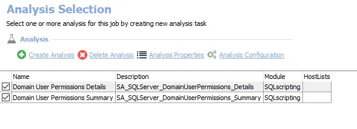

# SQL_DomainUserPermissions Job

The SQL_DomainUserPermissions Job provides insight into Microsoft Active Directory domain users’ access to SQL and Azure SQL server objects at both the instance and database level.

## Analysis Tasks for the SQL_DomainUserPermissions Job

Navigate to the __Databases__ > SQL > 3.Permissions > SQL_DomainUserPermissions > Configure node and select Analysis to view the analysis tasks.

__CAUTION:__ Do not modify or deselect the selected analysis task(s). The analysis task(s) are preconfigured for this job.

The default analysis tasks are:

- Domain User Permissions Details – Creates the SA_SQLServer_DomainUserPermissions_Details table accessible under the job’s Results node
- Domain User Permissions Summary – Creates the SA_SQLServer_DomainUserPermissions_Summary table accessible under the job’s Results node

In addition to the tables and views created by the analysis tasks, the SQL_DomainUserPermissions Job produces the following pre-configured report.

| Report | Description | Default Tags | Report Elements |
| --- | --- | --- | --- |
| Domain User SQL Access | This report looks at SQL server permissions granted to domain users across the audited environment. | None | This report is comprised of three elements:   - Bar Chart – Displays top users by instance count - Table – Provides details on access sprawl - Table – Provides details on permission details |
