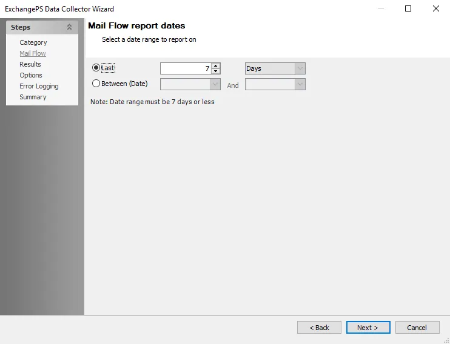

# 0. Collection > EX_Mailflow Job

The EX_Mailflow job collects message trace data from Office 365.


The EX_Mailflow job is located in the __Mailflow__ > __0. Collection__ job group.

## Parameter Configuration

The Configuration section on a Job's overview page allows you to easily modify any customizable parameters used by analysis tasks in the job. See the [Parameter Configuration](../../../../admin/jobs/job/overview.md#parameter-configuration) topic for instructions on how to edit parameters on a job overview page.

The EX_Mailflow job has the following configurable parameter:

- Number of months to keep

See the [Analysis Tasks for the EX_Mailflow Job](#analysis-tasks-for-the-ex_mailflow-job) topic for additional information.

## Queries for the EX_Mailflow Job

The EX_Mailflow job uses the ExchangePS Data Collector.


The following queries are included in the EX_Mailflow job:

- MailFlow – Collects Message Tracking data

  - The default is the __Last 7 Days__. It can be modified to a shorter date range
  - See the [Configure the ExchangePS Data Collector for Mail Flow Metrics](#configure-the-exchangeps-data-collector-for-mail-flow-metrics) topic for additional information
- LocalDomains – Collects domains local to the Office 365 environment

  __CAUTION:__ Do not modify this query. The query is preconfigured for this job.

  - See the [ExchangePS Data Collector](../../../../admin/datacollector/exchangeps/overview.md) topic for additional information

### Configure the ExchangePS Data Collector for Mail Flow Metrics

The ExchangePS Data Collector configured with the Mail Flow Metrics category can be scoped to specific report dates. By default, the MailFlow Query is set to report on the Last 7 Days.

Follow the steps to modify the query configuration:

__Step 1 –__ Navigate to the __Exchange__ > __8. Exchange Online__ > __0. Collection__ > __EX_Mailflow__ > __Configure__ node and select __Queries__.

__Step 2 –__ In the Query Selection view, select the query and click __Query Properties__. The Query Properties window opens.

__Step 3 –__ Select the __Data Source__ tab, and click __Configure__. The ExchangePS Data Collector Wizard opens.

__CAUTION:__ Do not modify other wizard pages. The wizard pages are pre-configured for this job.



__Step 4 –__ To modify the report dates, navigate to the Mail Flow page. Set the report data range as desired. See the [ExchangePS Data Collector](../../../../admin/datacollector/exchangeps/overview.md) topic for additional information.

_Remember,_ the date range must be 7 days or less.

__Step 5 –__ Navigate to the Summary page. Click __Finish__.

The job applies the modification to future job executions.

## Analysis Tasks for the EX_Mailflow Job

View the analysis tasks by navigating to the __Exchange__ > __8. Exchange Online__ > __0. Collection__ > __EX_Mailflow__ > __Configure__ node and selecting __Analysis__.

__CAUTION:__ Do not modify or deselect the selected analysis tasks. The analysis tasks are preconfigured for this job.


The following analysis tasks are selected by default:

- 01.EX_Mailflow_History – Creates the SA_EX_Mailflow_History table, accessible under the job’s Results node
- 02.Update History Table – Updates the SA_EX_Mailflow_History table, with data from the .Active Directory Inventory and .Entra ID Inventory solutions to determine local users and distribution lists
- 03. SET HISTORY RETENTION – Sets retention period in months

  - By default, retention is set to 6 months. This period can be modified. See the [Parameter Configuration](#parameter-configuration) topic for additional information.
  - Alternatively, the ```@Months``` parameter can be modified in the SQL Script Editor. See the [Configure the Customizable Parameters in an Analysis Task](../../../../admin/jobs/job/configure/analysiscustomizableparameters.md) topic for additional information

The following analysis task deletes table data from data collection and analysis jobs. This analysis task should remain cleared unless specifically needed:

__CAUTION:__ Do not select the __00. Deletes all Stored Data__ option. This analysis task is for troubleshooting and cleanup only. Data will be deleted from the database.

- 00. Deletes all Stored Data - LEAVE UNCHECKED – Deletes all historical data

  - See the [Troubleshooting Data Collection](../../hubmetrics/collection/ex_metricscollection.md#troubleshooting-data-collection) topic for additional information
