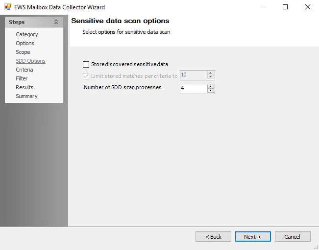
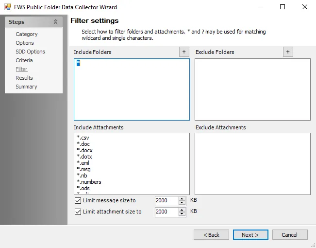
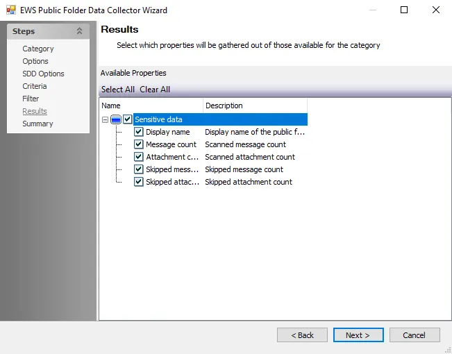

# EX_PublicFolder_SDD Job

The EX_PublicFolder_SDD job locates sensitive data found in public folders in the Exchange environment.

## Queries for the EX_PublicFolder_SDD Job

The EX_PublicFolder_SDD job uses the EWSPublicFolder Data Collector.

The following query is included in the EX_PublicFolder_SDD job:

- Exchange Sensitive Data Discovery – Scans Exchange public folders for specified sensitive data

  - Set to search all public folders. It can be scoped.
  - Default sensitive data criteria includes:

    - Birth Records
    - Credit Cards
    - Passwords
    - Tax Forms
    - US SSN
  - See the [Configure the EX_PublicFolder_SDD Query](#configure-the-ex_publicfolder_sdd-query) topic for additional information

### Configure the EX_PublicFolder_SDD Query

The Exchange Sensitive Data Discovery query has been preconfigured to run with the EWSPublicFolder Data Collector to scan for sensitive data.

__Step 1 –__ Navigate to the __Exchange__ > __7. Sensitive Data__ > __0. Collection__ > __EX_EWSPublicFolder_SDD__ > __Configure__ node and select __Queries__.

__Step 2 –__ In the Query Selection view, select __Exchange Sensitive Data Discovery__ and click __Query Properties__. The Query Properties window opens.

__Step 3 –__ Select the __Data Source__ tab, and click __Configure__. The EWS Public Folder Data Collector Wizard opens.

__CAUTION:__ Do not modify other wizard pages. The wizard pages are pre-configured for this job.

__Step 4 –__ To enable storage of discovered sensitive data, navigate to the SDD Options page. Sensitive data matches can be limited to reduce storage space. See the [EWSPublicFolder: SDD Options](../../../../admin/datacollector/ewspublicfolder/sddoptions.md) topic for additional information.

__NOTE:__ By default, discovered sensitive data strings are not stored in the Access Analyzer database.

__Step 5 –__ To modify criteria, navigate to the Criteria page. Add or remove criteria as desired. See the [EWSPublicFolder: Critieria](../../../../admin/datacollector/ewspublicfolder/critieria.md) topic for additional information.

- (Optional) To create custom criteria, see the [Sensitive Data Criteria Editor](../../../../sensitivedatadiscovery/criteriaeditor/overview.md) topic for additional information

__Step 6 –__ To filter the scan to specific mailbox folders, navigate to the Filter page. Include or exclude folders and attachments as desired. See the [EWSPublicFolder: Filter](../../../../admin/datacollector/ewspublicfolder/filter.md) topic for additional information.

- To modify the threshold for message size, set the __Limit message size to__ value as desired. The default is 2000 KB.
- To modify the threshold for large attachment size, set the __Limit attachment size to__ value as desired. The default is 2000 KB.

__Step 7 –__ To select which properties are gathered based on category, navigate to the Results page.  See the [EWSPublicFolder: Results](../../../../admin/datacollector/ewspublicfolder/results.md) topic for additional information.

__NOTE:__ By default, all categories are selected under sensitive data.

__Step 8 –__ Navigate to the Summary page, click __Finish__ to save any setting modifications or click __Cancel__ if no changes were made. Then click __OK__ to close the Query Properties window

The job applies the modification to future job executions.
