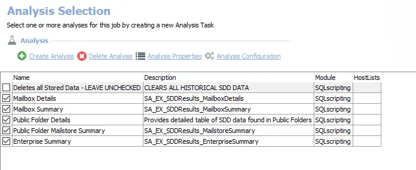

# EX_SDDResults Job

The EX_SDDResults job contains analyses and reports to provide insight into the types of sensitive
data that is located within Exchange mailboxes and public folders within the environment.

## Analysis Tasks for the EX_SDDResults Job

View the analysis tasks by navigating to the **Exchange** > **7. Sensitive Data** >
**EX_SDDResults** > **Configure** node and select **Analysis**.

**CAUTION:** Do not modify or deselect the selected analysis tasks. The analysis tasks are
preconfigured for this job.

The following analysis tasks are selected by default:

- Mailbox Details – Creates the EX_SDDResults_MailboxDetails table, accessible under the job’s
  Results node. Provides details regarding the number of matches that are found per item in each
  mailbox.
- Mailbox Summary – Creates the EX_SDDResults_MailboxSummary table, accessible under the job’s
  Results node. Summarizes the items found with matches.
- Public Folder Details – Creates the EX_SDDResults_PublicFolderDetails table, accessible under the
  job’s Result node. Provides details regarding the number of matches that are found per item in
  each public folder.
- Public Folder Mailstore Summary – Creates the EX_SDDResults_PublicFolderSummary table, accessible
  under the job’s Results node. Summarizes the items found with matches.
- Enterprise Summary – Creates the EX_SDDResults_EnterpriseSummary table, accessible under the job’s
  Results node. Summarizes the type and amount of sensitive content found in the environment.

The following analysis task deletes table data from data collection and analysis jobs. This analysis
task should remain cleared unless specifically needed:

**CAUTION:** Do not select the **Deletes all Stored Data** option. This analysis task is for
troubleshooting and cleanup only. Data will be deleted from the database.

- Deletes all Stored Data - LEAVE UNCHECKED – Clears all historical SDD data

    - See the
      [Troubleshooting Data Collection](../hubmetrics/collection/ex_metricscollection.md#troubleshooting-data-collection)
      topic for additional information

In addition to the tables and views created by the analysis tasks, the EX_SDDResults Job produces
the following pre-configured reports.

| Report                                                        | Description                                                                                 | Default Tags | Report Elements                                                                                                                                                                                                        |
| ------------------------------------------------------------- | ------------------------------------------------------------------------------------------- | ------------ | ---------------------------------------------------------------------------------------------------------------------------------------------------------------------------------------------------------------------- |
| Enterprise Summary (Sensitive Content)                        | This report identifies the type and amount of sensitive content found in scanned mailboxes. | None         | This report is comprised of two elements: - Bar Chart – Displays exceptions by item count - Table – Provides a criteria summary                                                                                        |
| Mailbox Details (Mailboxes with Sensitive Content)            | This report identifies the mailboxes containing sensitive data.                             | None         | This report is comprised of three elements: - Bar Chart – Displays top mailboxes by sensitive item count - Table – Provides mailbox details - Table – Provides details on top mailboxes by sensitive item count        |
| Public Folder Details (Public Folders with Sensitive Content) | This report identifies the public folders containing sensitive data.                        | None         | This report is comprised of three elements: - Bar Chart – Displays top folders by sensitive data item count - Table – Provides public folder details - Table – Provides details on top folders by sensitive item count |
