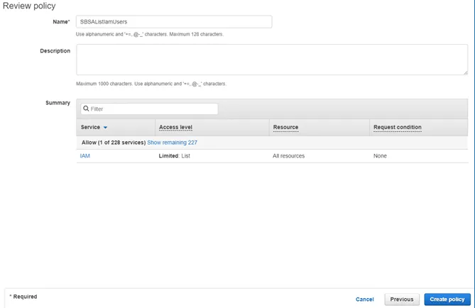
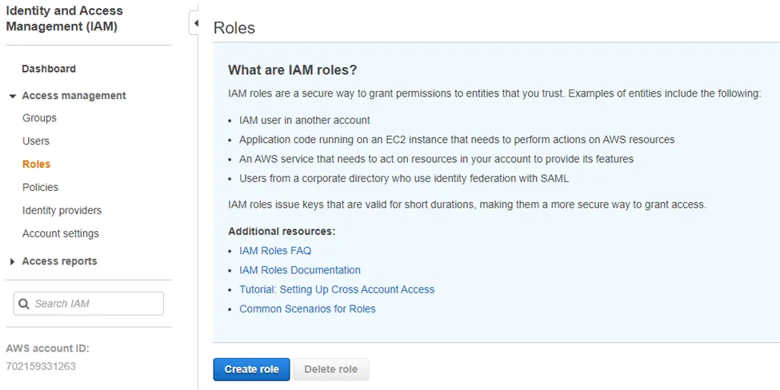
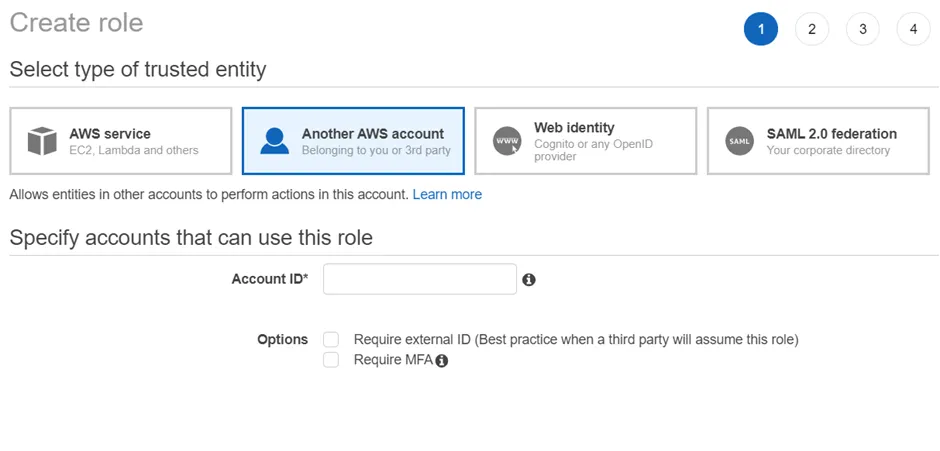
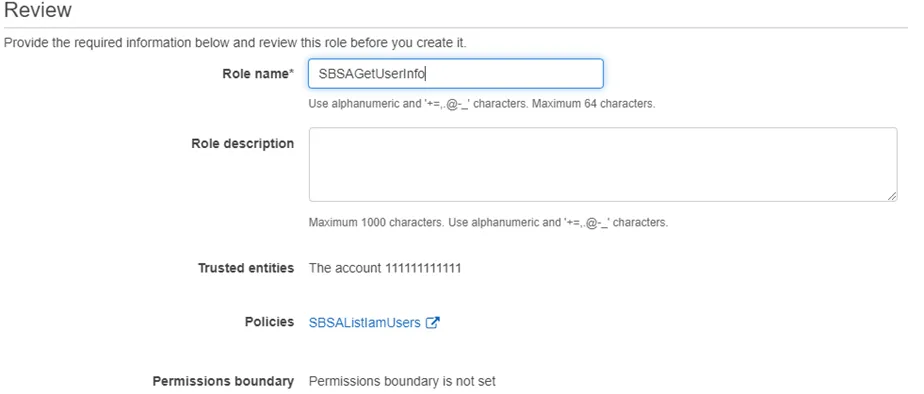

# Configure AWS for Scans

In order to scan multiple AWS accounts using one account you need to create a role in each target
account, so that It can provide the designated scanning account permissions to scan resources it
controls. This is achieved through the following steps which will need to be completed leveraging a
user with administrative access to each target account:

**Step 1 –** Create a Managed Policy in each target account that will be used to allow access to
account (S3, Org and IAM).

**Step 2 –** Create a Role in each target account that will be used to allow access to listing IAM
users.

**Step 3 –** Create a Managed Policy in the designated scanning account that will be used to allow
the service account to assume the configured role in each target account.

**Step 4 –** Add Role to Access Analyzer. The Role created in the scanning account will need to be
added to the **1-AWS_OrgScan**, **2-AWS_S3Scan**, and **3-AWS_IAMScan** job query configurations.
See the [AWS: Login Roles](../../../admin/datacollector/aws/loginroles.md) topic for additional
information.

Once these steps are completed, the role must be added to the AWS queries within Access Analyzer.

## Create a Managed Policy in Each Target Account

The following steps will need to be completed in each target account.

**Step 1 –** Sign into the Identity and Access Management Console (IAM) as an administrator of the
Trusting account.


**Step 2 –** Browse to the Identity and Access Management (IAM) Console. Navigate to **Policies**
and click **Create policy**.


**Step 3 –** Select the **JSON** tab.

**Step 4 –** Paste the following:

```
{
    "Version": "2012-10-17",
    "Statement": [
        {
            "Sid": "CapabilityIamScan",
            "Effect": "Allow",
            "Action": [
                "iam:GenerateCredentialReport",
                "iam:GenerateServiceLastAccessedDetails",
                "iam:Get*",
                "iam:List*",
                "iam:Simulate*",
        "sts:GetAccessKeyInfo"
            ],
            "Resource": "*"
        },
        {
            "Sid": "CapabilityS3Scan",
            "Effect": "Allow",
            "Action": [
                "s3:Describe*",
                "s3:Get*",
                "s3:HeadBucket",
                "s3:List*"
            ],
            "Resource": "*"
        }
    ]
}
```

**Step 5 –** Click **Review Policy**.

**Step 6 –** Enter a name for the policy in the **Name** box.



**Step 7 –** Click **Create Policy**.

**NOTE:** If the designated scanning account is not in Root (Master Account), create a second policy
in the Master Account with the following JSON definition:

[Copy](<javascript:void(0);>)

```
{
    "Version": "2012-10-17",
    "Statement": [
        {
            "Sid": "RequiredCapabilityOrgScan",
            "Effect": "Allow",
            "Action": [
                "iam:GenerateOrganizationsAccessReport",
                "organizations:Describe*",
                "organizations:List*"
            ],
            "Resource": "*"
        }
    ]
}
```

The next step is to create a role in each target account that will be used to allow access to
listing IAM users.

## Create a Role in Each Target Account

The following steps will need to be completed in each target account. For this, you will need the
Account ID of the designating scanning account.

**NOTE:** If the scanning account is also a target account, be sure to complete these steps for the
scanning account as well.

**Step 1 –** Sign into the Identity and Access Management Console (IAM) as an administrator of the
target account.



**Step 2 –** Navigate to **Access management** > **Roles** and click **Create role**.



**Step 3 –** Select the **Another AWS Account** option and add the Account ID of the scanning
account that will be leveraged within Access Analyzer.

**Step 4 –** Click **Next: Permissions**.


**Step 5 –** Add the policy or policies created earlier in this topic to this role.

**Step 6 –** Click **Next: Tags**.

**Step 7 –** Click **Next: Review**.



**Step 8 –** Enter a **Role name**.

**Step 9 –** Click **Create Role**.

The next step is to create a Managed Policy in the designated scanning account that will be used to
allow the service account to assume the configured role in each target account.

## Configure the Scanning Account

Create a Managed Policy in the scanning account that will be used to allow the user to assume the
roles configured in each target account.

**Step 1 –** Sign into the Identity and Access Management Console (IAM) as an administrator of the
scanning account.


**Step 2 –** Navigate to **Access Management** > **Policies** and click **Create policy**.


**Step 3 –** Select the **JSON** tab.

**Step 4 –** Paste the following:

```
{
    "Version": "2012-10-17",
    "Statement": [
        {
            "Sid": "RequiredCapabilityOrgScan",
            "Effect": "Allow",
            "Action": [
                "iam:GenerateOrganizationsAccessReport",
                "organizations:Describe*",
                "organizations:List*"
            ],
            "Resource": "*"
        },
        {
            "Sid": "RequiredCapabilityMemberAccountAccess",
            "Effect": "Allow",
            "Action": "sts:AssumeRole",
            "Resource": "arn:aws:iam::*:role/ROLENAME"
        }
    ]
}
```

**NOTE:** Replace `ROLENAME` with the name of the role that was created. If the `ROLENAME` is
different in each account, then a policy will need to be created for each distinct role name.

**Step 5 –** Click **Review Policy**.


**Step 6 –** Enter a **Policy Name**.

**Step 7 –** Click **Create Policy**.

**Step 8 –** Create a group with the service account user and assign both policies to this group.

**Step 9 –** Under **Access Management** > **Users**, select the service account user.


**Step 10 –** In the Security credentials tab, click **Create access key**. Make sure to note the
Access key ID and Secret access key which need to be input into Access Analyzer.

You can now create the Connection Profile for the AWS Solution. See the
[Amazon Web Services for User Credentials](../../../admin/settings/connection/profile/aws.md) topic
for additional information.
