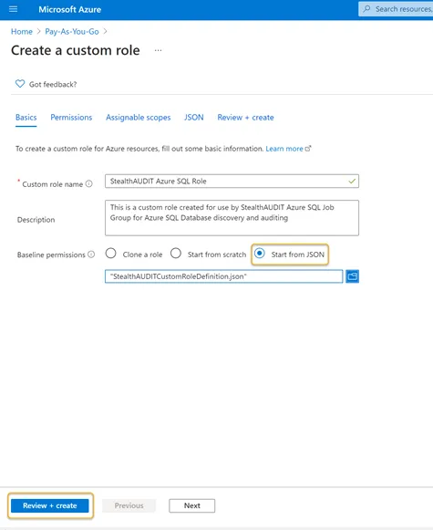
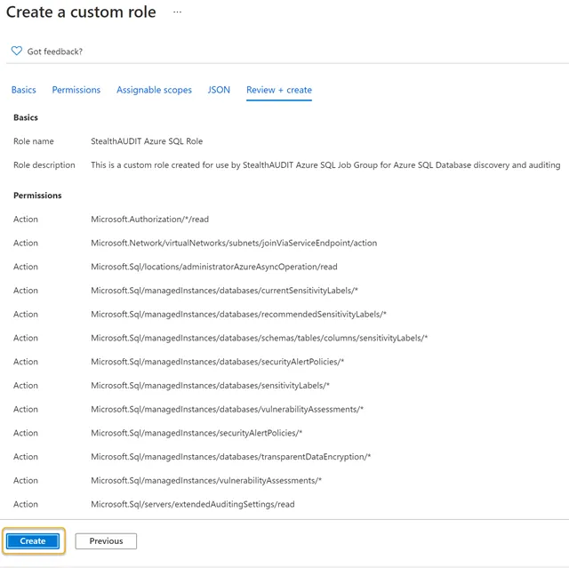
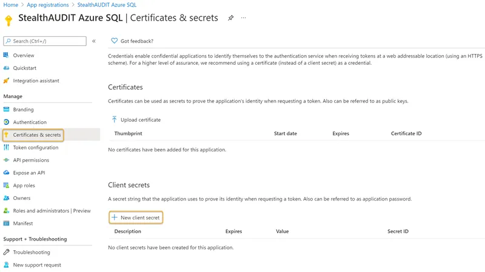
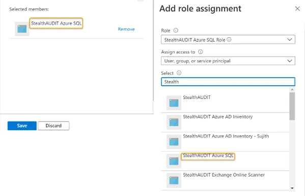
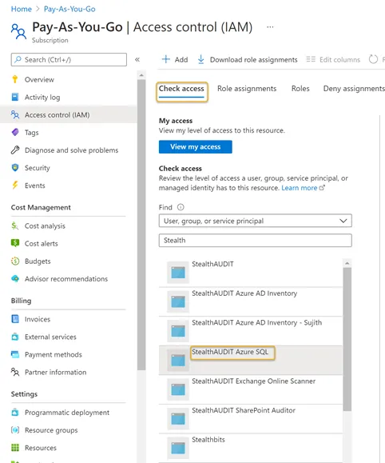

# Azure SQL Auditing Configuration

Access Analyzer for Azure SQL relies on the native Azure SQL auditing capabilities to collect and
report on user activity, as well as successful or unsuccessful server or database logon activity.
Azure SQL Auditing supports three different audit log destinations. At present Access Analyzer only
supports storage as the audit log destination. This document describes the necessary permissions
required to configure the Access Analyzer Azure SQL Job Group.

Access Analyzerfor Azure SQL enables users to create custom roles which allow for differential
access to Access Analyzer.

Within Access Analyzer for Azure SQL, roles are created specifically to target Azure SQL Databases:

- Stand-Alone Databases
- Managed Instances
- Elastic Pools

Role can be largely defined by the scope that particular role possesses. A scope-defined role has
access to, or is limited to all resources in a Management Group, Subscription, Resource Group or
Resource. For example, if all SQL databases reside within a resource group, then the scope can be
restricted to that resource group. If databases reside in different resource groups, then the scope
for the custom role should be at the subscription level.

This will enable Access Analyzer to discover all the SQL databases present in the subscription.

## Create a StealthAUDIT Custom Role

Follow the steps below to create an Azure SQL custom role at the subscription level.


**Step 1 –** Sign in to Azure. Navigate to the Azure Services section and click **Subscriptions**.
This will navigate you to the Pay-As-You-Go page of the Azure Portal.

**Step 2 –** Locate and click the **Access Control (IAM)** view option blade from the available
subscriptions in the left-hand menu.


**Step 3 –** Click **Add** > Add **Custom Role**.

**Step 4 –** Create a JSON file using the subscription ID provided by Microsoft Azure (see the
example below) and save it to a local directory.

```json
{
    "properties": {
        "roleName": "StealthAUDIT Azure SQL Role",
        "description": "This is a custom role created for use by StealthAUDIT Azure SQL Job Group for Azure SQL Database discovery and auditing",
        "assignableScopes": ["/subscriptions/<Your Subscription ID goes here>"],
        "permissions": [
            {
                "actions": [
                    "Microsoft.Authorization/*/read",
                    "Microsoft.Network/virtualNetworks/subnets/joinViaServiceEndpoint/action",
                    "Microsoft.Sql/locations/administratorAzureAsyncOperation/read",
                    "Microsoft.Sql/managedInstances/databases/currentSensitivityLabels/*",
                    "Microsoft.Sql/managedInstances/databases/recommendedSensitivityLabels/*",
                    "Microsoft.Sql/managedInstances/databases/schemas/tables/columns/sensitivityLabels/*",
                    "Microsoft.Sql/managedInstances/databases/securityAlertPolicies/*",
                    "Microsoft.Sql/managedInstances/databases/sensitivityLabels/*",
                    "Microsoft.Sql/managedInstances/databases/vulnerabilityAssessments/*",
                    "Microsoft.Sql/managedInstances/securityAlertPolicies/*",
                    "Microsoft.Sql/managedInstances/databases/transparentDataEncryption/*",
                    "Microsoft.Sql/managedInstances/vulnerabilityAssessments/*",
                    "Microsoft.Sql/servers/extendedAuditingSettings/read",
                    "Microsoft.Sql/servers/databases/auditRecords/read",
                    "Microsoft.Sql/servers/databases/currentSensitivityLabels/*",
                    "Microsoft.Sql/servers/databases/dataMaskingPolicies/*",
                    "Microsoft.Sql/servers/databases/extendedAuditingSettings/read",
                    "Microsoft.Sql/servers/databases/read",
                    "Microsoft.Sql/servers/databases/recommendedSensitivityLabels/*",
                    "Microsoft.Sql/servers/databases/schemas/read",
                    "Microsoft.Sql/servers/databases/schemas/tables/columns/read",
                    "Microsoft.Sql/servers/databases/schemas/tables/columns/sensitivityLabels/*",
                    "Microsoft.Sql/servers/databases/schemas/tables/read",
                    "Microsoft.Sql/servers/databases/securityAlertPolicies/*",
                    "Microsoft.Sql/servers/databases/securityMetrics/*",
                    "Microsoft.Sql/servers/databases/sensitivityLabels/*",
                    "Microsoft.Sql/servers/databases/transparentDataEncryption/*",
                    "Microsoft.Sql/servers/databases/vulnerabilityAssessments/*",
                    "Microsoft.Sql/servers/databases/vulnerabilityAssessmentScans/*",
                    "Microsoft.Sql/servers/databases/vulnerabilityAssessmentSettings/*",
                    "Microsoft.Sql/servers/devOpsAuditingSettings/*",
                    "Microsoft.Sql/servers/firewallRules/*",
                    "Microsoft.Sql/servers/read",
                    "Microsoft.Sql/servers/securityAlertPolicies/*",
                    "Microsoft.Sql/servers/vulnerabilityAssessments/*",
                    "Microsoft.Sql/servers/azureADOnlyAuthentications/*",
                    "Microsoft.Sql/managedInstances/read",
                    "Microsoft.Sql/managedInstances/azureADOnlyAuthentications/*",
                    "Microsoft.Security/sqlVulnerabilityAssessments/*",
                    "Microsoft.Sql/managedInstances/administrators/read",
                    "Microsoft.Sql/servers/administrators/read",
                    "Microsoft.Storage/storageAccounts/blobServices/containers/read",
                    "Microsoft.Sql/servers/auditingSettings/read",
                    "Microsoft.Sql/servers/databases/auditingSettings/read"
                ],
                "notActions": [],
                "dataActions": [],
                "notDataActions": []
            }
        ]
    }
}
```



**Step 5 –** Once created, click **Start from JSON** in the Azure portal and select the JSON file.
Once that file is chosen, the Review + Create button should be enabled.

Click **Review + Create** to create the role or click **Next** to review and edit the permissions.
Once the JSON file is opened, the Custom Role Name and Description boxes will be populated
automatically. The name and description of the custom role can be customized if required in this
step.



**Step 6 –** Click Create. This action will save and finalize a custom role entitled Access Analyzer
Azure SQL Role.

**Step 7 –** Click OK on the final screen to complete the custom role creation process. The custom
role can now be used to register the Access Analyzer application within the Azure portal.

**NOTE:** Depending upon the number of resources in the Azure tenancy, it might take some time for
the role to be made available to the resources.

## Register an Azure SQL Application

Follow the steps below to create an Azure SQL Application Registration in the Azure portal.

**Step 1 –** In the Azure portal under Azure Services, click the **App Registration** icon.


**Step 2 –** Click **New Registration** in the Register an application blade.


**Step 3 –** Enter a **Name** for the application and select an appropriate option from the
Supported account types options.

**Step 4 –** Click **Register** at the bottom of the page when finished. Once the application has
been registered, the App registration overview blade will appear. Take note of the _Application
(client) ID_ on this page.

**NOTE:** The _Application (client) ID_ is required to create a Connection Profile within the Access
Analyzer.



**Step 5 –** Click the **Certificates & secrets** blade in the left-hand menu. Click **New Client
secret**.

**Step 6 –** Enter a unique identifier in the Description field of the Add a client secret window.
Select a Expiration time frame from the drop down. Click **Add** when finished.

_Remember,_ you will have to update the Access Analyzer Connection Profile once the expiration time
frame is reached (within 24 months, for example).

**Step 7 –** Make note of the key under the Value column.

**NOTE:** The Value key on this paged will be used to create the Access Analyzer connection profile.


## Add a Role Assignment

Follow the steps below to add a role assignment to the custom role and newly registered Access
Analyzer Azure SQL application.

**Step 1 –** Navigate to the Subscriptions blade and click the **Access Control (IAM)** option.
Click the **Add** drop down > Click **Add role assignment**.



**Step 2 –** Search for and click the recently created custom role from the Role drop down. See
[Create a StealthAUDIT Custom Role](#create-a-stealthaudit-custom-role) for steps required to create
a custom role in the Azure portal.

**Step 3 –** Search for and select the recently registered Azure SQL application from the Select
drop down. See [Register an Azure SQL Application](#register-an-azure-sql-application) for steps
required to register an Azure SQL application in the Azure portal. The registered application will
be visible in the Selected members window. Click **Save** when finished.


**Step 4 –** Search for and select the SQL Server Contributor role in the Role drop down.

**Step 5 –** Search for and select the recently registered Azure SQL application from the Select
drop down. See [Register an Azure SQL Application](#register-an-azure-sql-application) for steps
required to register an Azure SQL application in the Azure portal. The registered application will
be visible in the Selected members window. Click **Save** when finished.



**Step 6 –** Navigate to the **Subscriptions** blade. Click **Access Control (IAM)**.

**Step 7 –** Click the **Check access** menu tab Search for and select the recently registered Azure
SQL application from the drop down. See
[Register an Azure SQL Application](#register-an-azure-sql-application) for steps required to
register an Azure SQL application in the Azure portal. A preview window will appear on the
right-hand side of the window.
