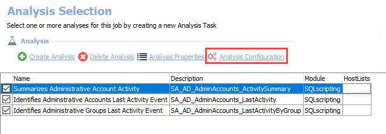
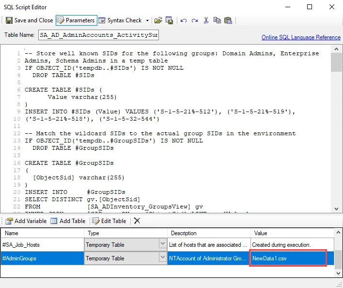

# AD_AdminAccounts Job

The AD_AdminAccounts Job shows all actions taken by domain administrators within the environment.

## Analysis Tasks for the AD_AdminAccounts Job

Navigate to the **Jobs** > **Active Directory** > **6.Activity** > **Privileged Accounts** >
**AD_AdminAccounts** > **Configure** node and select **Analysis** to view the analysis tasks.

**CAUTION:** Do not modify or deselect the selected analysis tasks. The analysis tasks are
preconfigured for this job.

The default analysis tasks are:

- Summarizes Administrative Account Activity – Creates the SA_AD_AdminAccounts_ActivitySummary table
  accessible under the job’s Results node
- Identifies Administrative Accounts Last Activity Event – Creates the
  SA_AD_AdminAccounts_LastActivity table accessible under the job’s Results node
- Identifies Administrative Group List Activity Event – Creates the
  SA_AD_AdminAccounts_LastActivityByGroup table accessible under the job’s Results node

In addition to the tables created by the analysis tasks, the AD_AdminAccounts Job produces the
follow pre-configured reports:

| Report                | Description                                                                                                   | Default Tags                                               | Report Elements                                                                                                                                                                               |
| --------------------- | ------------------------------------------------------------------------------------------------------------- | ---------------------------------------------------------- | --------------------------------------------------------------------------------------------------------------------------------------------------------------------------------------------- |
| Admin Activity        | Highlights administrative account activity events.                                                            | CCPA GDPR SOX HIPPA PCI-DSS GLBA ITAR FERPA FISMA ISO27001 | This report is comprised of two elements: - Bar Chart– Displays least active administrators - Table – Displays administrative user activity details                                           |
| Admin Authentications | Authenticating from many different clients increases the risk of Administrator credentials being compromised. | GDPR SOX HIPPA PCI-DSS GLBA ITAR FERPA FISMA ISO27001      | This report is comprised of three elements: - Bar Chart – Displays the top admin accounts by client usage - Table – Displays all client usage - Table – Displays administrator authentication |

### Configure the Summarize Administrative Account Activity Analysis Task

Customizable parameters enable you to set the values used to include the NT Account name for admin
groups during this job’s analysis. The parameters can be customized and are listed in a section at
the bottom of the SQL Script Editor. Follow the steps to customize an analysis task’s parameters.

**Step 1 –** Navigate to the **Active Directory** > **6.Activity** > **Privileged Accounts** >
**AD_AdminAccounts** > **Configure** node and select **Analysis**.

**Step 2 –** In the Analysis Selection view, select the **Summarizes Administrative Account
Activity** analysis task and click **Analysis Configuration**. The SQL Script Editor opens.

**CAUTION:** Do not change any parameters where the Value states `Created during execution`.

**Step 3 –** In the parameters section at the bottom of the editor, find the Value column. Select
the cell for the temporary table called #AdminGroups, and click **Edit Table** to modify the value.

- The new value should include the NT Account names for the admin groups that are considered
  administrative groups beyond the default admin groups.

**Step 4 –** Click **Save and Close** to finalize the customization and close the SQL Script Editor
window.

The analysis task now includes custom parameters for the updated values.
