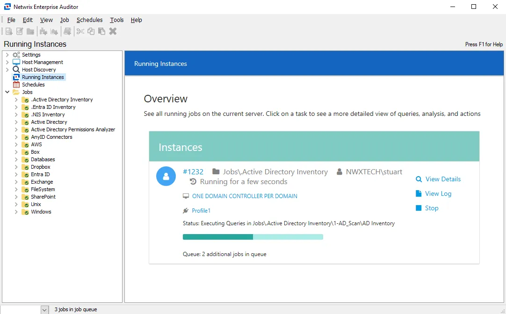

# Resource Based Groups Job Group

The Resource Based Groups Job Group will transform permissions on specified folders to a resource
based groups model. The jobs which comprise the Resource Based Groups Job Group use the Active
Directory Action Module to create resource based groups and populate resource based groups
membership. The jobs use the File System Action Module to modify folder permissions and break
inheritance.

## Prerequisites

Action modules are available with a special Access Analyzer license. In order to use the Resource
Based Groups workflow, the following Access Analyzer licensing components are required:

- File System Feature
- File System Reports Add-on
- File System Actions Add-on
- Active Directory Actions Add-on

The following job groups must be successfully run prior to using this workflow:

- .Active Directory Inventory Job Group
- FileSystem > 0.Collection Job Group

## Location

The **File System** > **Resource Based Groups** Job Group is a separately licensed component of the
Access Analyzer File System solution set. Typically this job group is added during installation, but
it can be installed from the Instant Job Wizard.

Once it has been installed into the Jobs tree, navigate to the solution: **Jobs** > **FileSystem** >
**Resource Based Groups**.

The FS_TraverseGroups Job and the FS_ResourceBasedGroupsAICImport Job must be installed from the
Instant Job library. See the [Instant Job Wizard](../../../admin/jobs/instantjobs/overview.md) topic
for additional information.

## Jobs

The Resource Based Groups Job Group will transform permissions on specified folders to a resource
based groups model.

The following jobs comprise the Resource Based Groups Job Group:

- [FS_ResourceBasedGroups Job](fs_resourcebasedgroups.md) – This job will transform permission on
  specified folders to a resource based groups model
- [FS_TraverseGroups Job](fs_traversegroups.md) – (Optional) This job can be used to create and
  apply permissions for traverse groups based on previous resource based groups. The
  FS_TraverseGroupsJob must be added from the Instant Job Library in order to be used.
- [FS_ResourceBasedGroupAICImport Job](fs_resourcebasedgroupaicimport.md) – (Optional) This job
  imports resources and access groups from the FS_ResoureBasedGroup Job into the Netwrix Access
  Information Center. The FS_ResourceBasedGroupsAICImport Job must be added from the Instant Job
  Library to be used.

## Recommended Configurations for the Resource Based Groups Job Group

Dependencies

- The **.Active Directory Inventory** Job Group must be successfully run prior to running this job
- The **FileSystem** > **0.Collection** Job Group must be successfully run prior to running this job

Targeted Hosts

- None – If targeting all file servers known to Access Analyzer
- Scope the actions to a host list – If targeting specific file servers

Schedule Frequency

This job group can be scheduled to run as desired. Throughout this document reference to executing a
job refers to either manual execution or scheduled execution, according to the needs of the
organization. See the
[Scheduling the Resource Based Groups Job Group](#scheduling-the-resource-based-groups-job-group)
topic for additional information.

History Retention

Not supported

## Scheduling the Resource Based Groups Job Group

Netwrix recommends that the job be run by a scheduled task with an unlimited timeout to ensure the
job will not be aborted when an interactive session is ended due to logoff (a logoff based on
inactivity is common in enterprise environments). Netwrix also recommends that the job only be
scheduled for discrete one-time runs so that results may be reviewed after each execution. See the
[Schedule Jobs](../../../admin/schedule/overview.md#schedule-jobs) topic for additional information.

Throughout this document reference to executing a job refers to either manual execution or scheduled
execution, according to the needs of the organization.
