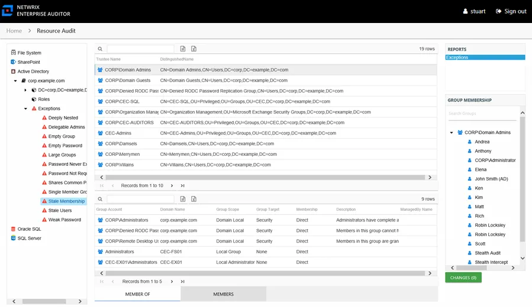

# Exceptions by Type Report

The Exceptions report at the exception type level provides details on the selected exception type.
An exception is defined as a problem or risk to Active Directory security. Each of these reports
includes a Member Of table. Certain exception types also include a Members table.

This report is comprised of the following columns:

- Trustee Name – Owner of the trustee account
- Trustee Account – Active Directory account associated with the trustee
- Department – Department to which the trustee account belongs
- Title – Trustee’s title as read from Active Directory
- Mail – Trustee’s email account as read from Active Directory
- EmployeeId – Corporate ID for the employee as read from Active Directory
- Description – Description of the trustee object as read from Active Directory
- DistinguishedName – Distinguished name for the trustee account
- ObjectSid – Security ID of the object
- Disabled – True or False if trustee account is disabled
- Deleted – True or False if trustee account is deleted
- Last Logon – Date and timestamp from last logon as tracked by Active Directory
- Group Type – Type and scope of the group object: Domain Local/Global/Universal,
  Distribution/Security

If the selected trustee in the top section of the report is a group, the Group Membership pane
displays the group membership, including nested groups.

There are two tables at the bottom displaying Member Of and Members for the selected trustee.

The Member Of table contains the following additional information for the selected trustee:

- Group Account – Account associated with the group
- Group Mail – Group’s email account as read from Active Directory, if applicable
- Group ObjectSid – Security ID of the group object
- Domain Name – Name of the domain
- Group Scope – Scope of the group object: Domain Local, Global, or Universal
- Group Target – Type of the group object: Distribution or Security
- Membership – Type of membership the trustee has to this group

    - Direct – Trustee is specifically assigned to this group
    - Nested – Trustee is a member of a group which has membership in this group

- Description – Description of this group from Active Directory
- DistinguishedName – Distinguished name for the trustee account
- Created – Date Active Directory object was created
- Changed – Date and timestamp from last change as tracked by Active Directory (whenChanged
  attribute)
- ManagedBy Name – Name of manager for the group from Active Directory
- ManagedBy Logon – Trustee account for the group’s manager
- ManagedBy Department – Department of the group’s manager
- ManagedBy Mail – Email address for the group’s manager

When the selected trustee is a group, the Members table contains additional information for the
selected trustee:

- Trustee Name – Owner of the trustee account
- Trustee Account – Active Directory account associated with the trustee
- Domain Name – Name of the domain
- Department – Department to which the trustee account belongs
- Title – Trustee’s title as read from Active Directory
- Mail – Trustee’s email account as read from Active Directory
- EmployeeId – Corporate ID for the employee as read from Active Directory
- Description – Description of the trustee object as read from Active Directory
- DistinguishedName – Distinguished name for the trustee account
- ObjectSid – Security ID of the object
- Disabled – True or False if trustee account is disabled
- Last Logon – Date and timestamp from last logon as tracked by Active Directory
- Type – Type of membership the trustee has to this group

    - Direct – Trustee is specifically assigned to this group
    - Nested – Trustee is a member of a group which has membership in this group

- Nested Level – Count of groups nested between the audited group and the selected trustee’s direct
  membership
- Manager Name – Name of manager for this group from Active Directory
- Manager Logon – Trustee account for group manager
- Manager Department – Department of group manager
- Manager Mail – Email address for group manager
