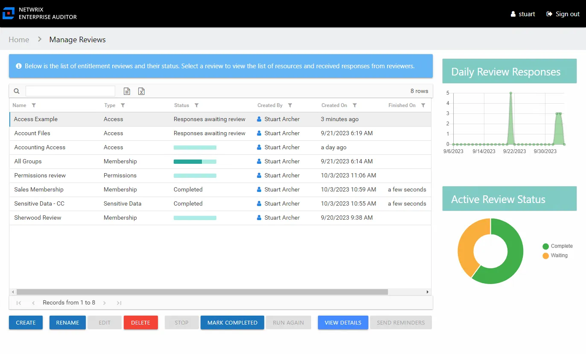
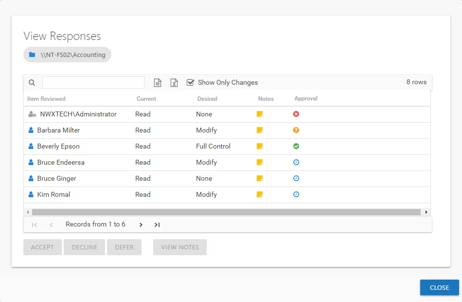

# Approval Process

After all owners assigned to a specific review have submitted their review, its status on the Manage
Reviews page of the Resource Reviews interface changes to Responses awaiting review.

In the approval process, the Review Administrator looks at the owner-recommended changes and chooses
to approve, deny, or defer the changes.

The Review Administrator may choose to model the requested changes to see how the user's overall
access will be impacted. Change modeling is conducted through the Resource Audit interface. You can
access this interface via the **Resource Audit** button on the
[Review Details Page](interface.md#review-details-page). See the
[Model Changes in the AIC](../resourceaudit/changemodeling/model.md) topic for additional
information.

**CAUTION:** If the Access Information Center has been configured to commit changes to Active
Directory and the automation prerequisites have been met for this type of review, this change will
be committed when the review is complete.

If the Access Information Center automatically commits the approved change, it is immediately
visible in Access Information Center reports. It is not necessary to rescan with Netwrix Access
Analyzer (formerly Enterprise Auditor). If approved changes are being manually committed by your
organization's IT team, it will be necessary to rescan the environment before the changes will be
reflected in Access Information Center reports.

See the Process Owner Responses topic for instructions on how to perform a granular review of
owner-recommended changes. See the Batch Processing topic for instructions on how to approve,
decline, or defer all owner-recommended changes for a review.

## Process Owner Responses

Follow the steps to perform a granular review of a resource owner's recommended changes.

**CAUTION:** If the Access Information Center has been configured to commit changes to Active
Directory and the automation prerequisites have been met for this type of review, this change will
be committed when the review is complete.

**Step 1 –** On the Manage Reviews page, select a review and click **View Details**. The Review
Details page opens.

**Step 2 –** Select a resource in the list and click **View Responses**. The View Responses window
opens.

_Remember,_ the **Resource Audit** button opens the Resource Audit interface filtered to that
resource's reports. This is where you can conduct change modeling.

**Step 3 –** By default, the table displays only the recommended changes. Select an item and click
the desired action button: Accept, Decline, or Defer. The Approval column icon updates. See the
[View Responses Window](window/viewresponses.md) topic for additional information.

**Step 4 –** Repeat Step 3 until all changes have been processed. Then click **Close**. The View
Responses window closes.

**Step 5 –** Repeat Steps 2-4 for each resource included in the review.

**Step 6 –** Remediation of the accepted changes can be done one of two ways:

- Automatic — If the Access Information Center has been configured to commit AD changes, accepted
  changes were implemented if the prerequisites were met. If this was a Sensitive Data review, you
  may need to export the approved changes and send those to your IT department. See the
  [Automation Prerequisites](prerequisites.md#automation-prerequisites) topic for additional
  information.
- Manual — Accepted changes must be implemented outside of the application by your IT department.
  Use the **Export Excel** or **Export CSV** buttons to generate and download an export of accepted
  changes.

**Step 7 –** When remediation is complete, return to the Mange Reviews page (click on the
breadcrumb). Select the review in the list and click **Mark Completed**.

The review remains marked as Completed until the next instance is started.

## Batch Processing

Follow the steps to perform a batch processing of a resource owner's recommended changes.

**CAUTION:** If the Access Information Center has been configured to commit changes to Active
Directory and the automation prerequisites have been met for this type of review, this change will
be committed when the review is complete.

**Step 1 –** On the Manage Reviews page, select a review and click **View Details**. The Review
Details page opens.

**Step 2 –** Select a resource in the list and open the **Process Changes** drop-down menu. You can
also select multiple resources in the list to be processed at once using the **Ctrl** and **Shift**
key and click combinations.

_Remember,_ the **Resource Audit** button opens the Resource Audit interface filtered to that
resource's reports. This is where you can conduct change modeling.

**Step 3 –** Select the desired action for all recommended changes: Accept, Decline, or Defer.

_Remember,_ all recommended changes for the selected resource will be processed with the same
resolution.

**Step 4 –** Repeat Steps 2-3 for each resource included in the review.

**Step 5 –** Remediation of the accepted changes can be done one of two ways:

- Automatic — If the Access Information Center has been configured to commit AD changes, accepted
  changes were implemented if the prerequisites were met. If this was a Sensitive Data review, you
  may need to export the approved changes and send those to your IT department. See the
  [Automation Prerequisites](prerequisites.md#automation-prerequisites) topic for additional
  information.
- Manual — Accepted changes must be implemented outside of the application by your IT department.
  Use the **Export Excel** or **Export CSV** buttons to generate and download an export of accepted
  changes.

**Step 6 –** When remediation is complete, return to the Mange Reviews page (click on the
breadcrumb). Select the review in the list and click **Mark Completed**.

The review remains marked as Completed until the next instance is started.
