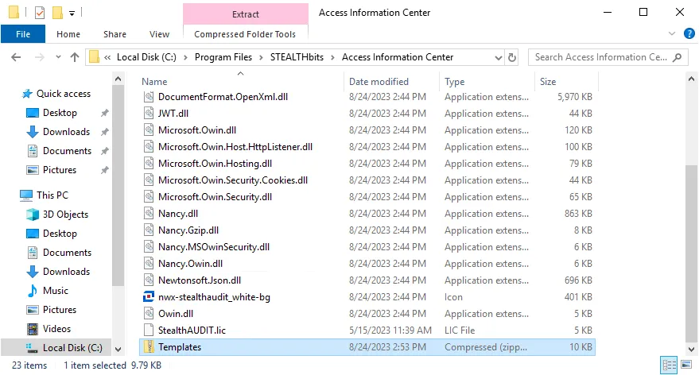
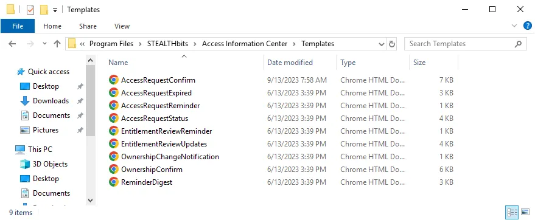

# Email Templates

The HTML templates used to format notification email can be customized. These templates are designed
to make the message viewable within an email client. It is recommended to edit text and layout as
desired, but NOT to embed new images or logos. The following table shows the notification email
templates and describes the purpose of each.

| Template Name               | Message Type Description                                                                                                                                |
| --------------------------- | ------------------------------------------------------------------------------------------------------------------------------------------------------- |
| AccessRequestConfirm        | Sent to owners when an access request has been submitted for their resource                                                                             |
| AccessRequestExpired        | Sent to users when their access to a resource has expired                                                                                               |
| AccessRequestReminder       | Reminds owners of pending access requests; manually sent by a Request Administrator from the Access Requests interface                                  |
| AccessRequestStatus         | Sent to requesting users when an owner reviews an access request                                                                                        |
| EntitlementReviewReminder   | Reminds owners of pending reviews; manually sent by a Review Administrator from the Resource Reviews interface                                          |
| EntitlementReviewUpdates    | Sent to the review creator when a resource owner submits a response to a resource review                                                                |
| OwnershipChangeNotification | Sent to owners when assigned ownership is changed for a resource which already has pending reviews or access requests                                   |
| OwnershipConfirm            | Sent to owners to confirm or decline ownership of a given resource; manually sent by an Ownership Administrator from the Resource Owners interface      |
| ReminderDigest              | Weekly reminder configured by Administrators on the Notifications page of the Configuration interface to owners with pending reviews or access requests |

While customizing the template content, take note of the inline Substitution Tokens. These exist to
provide the message with dynamic content, i.e. inserting values and strings from data in line with
the static portion of the message body. These Substitution Tokens begin and end with the “@” symbol,
e.g. @UserName@.

Substitution Tokens are only valid for certain Notification message templates. Below is a table of
the Substitution Tokens, the value or string they represent, and the message templates in which they
may be used.

| Substitution Token    | Description                                                                                                                                       | Applicable Template(s)                                                                                                 |
| --------------------- | ------------------------------------------------------------------------------------------------------------------------------------------------- | ---------------------------------------------------------------------------------------------------------------------- |
| @AccessName@          | Descriptive name of the type of access being requested (Read, Modify, etc.) to a resource                                                         | AccessRequestConfirm AccessRequestExpired AccessRequestStatus                                                          |
| @Changes@             | Number of review changes                                                                                                                          | EntitlementReviewUpdates                                                                                               |
| @LoginUrl@            | URL that allows a user to access the default (login) page                                                                                         | AccessRequestConfirm AccessRequestReminder OwnershipChangeNotification ReminderDigest                                  |
| @RequestCount@        | Numerically formatted count of pending access requests                                                                                            | ReminderDigest                                                                                                         |
| @ResourceDescription@ | Description of resource - To use the resource's description in emails instead of the path, replace @ResourcePath@ with @ResourceDescription@      | AccessRequestConfirm AccessRequestStatus OwnershipConfirm ReminderDigest                                               |
| @ResourcePath@        | Path of the current resource - To use the resources’ description in emails instead of the path, replace @ResourcePath@ with @ResourceDescription@ | AccessRequestConfirm AccessRequestExpired AccessRequestStatus EntitlementReviewUpdates OwnershipConfirm ReminderDigest |
| @ResourceType@        | Type of resource                                                                                                                                  | AccessRequestConfirm AccessRequestExpired AccessRequestStatus EntitlementReviewUpdates OwnershipConfirm ReminderDigest |
| @ResourceUrl@         | URL specifically created to respond to a request                                                                                                  | AccessRequestConfirm EntitlementReviewReminder OwnershipConfirm                                                        |
| @ResponseCount@       | Numerically formatted count of pending reviews or access requests                                                                                 | AccessRequestReminder ReminderDigest                                                                                   |
| @ReviewCount@         | Numerically formatted count of pending reviews                                                                                                    | ReminderDigest                                                                                                         |
| @ReviewName@          | Name of the resource review                                                                                                                       | EntitlementReviewUpdates                                                                                               |
| @ReviewType@          | Type of resource review                                                                                                                           | EntitlementReviewUpdates                                                                                               |
| @StatusText@          | Status of an access request (Confirmed, Declined, Waiting)                                                                                        | AccessRequestStatus                                                                                                    |
| @UserName@            | Name of the user who submitted the access request                                                                                                 | AccessRequestConfirm AccessRequestStatus EntitlementReviewUpdates                                                      |
| @UserNotes@           | Any notes the user submitted as part of the access request                                                                                        | AccessRequestConfirm AccessRequestStatus                                                                               |

## Customize Email Templates

Email templates are shipped in a ZIP file and stored in the Access Information Center installation
directory:

…\STEALTHbits\Access Information Center

Follow the steps to customize the email templates.

**NOTE:** To successfully modify these Notifications email templates, a familiarity with basic HTML
is necessary.

**Step 1 –** Navigate to the Access Information Center installation directory:

…\STEALTHbits\Access Information Center

**Step 2 –** Unzip the `Templates.zip` file and save the contents to a folder within this directory
named `Templates`.

**CAUTION:** The customized email templates must be in the `Templates` folder within the
installation directory to be preserved during future application upgrades.

**Step 3 –** Locate the desired HTML message template.

**Step 4 –** Open the file with a text editor, e.g. Notepad, and customize the email body.

**NOTE:** Using a tool other than a text editor to edit HTML files, such as a WYSIWYG web page
editor which may drastically alter the underlying HTML code, is not supported.

**Step 5 –** Email subject lines can be edited by changing the text between the opening `<title>`
tag and the closing `</title>` tag.

**Step 6 –** After making changes, save the file and view it within a web browser to see what the
changes will look like. The Substitution Tokens will display without supplied values.

**Step 7 –** After making the desired changes, save and close the text editor. Then re-launch the
application.

The modifications to the HTML email templates are in use by the notification emails.
