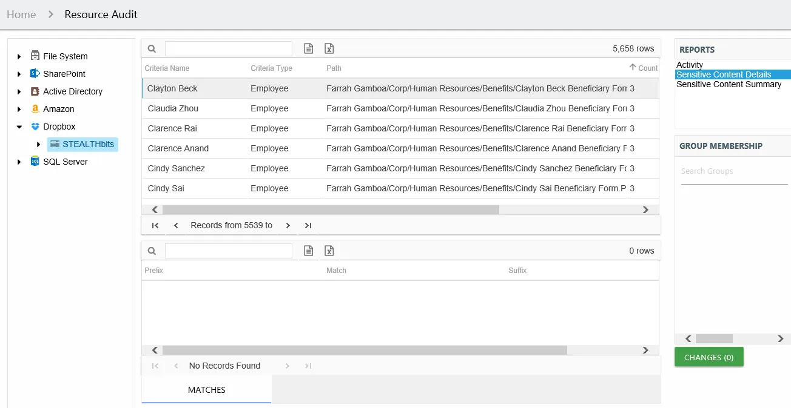

# Sensitive Content Details Report

The Sensitive Content Details report at the Team level provides details of files where criteria matches were found on the selected instance. This report includes a table with criteria matches visible to Access Information Center users with either Security Team Member or Administrator roles. The Matches table requires the storage of discovered sensitive data within the Access Analyzer database or it will be blank.

This report is comprised of the following columns:

- Criteria Name – Type of potentially sensitive criteria matches found
- Criteria Type – Pattern for pattern based matches (System Criteria), and subject type based on Subject Profile matches (for example, Customer, Employee, and so on)
- Path – Location of the file where the criteria matches were found
- Sub File – File name if the sensitive data files reside in a PST file or a ZIP file
- Count – Number of files with criteria matches
- Attributes – Comma separated list of Attributes found for the identity

There is one table at the bottom displaying Matches in the files where the selected criterion value were found:

- Prefix – Text just prior to the sensitive data match in the file
- Match – Lists any sensitive data matches found for the highlighted criteria in the top grid of the report
- Suffix – Text just after the sensitive data match in the file
- Sub File – File name if the sensitive data files reside in a PST file or a ZIP file
