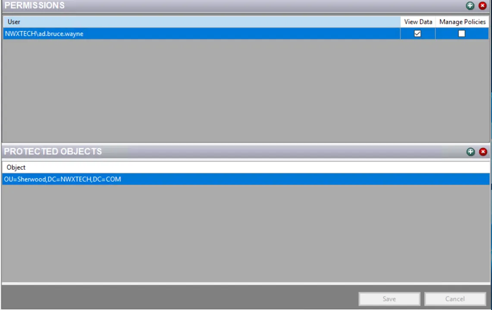

# Permissions Report

The Permissions report for imported data shows the permissions for trustees on the resource.

This report is comprised of the following columns:

- Trustee Type – Type of the trustee (for example, Domain User or Domain Group)
- Trustee Name – Owner of the trustee account
- Trustee Account – Account associated with the trustee
- Department – Department to which the trustee account belongs
- Title – Trustee’s title
- Mail – Trustee’s email account
- EmployeeId – Corporate ID for the employee
- Description – Description of the trustee object
- DistinguishedName – Distinguished name for the trustee account
- ObjectSid – Security ID of the object
- Disabled – True or False if trustee account is disabled
- Deleted – True or False if trustee account is deleted
- Stale – True or False if trustee account is stale (according to the length of inactive time used by the Access Analyzer data collection and analysis configuration to identify stale accounts)
- Source – Direct or Inherited permission type
- Type – Type of resource where the permission is set

The following rights are a normalized representation of the permissions granted to the trustee:

- List – Right to view list of files and subfolders
- Read – Right to view/read files and subfolders
- Write – Right to add or modify files and subfolders
- Delete – Right to delete files and subfolders
- Manage – Equivalent to full control over files and subfolders

The following columns display the combined direct and inherited rights:

- Allow Mask – Bitmask corresponding to Windows ACE permission bits for combined direct and inherited allow rights
- Deny Mask – Bitmask corresponding to Windows ACE permission bits for combined direct inherited deny rights

If the selected trustee is a group, the Group Membership pane displays the Active Directory and local group membership, including nested groups.
