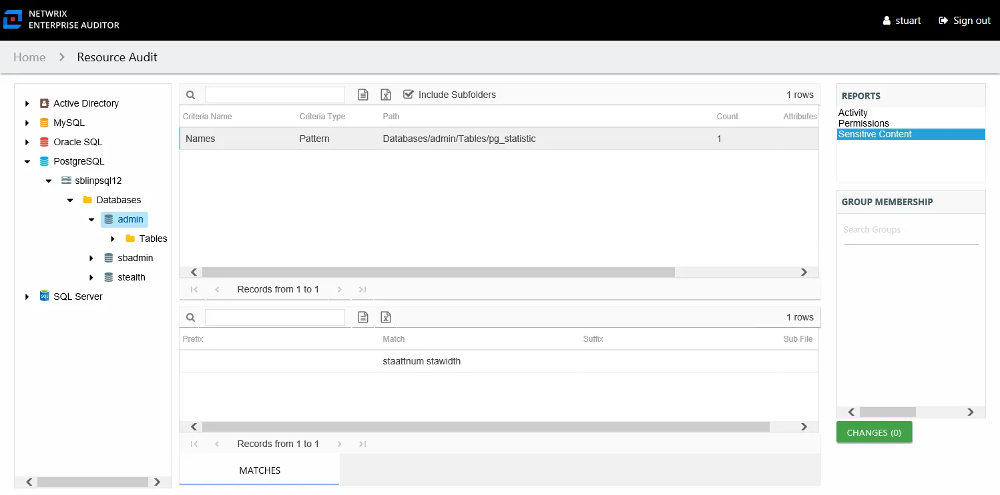

# Sensitive Content Report

The Sensitive Content report at the database and library level provides a list of paths and a hit
count per table where criteria matches were found on the selected resource. This report includes a
second table with criteria matches visible to Access Information Center users with either Security
Team Member or Administrator roles. The Matches table requires the storage of discovered sensitive
data within the Access Analyzer database or it will be blank.

This report is comprised of the following columns:

- Criteria Name – Type of potentially sensitive criteria matches found
- Criteria Type – Pattern for pattern based matches (System Criteria), and subject type based on
  Subject Profile matches (for example, Customer, Employee, and so on)
- Path – Location of the table where the criteria matches were found
- Sub File – Column name of where the sensitive data resides
- Count – Number of criteria matches found within each table
- Attributes – Comma separated list of Attributes found for the identity

There is one table at the bottom displaying Matches on the tables where the selected criterion value
were found:

- Prefix – Not populated
- Match – Lists any sensitive data matches found for the highlighted criteria in the top grid of the
  report
- Suffix – Not populated
- Sub File – Column name of where the sensitive data resides
