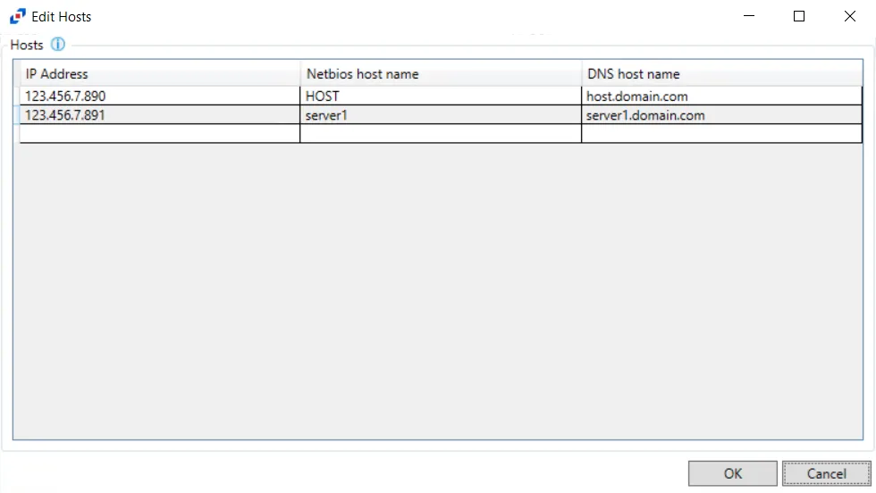

# Global Filters Tab

The Global Filters options are for excluding specific Active Directory and Authentication events
from being monitored.

The filter options are grouped by AD Global Pre-Filters, and Authentication Global Pre-Filters.
Check the boxes to activate the filters. To disable for diagnostic purposes, simply uncheck the
option(s) and click OK. All Authentication Global Pre-Filters options require configuration before
they can be enabled.

Enable all of the AD Global Pre-Filters options as well as the Exclude Logins from Machine Accounts
option in the Authentication Global Pre-Filters section.

When activated, the AD Agent(s) filters out the event data according to configuration defined in the
`filters.json` file located in the installation directory.

The configurable options in the Global Filters tab are:

- Exclude ‘Noise’ Events Option
- Exclude AD DNS Events Option
- Exclude Logins from Machine Accounts Option
- Exclude Authentication Events from Selected Hosts Option
- Exclude Authentication Events from Selected Accounts Option

The ‘Help’ icon (**?**) opens a window that explains the type of “noise” events being filtered.

## Exclude ‘Noise’ Events Option

This option is enabled by default to filter out login and internal low level attributes which can be
considered ‘noise’ events. This option can be scoped to include any combination to the following
‘noise’ events:

- Successful AD User Logins – Excludes events with the following attributes where ‘objectClass’ does
  not equal computer:

    - logonCount
    - lastLogon
    - badPwdCount
    - lastLogonTimestamp

- AD User Logins with Bad Password – Excludes events with the following set of attributes where
  ‘objectClass’ does not equal computer:

    - badPwdCount
    - badPasswordTime

- AD Computer Logins – Excludes events with the following set of attributes where ‘objectClass’
  equals computer:

    - logonCount
    - lastLogon
    - badPwdCount
    - lastLogonTimestamp
    - badPasswordTime
    - badPwdCount

- Low Level Attributes – Excludes the following attributes from event:

    - lmPwdHistory
    - dBCSPwd
    - ntPwdHistory

## Exclude AD DNS Events Option

This option is enabled by default to filter out DNS events. They must meet both of the following
conditions to be excluded:

- objectClass = ‘dnsNode’ or ‘dnsZone’
- Contains the ‘dnsRecord’ or ‘dNSTombstoned’ attribute

## Exclude Logins from Machine Accounts Option

This option is enabled by default to filter out machine logins. Click the configure link to open the
Edit Accounts window.

The Exclude Logins from Machine Accounts collection is only accessible for configuration through the
Global Filters tab.

**NOTE:** Only perpetrators with accounts ending in “$” are considered for this filter. Wild cards
(\*) can be used for partial matches to account names.

All machine accounts in the textbox are either included or excluded from event data monitoring by
the AD Agent. Machine accounts not in the list have the unselected property applied.

Repeat the process until all machine accounts to be included or excluded from Authentication event
data have been entered in the list. Then click **OK**.

Usage Tip

Windows Server 2012 introduced gMSA (Group Managed Service Accounts). The account names for gMSA
accounts include
“$” in their names so by default authentication traffic generated by these accounts is filtered out because they ‘look’ like machine accounts, which prior to Server 2012 were the only account names ending in “$”.
The ability to add a list of filter strings to the “Exclude Logins from Machine Accounts” global
filter provides a means to capture activity by gMSA type accounts as this activity is typically of
interest where as true ‘machine accounts’ is not. By supplying either an explicit list of gMSA
account names, or if a naming convention has been adopted, a set of wild card strings such as
“gMSA\*” or “svc\*”, allows capturing authentication activity from such accounts while ignoring the
noisy ‘machine accounts’.

## Exclude Authentication Events from Selected Hosts Option

This option is disabled by default as it requires configuration before it can be enabled. Click the
selected hosts link to open the Edit Hosts window.

The Exclude Authentication Events from selected hosts collection is only accessible for
configuration through the Global Filters tab. All three methods of identification for a host (IP
Address, NETBIOS host name, or DNS host name) must be known in order to effectively exclude
authentication from the host. Identify the host to be excluded in the textbox of the IP Address
column and press the Enter or Tab to add another row on the grid. Activity Monitor attempts to
discover the NETBIOS host name and the DNS host name associated with the supplied IP Address.

Repeat the process until all hosts for which Authentication event data will not be collected have
been entered in the list. Then click **OK**.

## Exclude Authentication Events from Selected Accounts Option

This option is disabled by default as it requires configuration before it can be enabled. Click the
selected accounts link to open the Edit Accounts window.

The Exclude Authentication Events from selected accounts collection is only accessible for
configuration through the Global Filtering tab. Account names [domain name\account] can also be
typed in the textbox. Wild cards (\*) can be used as part of either the domain name or account. An
asterisk (\*) appearing anywhere other than as the first character or the last character are treated
as a literal character instead of as a wild card.

For example, \*\Service1 would exclude all Service1 accounts whether it is a domain or local
account, and Example\Service\* would exclude all accounts that start with “Service” for the Example
domain.

Repeat the process until all accounts to be excluded from Authentication event data have been
entered in the list. Then click **OK**.
