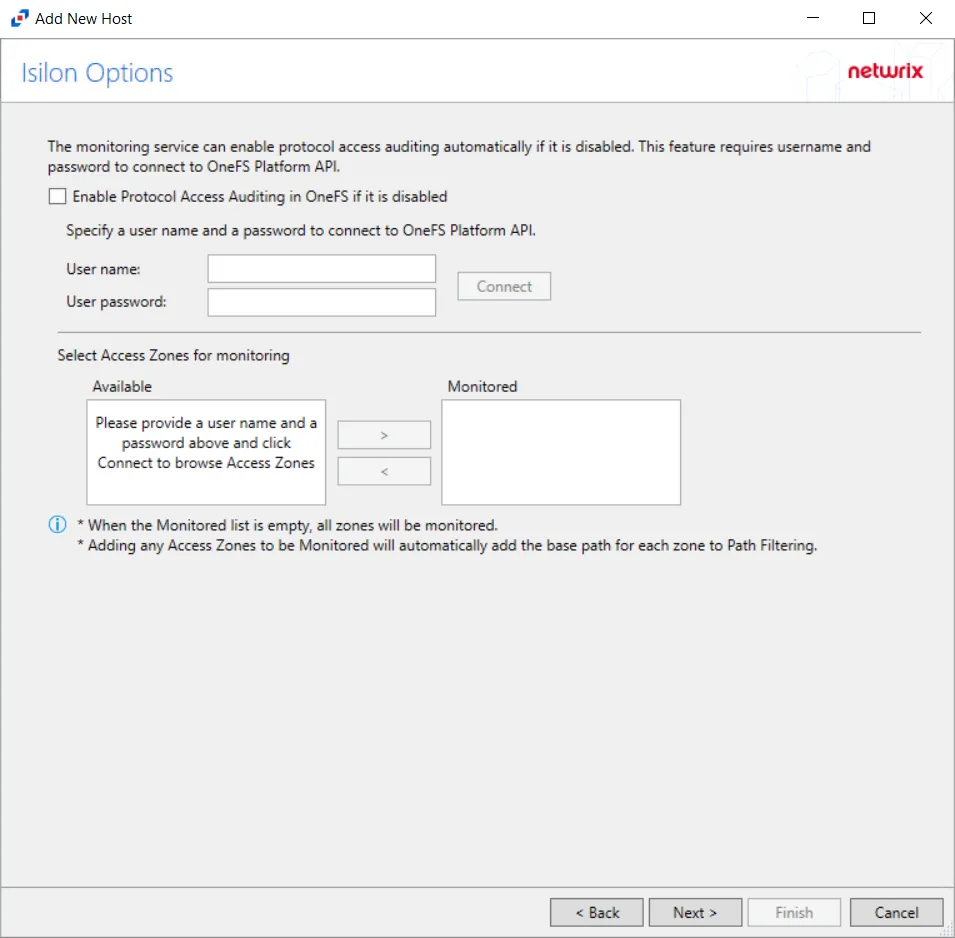
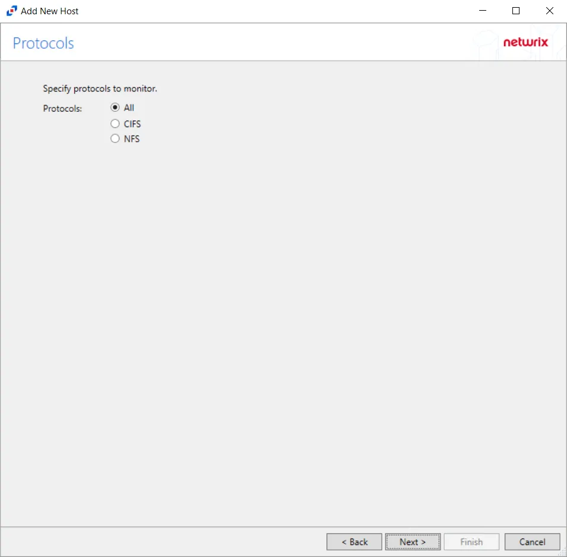
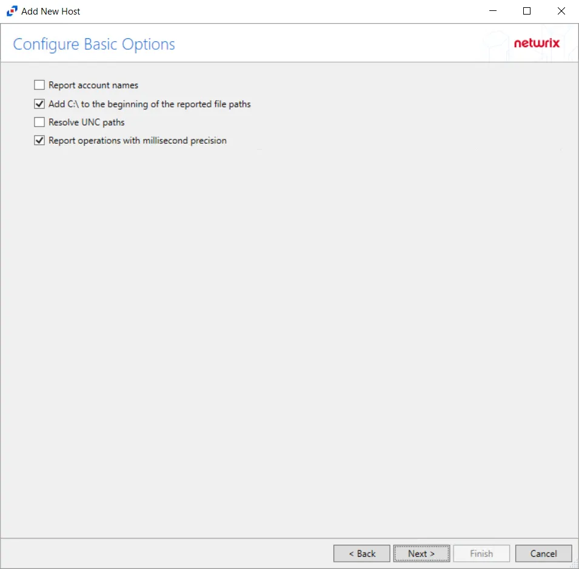
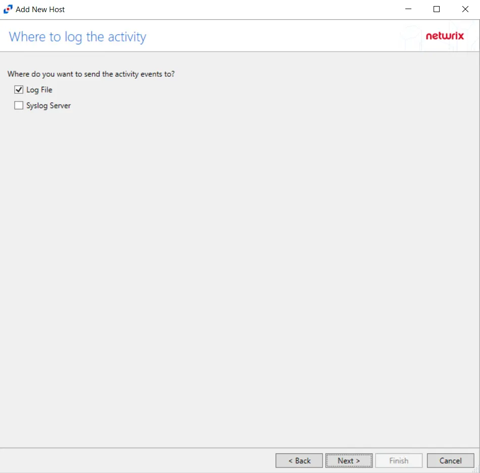
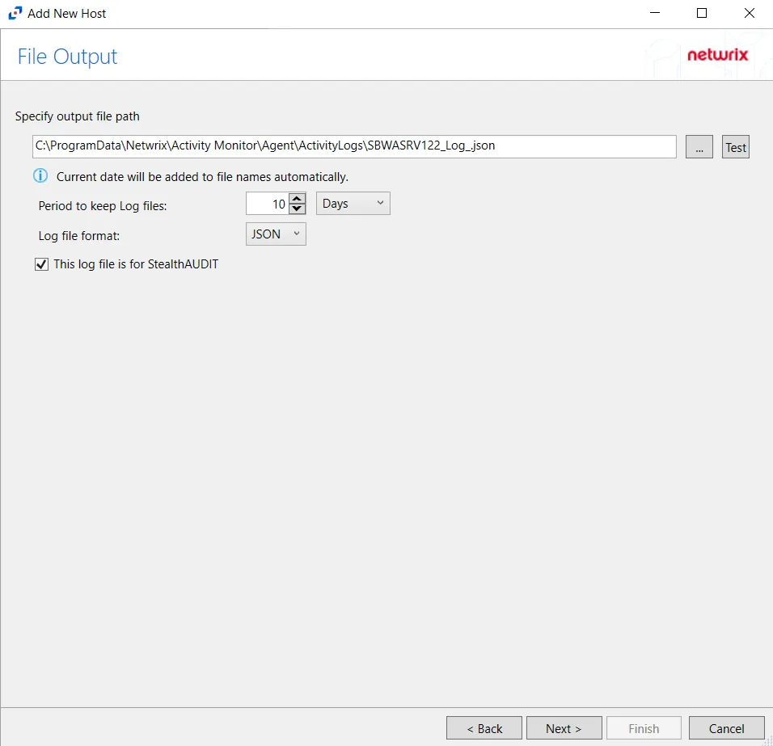
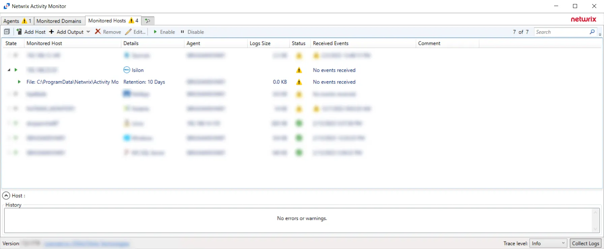

# Dell Isilon/PowerScale

Understanding File Activity Monitoring

The Activity Monitor can be configured to monitor the following:

- Ability to collect all or specific file activity for specific values or specific combinations of values

It provides the ability to feed activity data to SIEM products. The following dashboards have been specifically created for Activity Monitor event data:

- For IBM® QRadar®, see the [Netwrix File Activity Monitor App for QRadar](../../../siem/qradar/overview.md) for additional information.
- For Splunk®, see the [File Activity Monitor App for Splunk](../../../siem/splunk/overview.md) for additional information.

It also provides the ability to feed activity data to other Netwrix products:

- Netwrix Access Analyzer (formerly Enterprise Auditor)
- Netwrix Threat Prevention
- Netwrix Threat Manager

Prior to adding a Dell Isilon/PowerScale host to the Activity Monitor, the prerequisites for the target environment must be met. See the [Dell Isilon/PowerScale Activity Auditing Configuration](../../../../config/dellpowerscale/activity.md) topic for additional information.

_Remember,_ the Activity Agent must be deployed to a Windows server that acts as a proxy for monitoring the target environment.

## Add Dell Isilon/PowerScale Host

Follow the steps to add a Dell Isilon/PowerScale host to be monitored.

__Step 1 –__ Navigate to the Monitored Hosts tab and click Add. The Add New Host window opens.

__Step 2 –__ On the Choose Agent page, select the __Agent__ to monitor the storage device. Click __Next__.

__Step 3 –__ On the Add Host page, select the Dell Isilon radio button and enter both the __Server name or address__ and the __CIFS/NFS server name__ for the device. The CIFS/NFS server name can be left blank to collect activity from the Isilon cluster. If desired, add a __Comment__. Click __Next__.

__NOTE:__ All Dell event source types must have the CEE Monitor Service installed on the agent in order to collect events. Activity Monitor will detect if the CEE Monitor is not installed and display a warning to install the service. If the CEE Monitor service is installed on a remote machine, manual configuration is required. See the [Dell CEE Options Tab](../../agents/properties/dellceeoptions.md) topic for additional information.

__Step 4 –__ On the Isilon Options page, choose whether or not to automatically enable and configure auditing on the Isilon cluster. If a manual configuration has been completed, do not enable these options.

Follow these steps to use this automated option:

- Check the __Enable Protocol Access Auditing in OneFS if it is disabled__ box.
- Enter the User name and User password to connect to the OneFS Platform API.

  __NOTE:__ The User name entered must be an Administrator account on the Dell Isilon device.
- Click Connect to test the connection. If the connection is successful, discovered access zones is displayed in the __Available__ box.
- Access Zones:
  - By default, the __Monitored__ box is left empty and all available access zones are monitored. All activity for the host is collected and placed in a single activity log file per day.
  - If access zones are selected, only those access zones are monitored and the activity is placed in a single activity log file per day.
    - Use the arrow buttons to move the desired access zones to the __Monitored__ box.
  - (_Optional_) Activity log files can be generated for each access zone. In order to generate one activity log file for each access zone, add only one access zone to this configuration of the monitored host. Then, add the host again for each access zone to be monitored. When adding an Isilon host for each access zone, the Dell device name will be the same for each configuration, but the __CIFS/NFS server name__ must have a unique value.

    __NOTE:__ Although the Isilon Options page allows multiple access zones to be placed in the Monitored box for a single Isilon host, when generating separate activity log files for each access zones, Access Analyzer does not support this configuration. Access Analyzer integration requires all access zones to be monitored from a single configuration.

Click __Next__.

__Step 5 –__ On the Protocols page, select which protocol to monitor. The list of protocols that can be monitored are All, CIFS, or NIFS. Click __Next__.

__Step 6 –__ On the Configure Operations page, select the __File Operations__ and __Directory Operations__ options to be monitored. Additional options include:

__CAUTION:__ Suppress Microsoft Office operations on temporary files – Filters out events for Microsoft Office temporary files. When Microsoft Office files are saved or edited, many temporary files are created. With this option enabled, events for these temporary files are ignored. This feature may delay reporting of activity.

Click __Next__.

__Step 7 –__ On the Configure Basic Options page, choose which settings to enable. The “Log files” are the activity logs created by the activity agent on the proxy host. Select the desired options:

- Report account names – Adds an __Account Name__ column in the generated TSV files
- Add C:\ to the beginning of the reported file paths – Adds ‘C:\” to file paths to be displayed like a Windows file path:
  - Display example if checked – C:\Folder\file.txt
  - Display example if unchecked – /Folder/file.text
- Resolve UNC paths – Adds a __UNC Path__ column and a __Rename UNC Path__ column in the generated TSV files
  - This option corresponds to the REPORT_UNC_PATH parameter in the INI file. It is disabled by default. The UNC Path is in the following format:
    - For CIFS activity – \\[HOST]\[SHARE]\[PATH]
    - Example CIFS activity – \\ExampleHost\TestShare\DocTeam\Temp.txt
    - For NFS activity – [HOST]:/[VOLUME]/[PATH]
    - Example NFS activity – ExampleHost:/ExampleVolume/DocTeam/Temp.txt
  - When the option is enabled, the added columns are populated when a file is accessed remotely through the UNC Path. If a file is accessed locally, these columns are empty. These columns have also been added as Syslog macros.
  - When this option is selected, the user needs to provide credentials in the Auditing tab. If credentials are not provided, the following warning message is displayed:
    - Credentials are required for this feature. Provide the credentials in the Auditing tab.
- Report operations with millisecond precision – Changes the timestamps of events being recorded in the TSV log file for better ordering of events if multiple events occur within the same second

Click __Next__.

__Step 8 –__ On the Where To Log The Activity page, select whether to send the activity to either a __Log File__ or __Syslog Server__. Click __Next__.

__Step 9 –__ If __Log File)__ is selected on the __Where To Log The Activity__ page, the __File Output__ page can be configured.

- Specify output file path – Specify the file path where log files are saved. Click the ellipses button (__...__) to open the Windows Explorer to navigate to a folder destination. Click __Test__ to test if the path works.
- Period to keep Log files – Log files will be deleted after the period entered number of days entered. The default is 10 days. Use the dropdown to specify whether to keep the Log files for a set amount of Minutes, Hours, or Days.
- This log file is for Access Analyzer – Enable this option to have Access Analyzer collect this monitored host configuration

  ___RECOMMENDED:___ Identify the configuration to be read by Netwrix Access Analyzer (formerly Enterprise Auditor) when integration is available.

  - While the Activity Monitor can have multiple configurations per host, Access Analyzer can only read one of them.
- Add header to Log files – Adds headers to TSV files. This is used to feed data into Splunk.

Click __Next__.

__Step 10 –__ If Syslog Server is selected on the __Where To Log The Activity__ page, the Syslog Output page can be configured.

- Syslog server in SERVER[:PORT] format – Type the __Syslog server name__ with a SERVER:Port format in the text box.
  - The server name can be short name, fully qualified name (FQDN), or IP Address, as long as the organization’s environment can resolve the name format used. The Event stream is the activity being monitored according to this configuration for the monitored host.
- Syslog Protocol – Identify the __Syslog protocol__ to be used for the Event stream. The drop-down menu includes:
  - UDP
  - TCP
  - TLS

  The TCP and TLS protocols add the Message framing drop-down menu. See the [Syslog Tab](../../outputs/syslog.md) topic for additional information.
- Syslog message template – Click the ellipsis (…)  to open the Syslog Message Template window. The following Syslog templates have been provided:
  - AlienVault / Generic Syslog
  - CEF – Incorporates the CEF message format
  - HP Arcsight
  - LEEF – Incorporates the LEEF message format
  - LogRhythm
  - McAfee
  - QRadar – Use this template for IBM QRadar integration
  - Splunk – Use this template for Splunk integration
  - Threat Manager – Use this template for Threat Manager integration. This is the only supported template for Threat Manager. See the [Netwrix Threat Manager Documentation](https://helpcenter.netwrix.com/category/stealthdefend) for additional information.
  - Custom templates can be created. Select the desired template or create a new template by modifying an existing template within the Syslog Message Template window. The new message template will be named Custom.
- Add C:\ to the beginning of the reported file paths – Adds ‘C:\” to file paths to be displayed like a Windows file path:
  - Display example if checked – C:\Folder\file.txt
  - Display example if unchecked – /Folder/file.text
- Resolve UNC paths – Adds a __UNC Path__ column and a __Rename UNC Path__ column in the generated TSV files
  - This option corresponds to the REPORT_UNC_PATH parameter in the INI file. It is disabled by default. The UNC Path is in the following format:
    - For CIFS activity – \\[HOST]\[SHARE]\[PATH]
    - Example CIFS activity – \\ExampleHost\TestShare\DocTeam\Temp.txt
    - For NFS activity – [HOST]:/[VOLUME]/[PATH]
    - Example NFS activity – ExampleHost:/ExampleVolume/DocTeam/Temp.txt
  - When the option is enabled, the added columns are populated when a file is accessed remotely through the UNC Path. If a file is accessed locally, these columns are empty. These columns have also been added as Syslog macros.
  - When this option is selected, the user needs to provide credentials in the Auditing tab. If credentials are not provided, the following warning message is displayed:
    - Credentials are required for this feature. Provide the credentials in the Auditing tab.
- The Test button – Sends a test message to the Syslog server to check the connection. A green check mark or red will determine whether the test message has been sent or failed to send. Messages vary by Syslog protocol:
  - UDP – Sends a test message and does not verify connection
  - TCP/TLS – Sends test message and verifies connection
  - TLS – Shows error if TLS handshake fails

  See the [Syslog Tab](../../outputs/syslog.md) topic for additional information.

Click __Finish__.

The added Dell Isilon/PowerScale host is displayed in the monitored hosts table. Once a host has been added for monitoring, configure the desired ouptuts. See the [Output for Monitored Hosts](../output.md) topic for additional information.

## Host Properties for Dell Isilon/PowerScale

Configuration settings can be edited through the tabs in the host’s Properties window. The configurable host properties are:

- [Dell Tab](../properties/dell.md)
- [Auditing Tab](../properties/auditing.md)
- [Unix IDs Tab](../properties/unixids.md)
- [Inactivity Alerts Tab](../properties/inactivityalerts.md)

See the [Host Properties Window](../properties/overview.md) topic for additional information.
