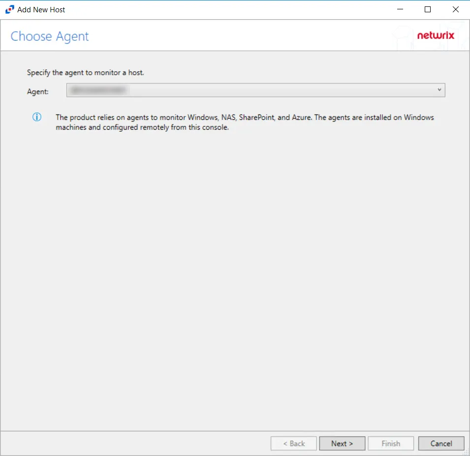
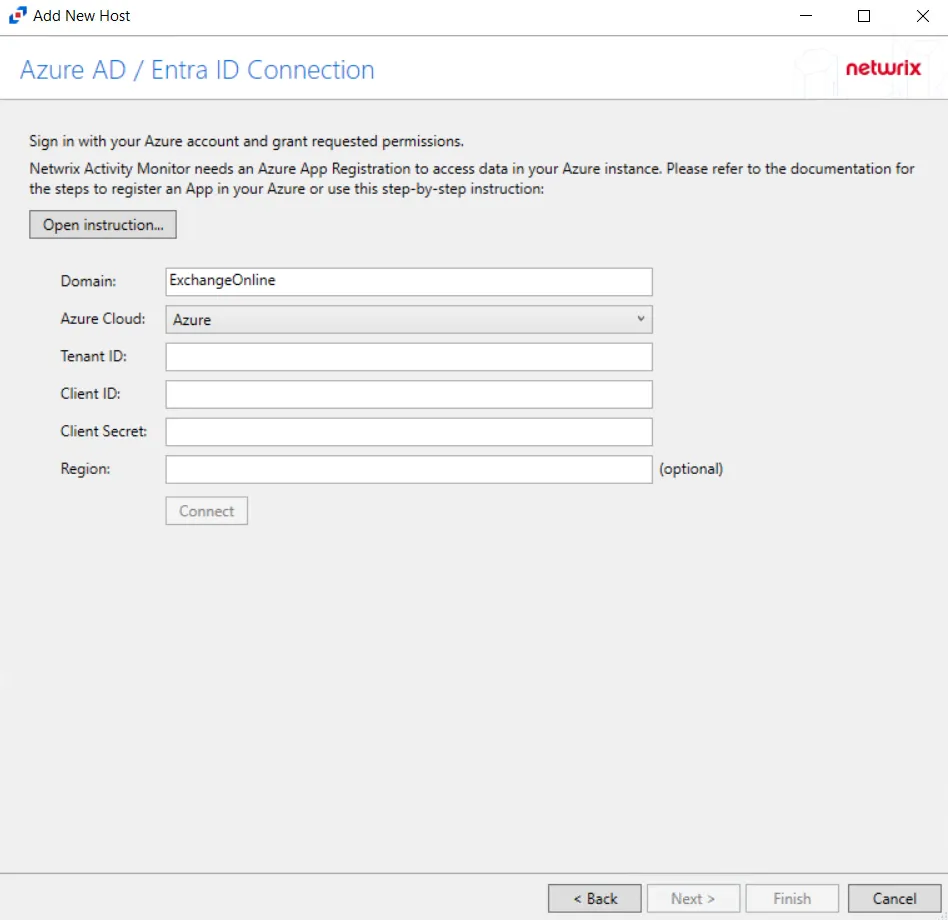
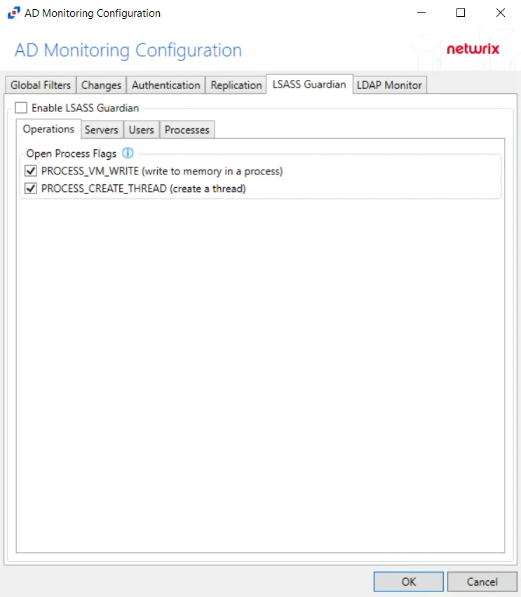
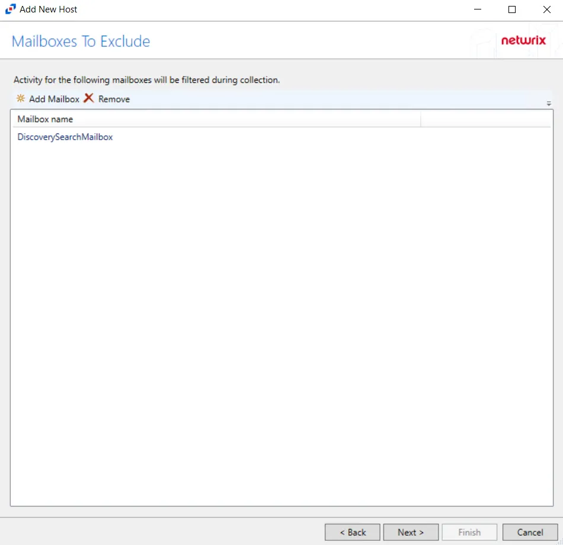
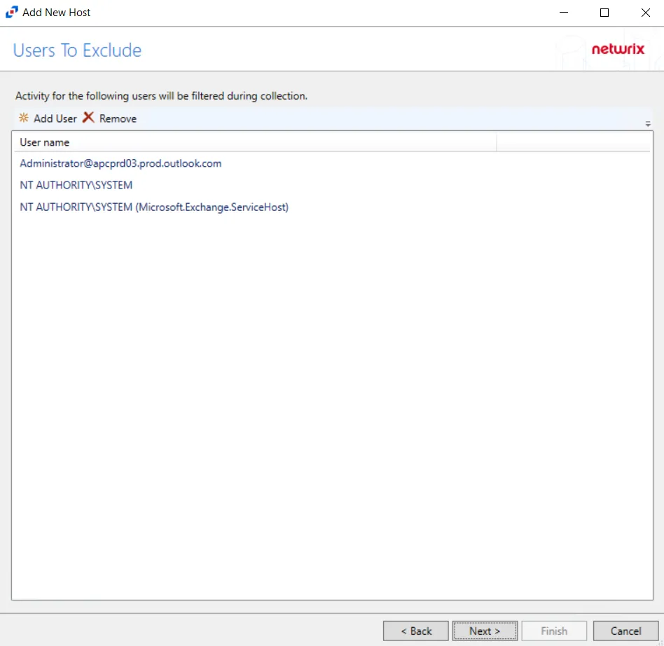
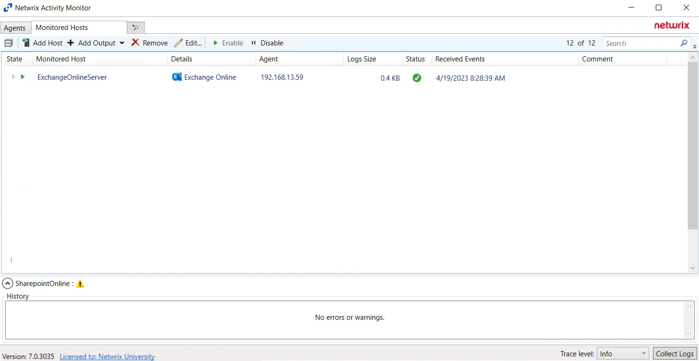

# Exchange Online

Prior to adding an Exchange Online host to the Activity Monitor, the prerequisites for the target
environment must be met. See the
[Exchange Online Activity Auditing Configuration](../../../../config/exchangeonline/activity.md)
topic for additional information.

_Remember,_ the Activity Agent must be deployed to a Windows server that acts as a proxy for
monitoring the target environment.

## Add Exchange Online Host

Follow the steps to add an Exchange Online host to be monitored.

**Step 1 –** In the Activity Monitor, go to the Monitored Hosts tab and click Add. The Add New Host
window opens.

**Step 2 –** On the Choose Agent page, select the Agent to monitor the storage device.

**Step 3 –** On the Add Host page, select the Exchange Online radio button and enter the domain
name.

_(Optional)_ Enter a comment for the Exchange Online host.

**Step 4 –** On the Azure AD / Entra ID Connection page, enter Tenant ID, Client ID, Client Secret,
and Region(optional) then click **Connect** to verify the connection.. Click **Open Instruction...**
for steps on registering the Activity Monitor with Microsoft Azure. Click **Next**.

**Step 5 –** On the Exchange Online Operations page, configure the options found in the following
tabs:

- Admin Activity
- Mailbox Audit
- DLP
- Other

These options can be configured again in a Exchange Online host's properties window. See the
[Operations Tab](../../outputs/operations.md) for additional information. Click **Next**.

**Step 6 –** Click **Add Mailbox** to display the Select User dialog box. Specify the mailboxes that
will be filtered during collection. Click **Next**.

**Step 7 –** Click **Add User** to display the Select User dialog box. Specify the user or email
that will be filtered during collection. Click **Next**.

**Step 8 –** On the Where To Log The Activity page, select whether to send the activity to either a
**Log File** or **Syslog Server**.

**Step 9 –** If **Log Files** is selected on the **Where To Log The Activity** page, the **File
Output** page can be configured. The configurable options are:

- Specify output file path – Specify the file path where log files are saved. Click the ellipses
  button (**...**) to open the Windows Explorer to navigate to a folder destination. Click **Test**
  to test if the path works.
- Period to keep Log files – Log files will be deleted after the period entered number of days
  entered. The default is 10 days. Use the dropdown to specify whether to keep the Log files for a
  set amount of Minutes, Hours, or Days.
- This log file is for Netwrix Access Analyzer (formerly Enterprise Auditor) (StealthAUDIT) – Enable
  this option to have Netwrix Access Analyzer (formerly Enterprise Auditor) collect this monitored
  host configuration

    **_RECOMMENDED:_** Identify the configuration to be read by Netwrix Access Analyzer (formerly
    Enterprise Auditor) when integration is available.

    - While the Activity Monitor can have multiple outputs per host, Netwrix Access Analyzer
      (formerly Enterprise Auditor) can only read one of them.

Click **Next**.

**Step 10 –** If Syslog Server is selected on the **Where To Log The Activity** page, the Syslog
Output page can be configured. The configurable options are:

- Syslog server in SERVER[:PORT] format – Type the **Syslog server name** with a SERVER:Port format
  in the textbox.
    - The server name can be short name, fully qualified name (FQDN), or IP Address, as long as the
      organization’s environment can resolve the name format used. The Event stream is the activity
      being monitored according to this configuration for the monitored host.
- Syslog Protocol – Identify the **Syslog protocol** to be used for the Event stream. The drop-down
  menu includes:

    - UDP
    - TCP
    - TLS

    The TCP and TLS protocols add the Message framing drop-down menu. See the
    [Syslog Tab](../../outputs/syslog.md) topic for additional information.

- The Test button sends a test message to the Syslog server to check the connection. A green check
  mark or red will determine whether the test message has been sent or failed to send. Messages vary
  by Syslog protocol:

    - UDP – Sends a test message and does not verify connection
    - TCP/TLS – Sends test message and verifies connection
    - TLS – Shows error if TLS handshake fails

    See the [Syslog Tab](../../outputs/syslog.md) topic for additional information.

Click **Finish**.

The added Exchange Online host is displayed in the monitored hosts table. Once a host has been added
for monitoring, configure the desired outputs. See the [Output for Monitored Hosts](../output.md)
topic for additional information.

## Host Properties for Exchange Online

Configuration settings can be edited through the tabs in the host’s Properties window. The
configurable host properties are:

- [Connection Tab](../properties/connection.md)
- [Inactivity Alerts Tab](../properties/inactivityalerts.md)

See the [Host Properties Window](../properties/overview.md) topic for additional information.
