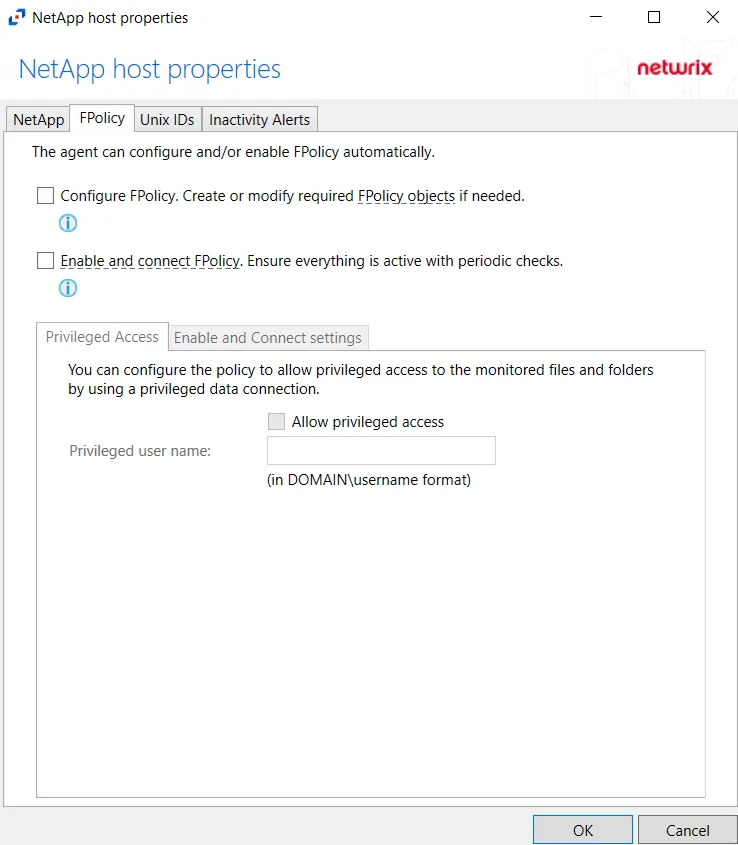
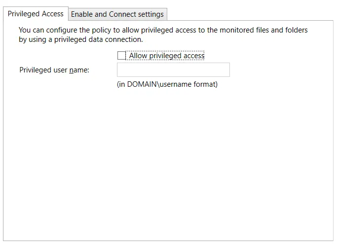
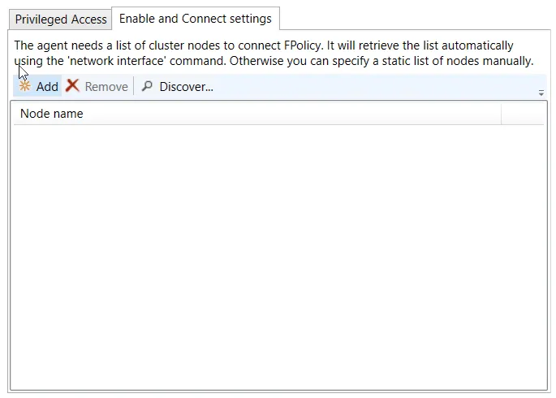
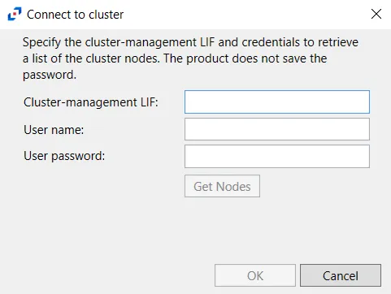

# FPolicy Tab

The FPolicy tab allows users to modify FPolicy settings for NetApp devices, privileged access, and
enabling/connecting to cluster nodes.

On the **FPolicy** tab, the agent can configure and/or enable FPolicy automatically. The recommended
setting is dependent on the type of NetApp device being targeted. The permissions required for each
option are listed. See the
[NetApp Data ONTAP 7-Mode Activity Auditing Configuration](../../../../config/netapp7mode/activity.md)
topic or the
[NetApp Data ONTAP Cluster-Mode Activity Auditing Configuration](../../../../config/netappcmode/activity.md)
topic for additional information.

At the bottom are two additional tabs with setting options. On this tab, specify the protocols to
monitor by selecting the radio buttons.

## Privileged Access Tab

The Privileged Access tab is enabled when the Configure FPolicy checkbox is selected at the top. The
Privileged Access tab must be configured if automatic configuration of the FPolicy for NetApp Data
ONTAP Cluster-Mode devices is used. See the
[Configure Privileged Access](../add/netapp.md#configure-privileged-access) topic for additional
information.

## Enable and Connect settings Tab

The Enable and Connect settings tab is enabled when the Enable and connect FPolicy checkbox is
selected.

**NOTE:** Adding nodes are not needed if set user is using a role that has Network Interface
permissions.

Add a list of cluster nodes to connect to FPolicy by clicking Add, which opens the Add or Edit
Cluster Node window. Enter at least one cluster node in the textbox. Separate multiple nodes with
either commas (,), semicolons (;), or spaces. Click OK and the node(s) is displayed in the **Node
name** list.

Click Discover to open the Connect to cluster window and retrieve nodes from the cluster.

Specify the Cluster-management LIF and then enter user credentials which will be used to retrieve a
list of the cluster nodes. This credential must have at least read-only rights to run the system
node show command on the cluster. Click Get Nodes. If a successful connection is not achieved, the
message indicates the error. If a successful connection is achieved, the message indicates how many
cluster nodes were discovered. Click OK and all discovered nodes are displayed in the **Node name**
list.

Use the Remove button to remove the selected node from the list.

## Changing the FPolicy Heartbeat Interval

The activity agent periodically checks for and re-enables any StealthAUDIT filter policies which had
been disabled for any reason, i.e. a network outage. Follow the steps to change the frequency of
checks.

**Step 1 –** Using Regedt32 navigate to:

HKEY_LOCAL_MACHINE\SYSTEM\CurrentCotrolSet\Services\FPolicyServerSvc\Parameters

**Step 2 –** Right-click on TimeInterval and select Modify.

**Step 3 –** Change “Base” to Decimal.

**Step 4 –** Set the “Value Data” to an integer value which represents how often, in minutes, the
service should poll corresponding NetApp filers.

**Step 5 –** Restart both the Stealthbits NetApp File Activity Monitoring Service
(**FPolicyServerSvc**) and the Stealthbits Logging Service for Network Appliances (**FSACLogging**)
on the activity agent server.

The activity agent now checks for disabled filter policies according to the modified heartbeat
interval.

## Resources Required for NetApp Monitoring

Each individual NetApp filer being monitored impacts local system resources and requires disk space.
These vary based on configuration settings chosen along with user activity. Average FPolicy and
associated Logging service resource consumption may be around 2% CPU usage and 10 MB of RAM. Average
disk space required per daily activity log file retained locally may be around 300 MB per filer.
