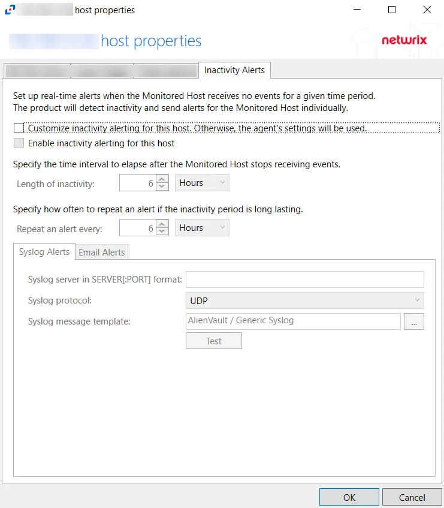
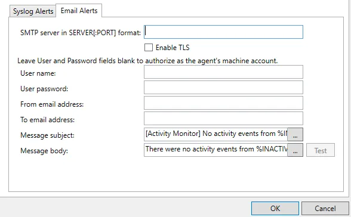

# Inactivity Alerts Tab

The Inactivity Alerts tab on a host's Properties window is used to configure alerts that are sent when monitored hosts receive no events for a specified period of time.

The configurable options are:

- Customize inactivity alerting for this host. Otherwise, the agent's settings will be used – Check this box to enable customization of alert settings for Monitored Hosts
- Enable inactivity alerting for this host – Check this box to enable inactivity alerts for host.
- Length of inactivity – Specify how much time must pass before an inactivity alert is sent out. The default is __6 hours__.
- Repeat an alert every – Specify how often an alert is sent out during periods of inactivity. The default is __6 hours__.

## Syslog Alerts Tab

Configure Syslog alerts using the Syslog Alerts Tab.

The configurable options are:

- Syslog server in SERVER[:PORT] format – Type the __Syslog server name__ with a SERVER:Port format in the textbox.
- Syslog protocol – Identify the Syslog protocol to be used for the alerts

  - UDP
  - TCP
  - TLS
- Syslog message template – Click the ellipsis (…) to open the Syslog Message Template window. The following Syslog templates have been provided:

  - AlienVault / Generic Syslog
  - CEF – Incorporates the CEF message format
  - HP Arcsight
  - LEEF – Incorporates the LEEF message format
  - LogRhythm
  - McAfee
  - QRadar – Use this template for IBM QRadar integration. See the [Netwrix File Activity Monitor App for QRadar](../../../siem/qradar/overview.md) topic for additional information.
  - Splunk – Use this template for Splunk integration. See the [File Activity Monitor App for Splunk](../../../siem/splunk/overview.md) section for additional information.
  - StealthDEFEND – Use this template for Netwrix Threat Manager integration. This is the only supported template for Threat Manager.

## Email Alerts Tab

Configure Email alerts using the Email Alerts Tab.

The configurable options are:

- SMTP server in SERVER[:PORT] format – Enter the SMTP server for the email alerts

  - Enable TLS – Check the box to enable TLS encryption
- User name – _(Optional)_ User name for the email alert
- User password – _(Optional)_ Password for the username
- From email address – Email address that the alert is sent from
- To email address – Email address that the alert is sent to
- Message subject – Subject line used for the email alert. Click the ellipses (...) to open the __Message Template__ window.
- Message body – Body of the message used for the email alert. Click the ellipses (...) to open the __Message Template__ window.
