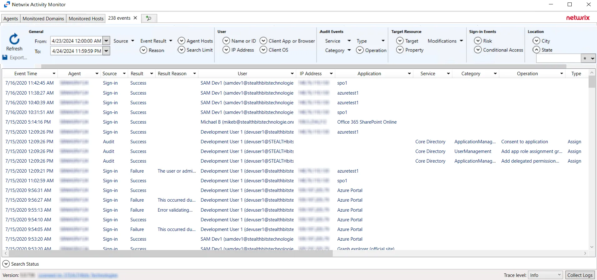

# Exchange Online Search Results

When a search has been started, the Search Status table at the bottom displays the percentage complete according to the size and quantity of the activity log files being searched per activity agent. You can [Filter](../overview.md#filter) and [Sort](../overview.md#sort) the results using the column headers. Below the Search button is the [Export](../overview.md#export) option.

The results data grid columns display the following information for each event:

- Event Time – Date timestamp of the event
- Agent – Agent which monitored the event
- Source – Indicates the source of the activity event
- Operation - Operation associated with event
- User – Indicates user account associated with the event
- User Type - Type of user associated with event
- External – Indicates whether external sharing is associated with the event
- IP Address – Indicates the IP Address associated with the event
- Object - Object associated with event
- Mailbox - The mailbox associated with the event
- Modified - Indicates whether a modification is associated with the event
- DLP Policy - If applicable, indicates the DLP Policy associated with the event

At the bottom of the search interface, additional information is displayed for selected events in the data grid. The Attribute Name, Operation, Old Value, and New Value for the logged event (as applicable to the event) are displayed.
