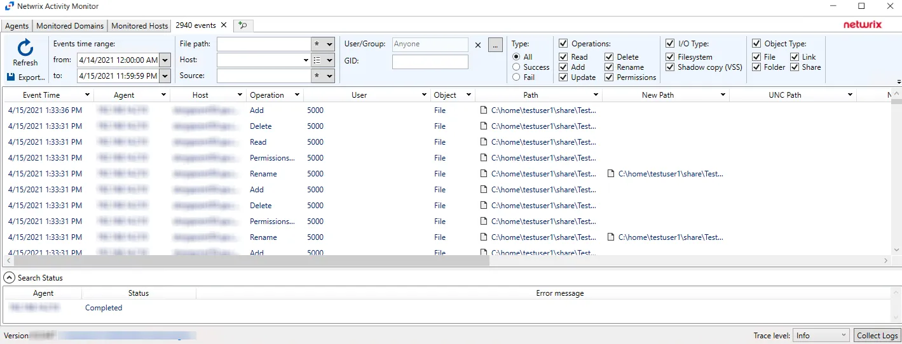

# Linux Search Results

When a search has been started, the Search Status table at the bottom displays the percentage
complete according to the size and quantity of the activity log files being searched per Linux
agent. You can [Filter](../overview.md#filter) and [Sort](../overview.md#sort) the results using the
column headers. Below the Search button is the [Export](../overview.md#export) option.

The results data grid columns display the following information for each event:

- Event Time – Date timestamp of the event
- Agent – Agent which monitored the event
- Host – Monitored host where the event occurred
- Operation – Type of the activity event which was monitored
- User – User account that performed the activity event
- Object – Type of object the activity event occurred upon:

    - File
    - Folder
    - Unknown

- Path – Path where the operation occurred
- New Path – For rename operation events only, the path’s new location/name
- UNC Path – UNC path employed by a remote user to access the share, folder, and/or file
- New UNC Path – For rename operation events only, the UNC path’s new location/name employed by a
  remote user
- Source – Indicates the source of the activity event
- Share Name – Name of share where the activity event occurred. This includes NFS.
- I/O Type – Displays the input/output type
- Protocol — Will be LOCAL for Linux Activity
- Protocol Version — This field is empty for Linux Activity
- GID — Group ID associated with event

At the bottom of the search interface, additional information is displayed for selected events in
the data grid. The Attribute Name, Operation, Old Value, and New Value for the logged event (as
applicable to the event) are displayed.
