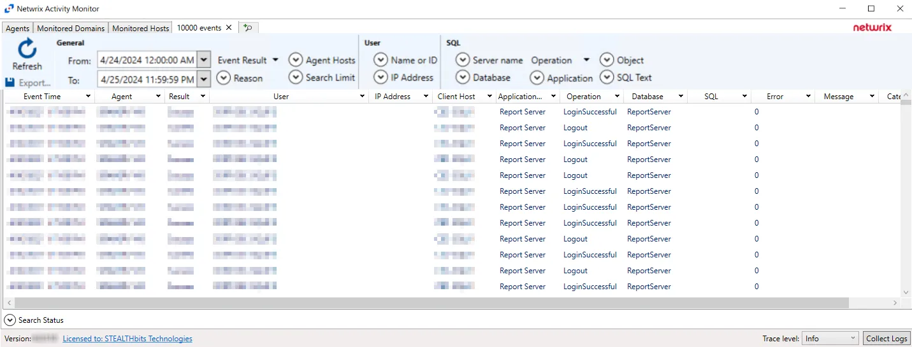

# SQL Server Search Results

When a search has been started, the Search Status table at the bottom displays the percentage
complete according to the size and quantity of the activity log files being searched per activity
agent. You can [Filter](../overview.md#filter) and [Sort](../overview.md#sort) the results using the
column headers. Below the Search button is the [Export](../overview.md#export) option.

The results data grid columns display the following information for each event:

- Event Time – Date timestamp of the event
- Agent – Agent which monitored the event
- Result – Indicates whether the event type was a success
- User – User account that performed the activity event
- IP Address – IP Address of the client host associated with the event
- Client Host – Name of the client host associated with the event
- Application Name – Name of the application associated with the event
- Operation – The type of operation associated with the event
- Database – The type of database associated with the event
- SQL – The SQL Server Query text associated with the event
- Error – Indicates SQL Server Error Code associated with the event
- Message – Description of the error associated with the event
- Category – Category of the error associated with the event

At the bottom of the search interface, additional information is displayed for selected events in
the data grid. The Attribute Name, Operation, Old Value, and New Value for the logged event (as
applicable to the event) are displayed.
