# Manually Install the AD Module

The AD Module, powered by Threat Prevention, can only be installed on domain controllers.

Follow the steps to manually deploy the AD Module.

**Step 1 –** From the Threat Prevention server, copy the Agent executable (
`...\Netwrix\Netwrix Threat Prevention\SIEnterpriseManager\Setup\SI Agent.exe`) to the machine where
you want to install the Agent. Then run the executable. The Netwrix Threat Prevention Windows Agent
Setup wizard opens.

**Step 2 –** On the Welcome page, click **Install**. The Setup Progress page is displayed, followed
by another Welcome page.

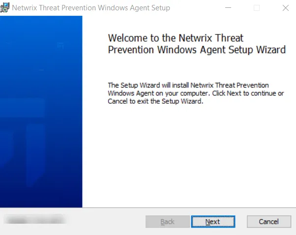

**Step 3 –** Click **Next**.

**Step 4 –** On the End-User License Agreement page, check the **I accept the terms in the License
Agreement** box and click **Next**.

**Step 5 –** _(Optional)_ On the Destination Folder page, change the installation directory
location.

- To change the default installation directory location, click **Change…**.

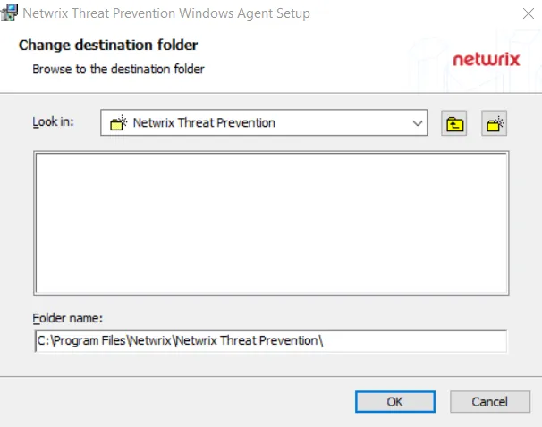

> > - Use the Look In field to select the desired installation folder.
> > - When the Folder name is as desired, click **OK**. The wizard returns to the Destination Folder
> >   page.
> > - Click **Next**.

> To use the default installation directory location, skip the previous step and click **Next** on
> the Destination Folder page.

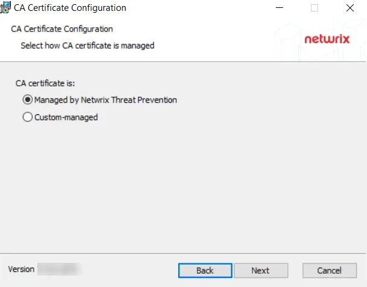

**Step 6 –** Keep the default radio button selection, Managed by Threat Prevention.

**NOTE:** The CA Certificate Configuration page is not applicable to the Activity Monitor.

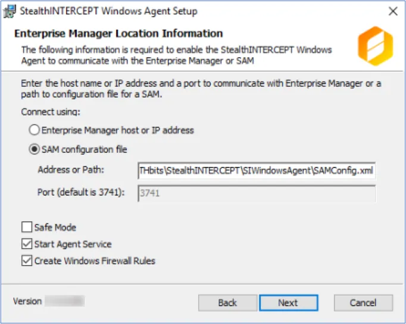

**Step 7 –** On the Enterprise Manager Location Information page, select the **Option** button for a
product to enable communication with it.

- Select the **SAM configuration file** radio button.
- In the **Address or Path** field, enter the path to the activity agent configuration file for this
  host. Remember, the Activity Monitor activity agent must already be deployed on the domain
  controller and enabled before installing the AD Agent. The default path is:
  `…\STEALTHbits\StealthINTERCEPT\SIWindowsAgent\SAMConfig.xml`
- The port configuration only applies to the Enterprise Manager Host option.
- Configure additional Agent options as desired:

    - Safe Mode

        - The Safe Mode option prevents the **Windows AD Events** monitoring module from loading if
          the LSASS DLL versions has been modified since the last time the Threat Prevention Windows
          Agent service was started.

    - Start Agent Service

        - The **Start Agent Service** option starts the Threat Prevention Windows Agent service
          after the installation is complete. If the Threat Prevention Windows Agent service is not
          started at the time of installation, the Activity Monitor Agent will start as needed.

    - Create Windows Firewall Rules

        - The **Create Windows Firewall Rules** option creates the rules needed to open this port
          during the installation process. If using a third party firewall, uncheck this option and
          manually create the necessary firewall rules.

- When the settings are configured, click **Next**.

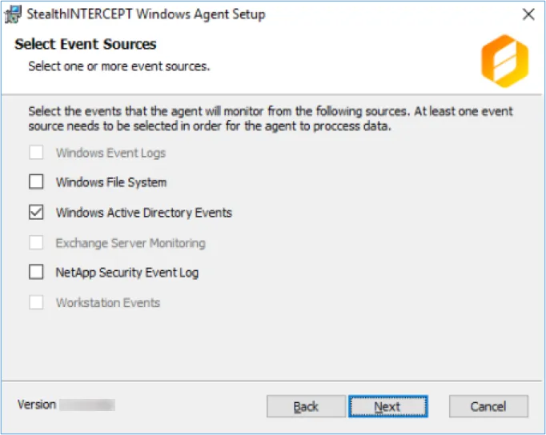

**Step 8 –** On the Select Event Sources page, select **Windows Active Directory Events** as needed
by the Activity Monitor for the Active Directory solution. Click **Next**.

**Step 9 –** On the Ready to install Threat Prevention Windows Agent page, click **Install**. The
Setup wizard displays the installation status.

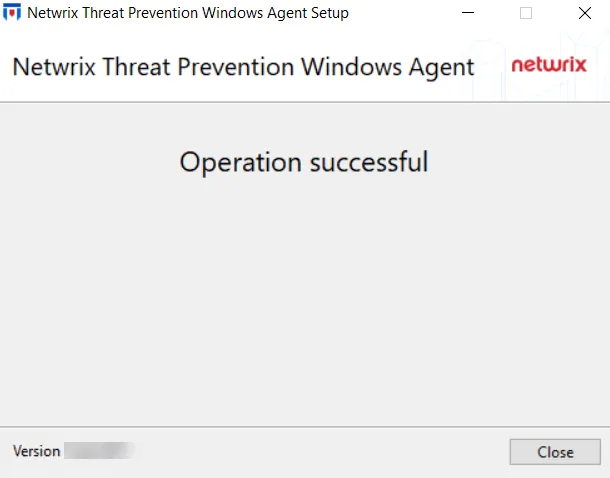

**Step 10 –** When installation is complete, click **Close**.

The AD Module (SI Agent) is now installed on the server.

## Add the AD Agent to the Console

Follow the steps to add the Activity Monitor Windows Agent (with the AD Module) to the Console:

**Step 1 –** Open the Activity Monitor Console.

**Step 2 –** On the Agents tab, click **Add Agent**. The Add New Agent(s) window opens.

**Step 3 –** Click the **install agents on Active Directory domain controllers** link.

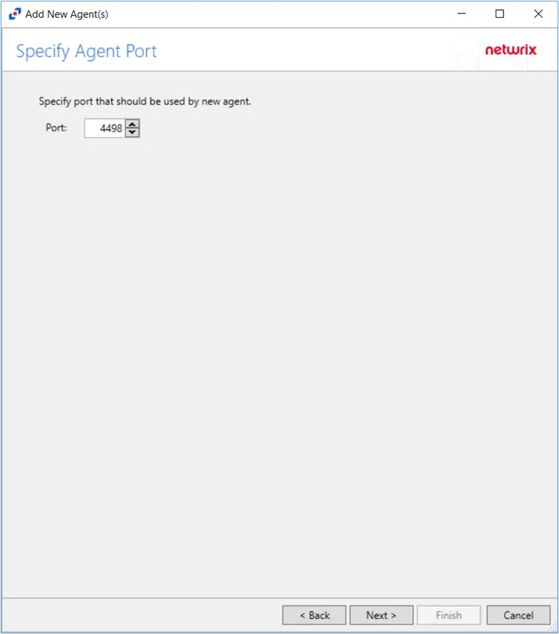

**Step 4 –** Specify the port for the Activity Monitor Agent. Click **Next**.

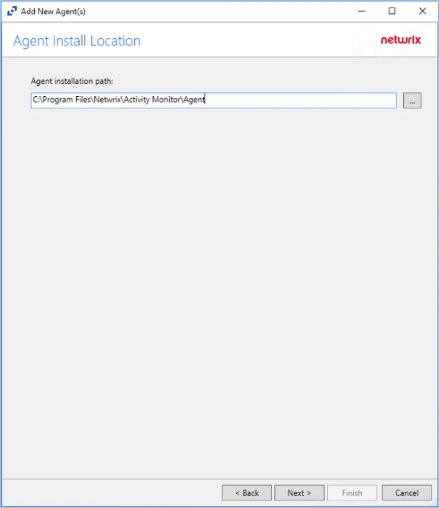

**Step 5 –** Specify the path of the Activity Monitor Agent, that has already been installed. Click
**Next**.

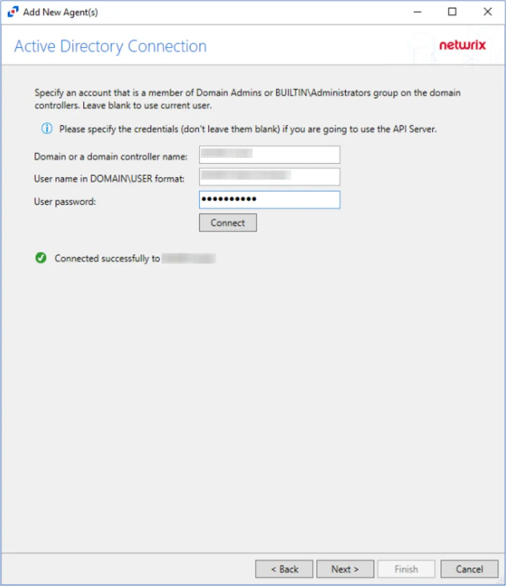

**Step 6 –** On the Active Directory Connection page, specify the credentials for the domain or
domain controller(s) where the agent is installed. Click **Connect** to verify connection to the
domain. Click **Next**.

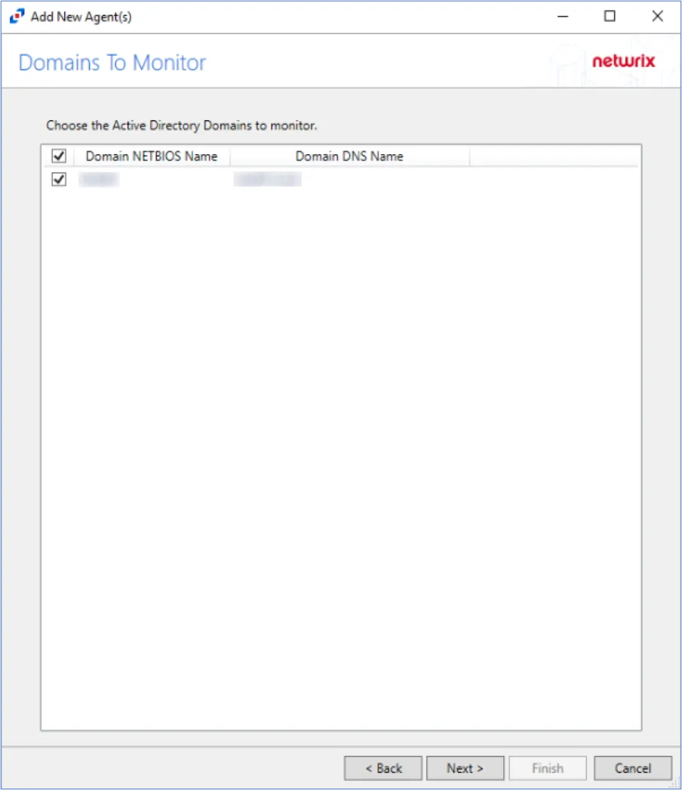

**Step 7 –** Select the domain of the domain controller(s) where the agent is installed. Click
**Next**.

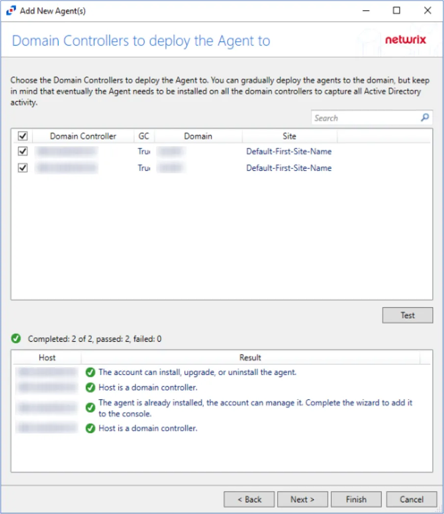

**Step 8 –** Select the domain controller(s) where the agent is installed. Click **Test**.

**NOTE:** When clicking Test while adding the Agent to the Console, the connection may fail. When
clicking Test, the Activity Monitor verifies not only its ability to manage the agent but the
console's ability to deploy the agent as well. Errors can be ignored if the agent was manually
installed.

**Step 9 –** Ignore the warning messages that the agent cannot be installed or upgraded and click
**Next**.

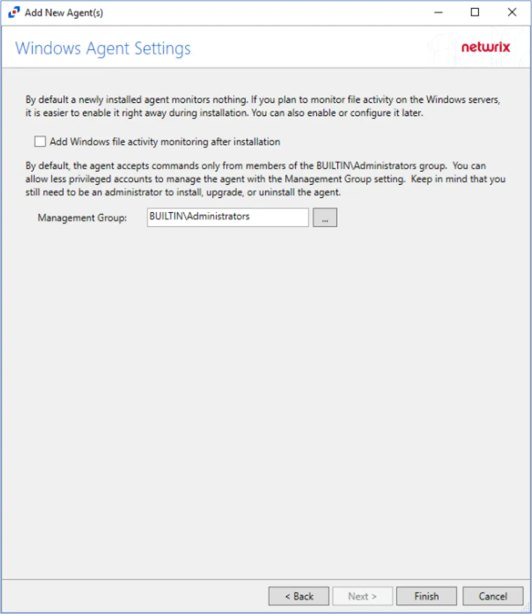

**Step 10 –** Specify the Activity Monitor Agent Management Group (if desired). Click **Finish**.

**NOTE:** The Activity Monitor Agent Management Group allows users in the specified group to manage
agents, but does not allow users in specified group to install, upgrade, or uninstall agents.

The console will automatically detect the agent as it is already installed.

The Agent is now added to the Activity Monitor Console.
