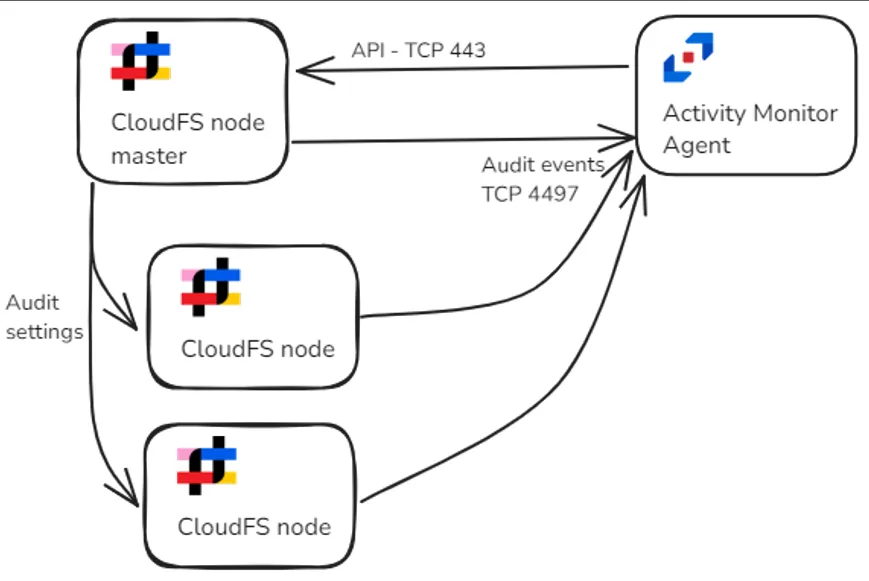

# Panzura CloudFS Monitoring

Netwrix Activity Monitor can be configured to monitor file system activity on Panzura CloudFS file-based storage.

The monitoring process is based on two technologies:

- Third Party Vendor Support auditing feature – Delivers audit events to Activity Monitor Agents
- CloudFS API – Used to register Activity Monitor as a consumer of audit events to query and update auditing settings

Auditing must be enabled on the master Panzura node and optionally overridden on the subordinate nodes to support different deployment scenarios depending on the expected load and network latency. A single agent monitors several Panzura nodes.

Audit events are distributed between two agents. Audit settings are overridden on one Panzura node.

The monitoring process relies on the Third Party Vendor Support auditing feature of the Panzura CloudFS platform, which uses the AMQP protocol for event delivery. Unlike typical uses of the AMQP protocol that require messaging middleware, the Panzura master and subordinate nodes connect directly to the Netwrix Activity Monitor Agent, eliminating the need for middleware.

Netwrix Activity Monitor uses Panzura API to register itself as a consumer of auditing events. It also uses the API to perform periodic checks to ensure the auditing settings in Panzura are correct. The credentials to access the API must be specified when a Panzura host is added to Activity Monitor for monitoring. Additionally, the IP address of the port is 4497 by default and can be customized in the properties for the Agent.

__NOTE:__ See the [Panzura](../../activitymonitor/admin/monitoredhosts/add/panzura.md) topic for additional information on Panzura Host.

To prepare Panzura CloudFS for monitoring, auditing must be enabled.

## Enable Auditing in CloudFS

Auditing in CloudFS can be enabled either automatically or manually.

___RECOMMENDED:___ Using the automatic option using the CloudFS API streamlines the configuration process and ensures that auditing remains enabled and accurate.

## Automatic Configuration

Netwrix Activity Monitor uses the CloudFS API to configure Third Party Vendor Support auditing option.

If a master node is targeted, the product will configure the global audit settings and assign to be pushed to subordinate nodes. If a subordinate node is targeted, the product will configure the local audit settings to override the global ones.

The product will also ensure the settings are correct with periodic checks.

## Manual Configuration

Follow these steps to enable auditing.

__Step 1 –__ Navigate to __Audit Settings__ > __Third Party Support__.

__Step 2 –__ Enable the __Generate Third Party Logs__ option.

__Step 3 –__ Enable the __Push to Subordinate(s)__ option.

__Step 4 –__ Enter __other__ as the Vendor Name.

__Step 5 –__ Under Actions, specify close, create, delete, delxattr, mkdir, move, open, read, remove, rename, rlclaim, rmdir, setxattr, and writeUnder .

If you require monitoring of Directory Read/List operations, which typically generate a high volume of data, also include readdir to the list.

__Step 6 –__ Specify \* in Include Files.

__Step 7 –__ Specify - in Exclude Files.

__Step 8 –__ Finally, add the Panzura host to be monitored in the Activity Monitor Console.

Auditing is now enabled.

## Network Configuration

Activity Monitor agents register themselves as consumers of audit data via the CloudFS API. The agents pass their IP address and port along with other AMQP parameters. Panzura nodes use this information to establish connections with the Activity Monitor agents.

__NOTE:__ The address and port used for registration can be found or modified in the agent’s settings.

Follow the steps for network configuration.

__Step 1 –__ Open Activity Monitor Console.

__Step 2 –__ On the Agents tab, select an agent and click __Edit__.

__Step 3 –__ Use the Network tab to select the network interface that will be used for registration.

__Step 4 –__ Use the Panzura tab to modify the port. The default port is 4497.

The agent will configure the Windows Firewall to allow incoming connections to the specified port automatically. Use the following table to configure the firewall.

| Communication Direction | Protocol | Ports | Description |
| --- | --- | --- | --- |
| Activity Monitor Console to Activity Monitor Agents | TCP | 4498 | Agent communication |
| Activity Monitor Agent to Panzura nodes | TCP/HTTPS | 443 | CloudFS API |
| Panzura nodes to Activity Monitor Agent | TCP/AMQP | 4497 | Audit events |
