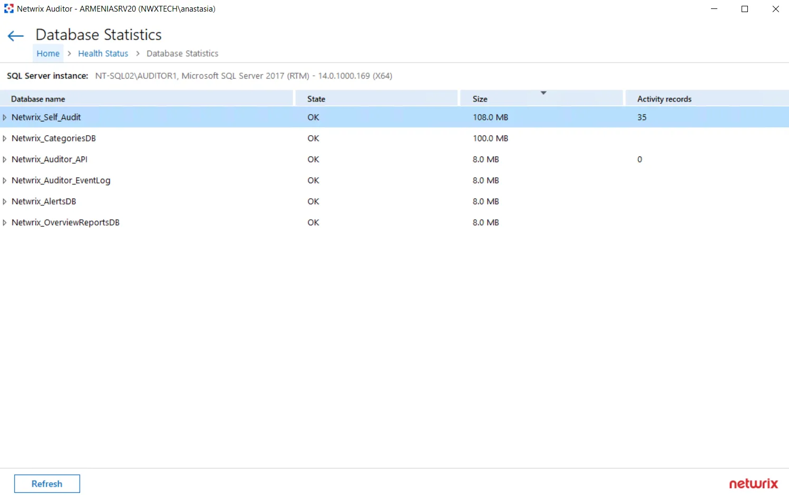
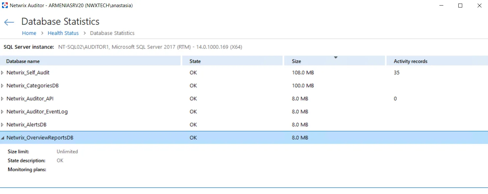

# Database Statistics

Databases may tend to run out of free space due to poor capacity provisioning or to retention
settings not configured properly. Use the Database statistics widget to examine database size and
adjust retention accordingly. The widget displays the name of default SQL Server instance hosting
all Netwrix Auditor databases, the overall database capacity at the moment and its change over the
last day (24 hours).

Transaction logs size is not included in the calculations.

After you click View details, the following information will be displayed for the specified SQL
Server instance:

The Database name column contains the list of Netwrix Auditor databases hosted by the specified
instance of the SQL Server:

- Special databases are created automatically on the default SQL Server instance to store:
    - alerts—_Netwrix_AlertsDB_ database
    - activity records collected using Integration API—_Netwrix_Auditor_API_ database
    - internal event records—_Netwrix_Auditor_EventLog_ database
    - data collected by Netwrix Auditor self-audit—_Netwrix_Self_Audit_ database
    - data needed for overview reports generation—_Netwrix_OverviewReportsDB_
- To store data from the data sources included in the monitoring plan, dedicated Audit databases are
  created and named by user (default name format is _Netwrix_Auditor_`<monitoring_plan_name>`\_)

The following capacity metrics are displayed for each database:

- **State**—database state summary
- **Size**—current database size (logs are not included)
- **Activity records**—number of the activity records stored in the database at the moment

After you expand the database node, the detailed database properties will be shown:

These properties are as follows:

| Property             | Possible Values                                                                                                                                                     | Description                                                                                                                          |
| -------------------- | ------------------------------------------------------------------------------------------------------------------------------------------------------------------- | ------------------------------------------------------------------------------------------------------------------------------------ |
| Size limit           | _`<size_limit>`_                                                                                                                                                    | For SQL Server Express Edition–shows database size limitations                                                                       |
| Unlimited            |                                                                                                                                                                     |                                                                                                                                      |
| State description    | OK                                                                                                                                                                  | Database is operating properly.                                                                                                      |
| Capacity error       | Database is running low on disk space. -OR- Size limit for SQL Server Express Edition will be reached soon (threshold is 500 MB, i.e. 5% of 10 GB limit remaining). |                                                                                                                                      |
| Failed to store data | Failed to store data to the database due to some issues.                                                                                                            |                                                                                                                                      |
| Unavailable          | Failed to connect to the database.                                                                                                                                  |                                                                                                                                      |
| Upgrade in progress  | Database is being upgraded.                                                                                                                                         |                                                                                                                                      |
| Monitoring plans     | _`<monitoring_plan>`_                                                                                                                                               | All monitoring plans for which this database is a target. Usually it is recommended to configure a dedicated database for each plan. |

You can use the Search field, or apply a filter to display the information you need. For example, in
the Apply Filters dialog you can select the Show only plans with issues to display only the
monitoring plans that require attention and corrective actions.

This information will help you to troubleshoot the product operation, detect and eliminate the root
cause of the monitoring errors, providing for auditing continuity and compliance.
