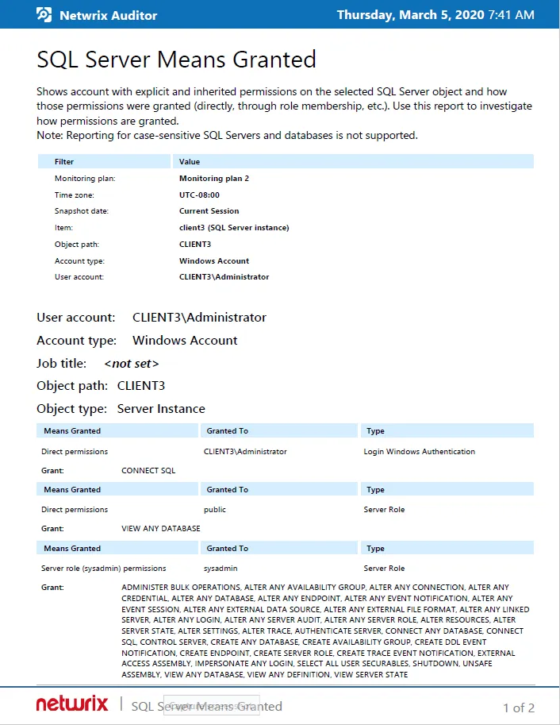
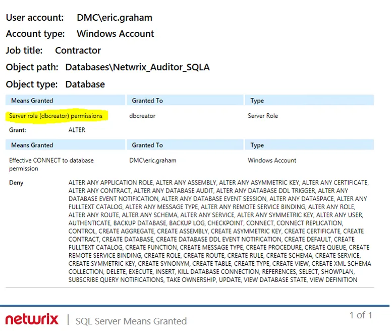

# SQL Server Means Granted

This report shows accounts with explicit and inherited permissions on the selected SQL Server object
and how those permissions were granted (directly, through role membership, etc.). Use this report to
investigate how permissions are granted.

Supported object types and attributes are listed in the
[SQL Server](../../../../configuration/sqlserver/overview.md) section.

To instruct Netwrix Auditor to collect data needed for this report, make sure that **Collect data
for state-in-time reports** option is selected in the monitoring plan properties.

## Reported data

The report has a summary section with general information on the selected SQL Server object, and the
details section presented in the table format.

The summary section shows:

- **User account** — name or SID of the account that has permissions on the selected object.

- **Account type** —possible values:
    - Windows Account
    - Login SQL Authentication
    - DB SQL User with password
- **Job title** —reported for Active Directory users as set in their corresponding attribute. If not
  set, _`<not set>`_ is reported.
- **Object path** —path to the monitored object, as formatted by Netwrix Auditor in the activity
  records (see '_What_' field in the reports, search results and activity summaries). For example,
  when reporting on the database hosted on selected SQL Server, the path will be as follows:
  _Databases\database_name_.
- **Object type** — monitored object type; for the full list of supported object types, refer to
  [SQL Server](../../../../configuration/sqlserver/overview.md).

The detailed information under summary includes:

- **Means granted** —how access permissions were granted to this account, e.g., _Direct permissions_
  or _Server role permissions_.
- **Granted to**— the security principal to which the access permissions were granted, e.g.
  _sysadmin_.
- **Type**— the security principal type, e.g. _Server role_.
- **Grant** —the set of permissions granted to this account on the selected object by all means.

Covering rules do not need to be applied, since **Grant** permissions are reported automatically
using these rules.

## Filters

This report has the following filters:

- **Monitoring plan** — name of the monitoring plan set to collect data from the SQL Server you
  need.
- **Time zone** — time zone where Netwrix Auditor server is located, for example, UTC-08:00. This
  value is filled in automatically.
- **Snapshot date** —select the date of state-in-time snapshot you want to report on. By default,
  the report includes data obtained during the latest data collection session (_Current Session_).
  To report on other snapshots, make sure they are available through import. For details, see
  **Manage historical snapshots** option description in the SQL Server monitoring plan
  documentation.
- **Item**—name of the SQL Server instance monitored with selected monitoring plan.
- **Object path** —path to the monitored object, as formatted by Netwrix Auditor in the activity
  records (see '_What_' field in the reports, search results and activity summaries). Wildcard (\*)
  is supported. For example, to report on the database hosted on selected SQL Server, specify the
  path as follows: _Databases\database_name_.
- **User account**—name or SID of the account that has permissions on the selected object. Default
  is _%_ (all accounts).
- **Account type** —possible values: _Windows Account_, _Login SQL Authentication_, _DB SQL User
  with password_.

## Considerations and limitations

- Reporting is not supported for the following objects:
    - Case-sensitive SQL Servers and databases
    - Read-only Filegroups
    - Contained databases.
- Permissions assigned using **With Grant option** are not reported (see
  [this Microsoft article](https://docs.microsoft.com/en-us/sql/t-sql/statements/grant-object-permissions-transact-sql?view=sql-server-ver15)
  on that means).
- When calculating effective rights and permissions, the following will not be considered:

    - Ownership chaining
    - Cross DB ownership chaining
    - Trustworthy database
    - SQL Server agent fixed database roles

## Usage example

When examining the **Object Permissions in SQL Server** report, database administrators in the
_Corp_ organization discovered that the accounts with Contractor job title has access to the
**SQLSrv01\SQLServer2016** instance. To explore how this could happen, they drilled down to the
**SQL Server Means Granted** report for that account by clicking the link in the **Means granted**
field for that account.

