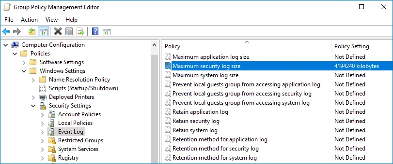

# Configure Security Event Log Size and Retention Settings

Follow the steps to configure Security Event Log settings:

**Step 1 –** Open the **Group Policy Management** console on any domain controller in the target
domain: navigate to Start > Windows Administrative Tools (Windows Server 2016 and higher) or
Administrative Tools (Windows 2012) **Group Policy Management.**

**Step 2 –** In the left pane, navigate to **Forest: `<forest_name>` > Domains > `<domain_name>`**
**> Domain Controllers**. Right-click the effective domain controllers policy (by default, it is the
**Default Domain Controllers Policy**), and select **Edit** from the pop-up menu.

**Step 3 –** Navigate to **Computer Configuration > Policies > Windows Settings > Security
Settings > Event Log** and double-click the **Maximum security log size** policy.

**Step 4 –** In the Maximum security log size Properties dialog, select **Define this policy
setting** and set maximum security log size to **4194240** kilobytes (4GB).

**Step 5 –** Select the **Retention method for security log** policy. In the Retention method for
security log Properties dialog, check **Define this policy** and select **Overwrite events as
needed**.

**Step 6 –** Run the following command to update group policy: `gpupdate /force`

**NOTE:** After configuring security event settings via Group Policy, you may notice that the log
size on a specific computer is not set correctly. In this case, follow the resolution steps from the
Netwrix Knowledge base article to fix the issue:
[Security log settings do not apply via GPO](https://helpcenter.netwrix.com/bundle/z-kb-articles-salesforce/page/kA04u000000HDk6CAG.html).
