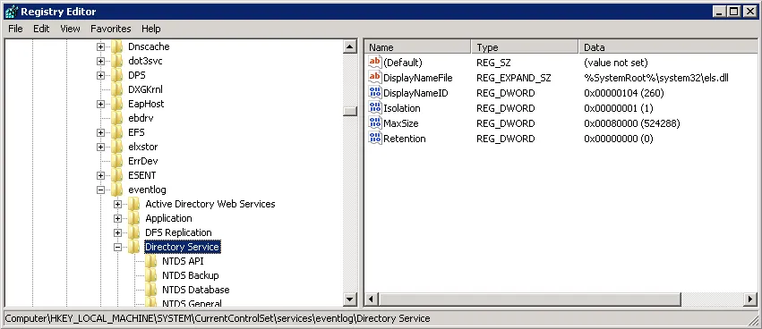
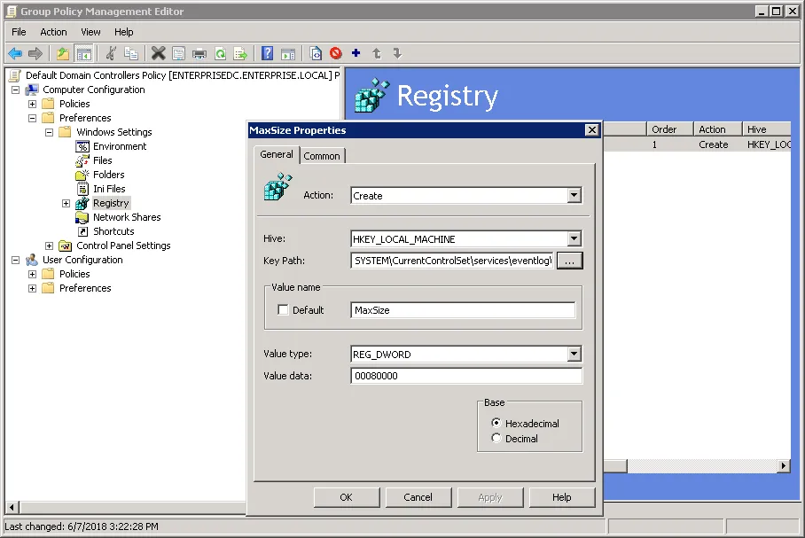

# Adjusting Event Log Size and Retention Settings

Consider that if the event log size is insufficient, overwrites may occur before data is written to
the Long-Term Archive and the Audit Database, and some audit data may be lost.

To prevent overwrites, you can increase the maximum size of the event logs and set retention method
for these logs to "_Overwrite events as needed_". This refers to the following event logs:

- Application
- Security
- Setup
- System
- Applications and Services logs > Microsoft>Windows > TaskScheduler > Operational
- Applications and Services logs > Microsoft > Windows > DNS-Server > Audit (only for DCs running
  Windows Server 2012 R2 and above)
- Applications and Services logs > AD FS > Admin log (for AD FS servers )

Refer to the following Microsoft
[article to read about the recommended event log settings](https://support.microsoft.com/en-us/help/957662/recommended-settings-for-event-log-sizes-in-windows).

The procedure below provides a possible way to specify the event log settings manually. However, if
you have multiple target computers, consider configuring these settings via Group Policy as also
described in this section

## Configure the Event Log Size Manually

Follow the steps to configure Event Log Size and Retention Settings.

**Step 1 –** On a target server, navigate to Start > Windows Administrative Tools > Event Viewer.

**Step 2 –** Navigate to Event Viewer tree > Windows Logs, right-click **Security** and select
**Properties**.

**Step 3 –** Make sure Enable logging is selected.

**Step 4 –** In the Maximum log size field, specify the desired log size.

**Step 5 –** Make sure the Do not overwrite events (Clear logs manually) check box is cleared. If
selected, change the retention method to _Overwrite events as needed (oldest events first)_.

Make sure the Maximum security log size group policy does not overwrite your log settings. To check
this, start the Group Policy Management console, proceed to the GPO that affects your server, and
navigate to Computer Configuration > Policies > Windows Settings > Security Settings > Event Log.

Repeat these steps for the following event logs:

- **Windows Logs** **>** **Application**
- **Windows Logs** **>** **System**
- **Applications and Services Logs > Microsoft > Windows > TaskScheduler > Operational**

    Configure setting for TaskScheduler/Operational log only if you want to monitor scheduled tasks.

- **Applications and Services Logs > Microsoft > Windows > DNS-Server > Audit**

    Configure setting for DNS log only if you want to monitor DNS changes. The log is available on
    Windows Server 2012 R2 and above and is not enabled by default. See Microsoft documentation for
    more information on how to enable this log.

- **Applications and Services Logs** **>** **AD FS** **>** **Admin**

    Applies to the AD FS servers.

## Configure the Event Log Size Using Group Policy

Personnel with administrative rights can use Group Policy Objects to apply configuration settings to
multiple servers in bulk.

Follow the steps to configure settings for Application, System and Security event logs.

**Step 1 –** Open the Group Policy Management Editor on the domain controller and go to **Computer
Configuration > Policies > Administrative Templates > Windows Components > Event Log Service**.

**Step 2 –** Select the log you need.

**Step 3 –** Edit Specify the maximum log file size setting; the value is usually set to _4194240
KB_.

**Step 4 –** Specify retention settings for the log; usually it is Overwrite as needed.

Follow the steps to configure settings for other logs.

**Step 1 –** Open the registry editor and go to
HKEY_LOCAL_MACHINE\SYSTEM\CurrentControlSet\Services\EventLog\<log_name>. For example:
HKEY_LOCAL_MACHINE\SYSTEM\CurrentControlSet\Services\EventLog\Directory Service

**Step 2 –** Set the MaxSize to the required decimal value (in bytes).

You can configure Group Policy Preferences to push registry changes to the target domain computers.
For the example above (Directory Service Log), perform the following steps.

**Step 1 –** In Group Policy Management Console on the domain controller go to **Computer >
Preferences > Windows Settings > Registry**.

**Step 2 –** Right-click Registry and select **New > Registry Item**.

**Step 3 –** In the Properties window on the General tab select the following:

- Action > Create
- Hive > HKEY_LOCAL_MACHINE
- Key Path – browse to MaxSize value at the SYSTEM\CurrentControlSet\Services\EventLog\Directory
  Service  
  

**Step 4 –** Change the MaxSize REG_DWORD to the required decimal value (in bytes).

**Step 5 –** Save the preferences and link them to the necessary servers (OUs).

When finished, run the `gpupdate /force` command to force group policy update.
