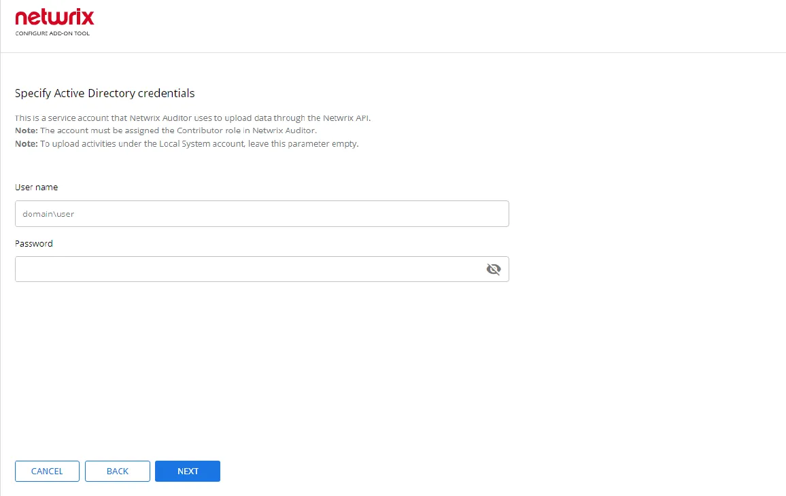

# Deployment Procedure

Follow the steps to install Microsoft Copilot add-on.

**Step 1 –** Accept EULA.

**Step 2 –** Select the installation folder and click **Next**.

**Step 3 –** Click **Install**. The wizard will start and ask the additional parameters.

## Configure Copilot for Monitoring

Follow the steps to configure Copilot for monitoring.

**Step 1 –** Make sure you have a storage account to store logs. To reduce the volume of the stored
logs and the corresponding cost, it is recommended to create a rule in Life Cycle Management for
this storage. Netwrix Auditor doesn't need historic logs, after the add-on has written them into the
database. Refer to the
[corresponding Microsoft article](https://learn.microsoft.com/en-us/azure/storage/blobs/lifecycle-management-overview?tabs=azure-portal)
for additional information.

**Step 2 –** Register an Azure App and grant it the following permissions:

- Microsoft.Graph — Domain.Read.All
- Office 365 Management APIs — ActivityFeed.Read

## Configure the add-on

Follow the steps to configure the add-on.

**Step 1 –** Specify Active Directory credentials.

- Username – Provide the name of the account under which the service runs. Unless specified, the
  service runs under the account currently logged on.
- Password – Provide the password for the selected account.

**Step 2 –** Enter Tenant ID, App ID and App Secret of the Azure App you registered for the add-on.
Click **Next**.

**Step 3 –** Click **Run** and close the window. The service should start the data collection now.
