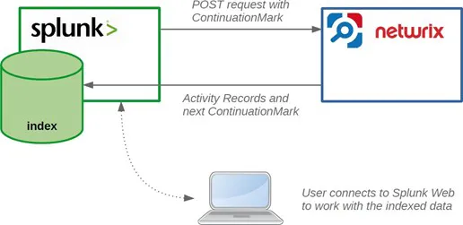

# Splunk

Netwrix Auditor is a visibility platform for user behavior analysis and risk mitigation that enables control over changes, configurations and access in hybrid IT environments to protect data regardless of its location. The platform provides security analytics to detect anomalies in user behavior and investigate threat patterns before a data breach occurs.

Splunk is a log management solution that enables search and visualization of data collected from the company's IT assets.

Netwrix Auditor add-on for Splunk works as an integration solution for both products: it instructs Splunk to pull the audit data collected by Netwrix Auditor and stored to the audit databases in Netwrix-compatible form (activity records). This data is saved in the event log format recognized by Splunk and also mapped to the CIM data models — for normalization and better correlation with other log sources. With that automated flow, you can use Splunk Enterprise as your single pane of glass for aggregated data analysis. This makes the IT infrastructure monitoring more efficient and helps you keep tabs on your IT assets.

The major benefits- are:

- Aggregated audit data from the variety of sources available from a single console
- Efficient search through the audit data

## Compatibility notice

Netwrix Auditor add-on for Splunk is compatible with the following products:

- Splunk Enterprise 8.0.6 and 8.2.1
- Netwrix Auditor 9.96 and above

## Supported data sources

Netwrix Auditor add-on for Splunk supports and provides CIM data models mapping for the following Netwrix Auditor data sources:

| Netwrix Auditor data source | CIM Data Model |
| --- | --- |
| Active Directory | Authentication  Change |
| Exchange | Change  Email |
| Exchange Online | Change  Email |
| File Servers | Change  Endpoint |
| Microsoft Entra ID | Authentication  Change |
| SharePoint | Change |
| SharePoint Online | Change |
| SQL Server | Authentication  Change |
| VMware | Authentication  Change |
| Windows Server | Change |

See [CIM Data Model Mapping](datamodelmap.md) for details.

## How It Works

Netwrix Auditor add-on for Splunk allows pulling activity records data from the Netwrix Auditor via its Integration API. Data is retrieved in JSON format, transferred over HTTPS and stored to Splunk index.

To learn more about Netwrix Auditor activity records, see the [Activity Records](../../api/postdata/activityrecords.md) topic for additional information.

For this data to be provided to Splunk, it adds a new Splunk source type, performing additional data parsing and field extraction. The audit data is also mapped into the Common Information Model (CIM) data models — for normalization and better correlation with other log sources.

On a high level, the solution works in the following steps.

__Step 1 –__ An IT administrator configures Netwrix Auditor Integration API settings to enable sharing Netwrix Auditor data with external applications.

__Step 2 –__ On the Splunk side, the IT administrator installs and configures the add-on, providing the necessary parameters for its operation: Netwrix Auditor Integration API host and account to access it with sufficient access rights.

__Step 3 –__ The IT administrator prepares a Splunk index to store the data that will be collected from Netwrix Auditor.

__Step 4 –__ Splunk starts pulling activity records via Netwrix Auditor Integration API by sending POST requests with Continuation Mark. Data is received in JSON format and stored in the specified Splunk index — to make it available for further search by Splunk.

__Step 5 –__ When search is performed, Splunk attempts to extract additional information available in the audit data and to map it to CIM data models.

User opens Splunk Enterprise to work with collected data:

- Search for the activity records in the specified index or data model
- Create reports and dashboards in Splunk

Report and dashboard creation in Splunk is outside the scope of this guide.

### Add-on delivery package

Netwrix Auditor add-on for Splunk delivery package is a ZIP archive that includes the following files:

| File name | Description |
| --- | --- |
| ta-netwrix-auditor-add-on-for- splunk-1.6.1.spl | Netwrix Auditor add-on for Splunk package. |

## Prerequisites

Before running the add-on, ensure that all the necessary components and policies are configured as follows:

| On... | Ensure that... |
| --- | --- |
| Auditor Server side | - Auditor version is 9.8 or later. - The Audit Database settings are configured in Auditor Server. See the [Prerequisites](../../api/prerequisites.md) and [Audit Database](../../admin/settings/auditdatabase.md) topics for additional information. - The TCP 9699 port (default Auditor Integration API port) is open for inbound connections. - The user retrieving data from the Audit Database is granted the Global reviewer role in Auditor or is a member of the Netwrix Auditor Client Users group. See the [Role-Based Access and Delegation](../../admin/monitoringplans/delegation.md) topic for additional information.  Alternatively, you can grant the Global administrator role or add the user to the Netwrix Auditor Administrators group. In this case, this user will have the most extended permissions in the product. |
| Splunk Enterprise | - Splunk version is 8.0.6 or higher. - Splunk Common Information Model add-on version 4.17.0 or higher. - Splunk Administrator or any other account with permissions to add add-ons, create indexes and data inputs. - The TCP 9699 port must be open on firewalls between Splunk and Netwrix Auditor server. |

### Considerations and limitations

- If the information is not available in the activity record received from Auditor, it will also not be available in Splunk.
- CIM might not have data models for some of the activity records received from Auditor; such information can only be accessed in Splunk using search by index.
