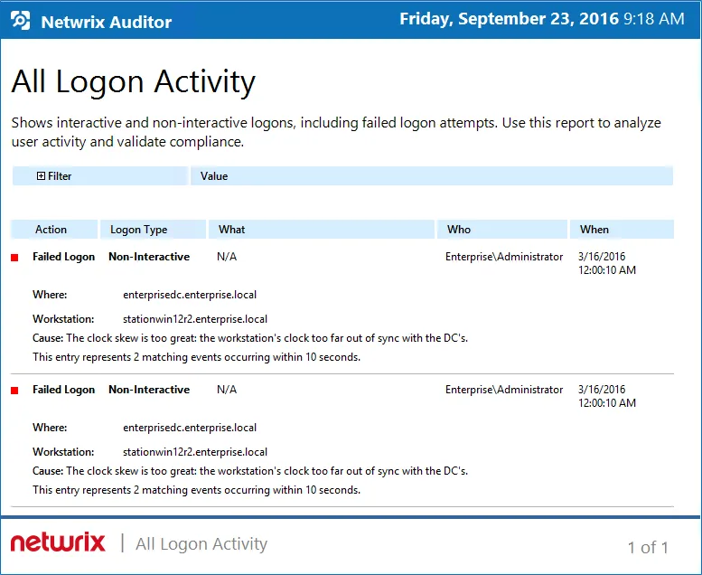
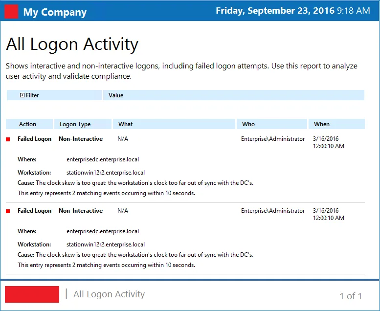

# Customize Branding

Netwrix Auditor allows customizing look and feel of your reports, search subscriptions and exported
search results—you can skip Netwrix logo, add your company logo and title. However, users are not
empowered to customize layout or color scheme.

Review the following for additional information:

- Customize Branding in AuditIntelligence Outputs
- Customize Branding in Reports

## Customize Branding in AuditIntelligence Outputs

You can customize branding for the following AuditIntelligence outputs:

- Search results delivered as pdf file in the search subscription email;
- Search results exported to pdf file;
- Risk Assessment dashboard exported to pdf file;
- Risk Assessment dashboard delivered in the subscription email;
- Overview dashboard exported to pdf file;
- Overview dashboard delivered in the subscription email.

Please note the following rebranding limitations and requirements to the logo file:

1. Make sure you have full Netwrix Auditor installation: Netwrix Auditor Server and Client to enable
   rebranding.
2. Since Netwrix applies company's logo as is, keep in mind reasonable limitations of your logo
   dimensions. You can find examples of appropriate logo files in the rebranding archive (file
   Logo.webp). Re-size your logo and verify that subscriptions emails and pdf files look fine after
   rebranding.
3. Only PNG images can be used as logo files.
4. Endure that image file is located in the default directory or custom folder. Consider the
   following:

    - For subscription emails, just put the logo file to _%ALLUSERSPROFILE%\Netwrix
      Auditor\Branding_ and run the script to update email look and feel.
    - For exported pdf files, make sure that the logo file is located in the default directory for
      each user that is going to work with exported search results, Risk Assessment and Overview
      dashboards. Otherwise, specify custom path to logo file. Default path to logo for exported
      files is _%LOCALAPPDATA%\Netwrix Auditor\Audit Intelligence\Resources_.

Follow the steps t o customize branding

**Step 1 –** On the computer where the Netwrix Auditor Server is installed, navigate to
_%ALLUSERSPROFILE%\Netwrix Auditor_ and locate the Rebranding.zip package.

**Step 2 –** Unzip the package to any folder on the computer where Netwrix Auditor Server is
installed.

**Step 3 –** Run SearchRebranding.ps1 considering the following:

- Use default paths to logo files—Run the script and type your company name as the `report_title`.
- Use custom paths to logo files—run the script as follows:

    `SearchRebranding.ps1 -subscriptions_logo_path <custom_path> -export_logo_path <custom_path>`

**Step 4 –** Generate any test subscription email or export a dashboard to pdf file to verify that
rebranding applied.

To restore original look and feel, run the script and replace"_True_" with "_False_" in the
"_enabled_" section.

## Customize Branding in Reports

By default, Netwrix Auditor reports look as follows:

Report branding is customized on Netwrix Auditor Server side that means that all clients connected
to this server will have the same look and feel for reports.

Follow the steps to customize branding.

**Step 1 –** On the computer where Auditor Server resides, navigate to _C:\Program Data\Netwrix
Auditor\Rebranding_.

**Step 2 –** Right-click the Rebranding.ps1 script and select Edit. Windows PowerShell ISE will
start.

**Step 3 –** Review the script and provide parameters.

| Parameter             | Description                                                                                                                                    |
| --------------------- | ---------------------------------------------------------------------------------------------------------------------------------------------- |
| UseIntegratedSecurity | Defines whether to use Windows Authentication when connecting to SQL Server instance. Enabled by default.                                      |
| UserName              | Defines a username used to connect to SQL Server instance in case of SQL Server Authentication. Leave blank if you use Windows Authentication. |
| Password              | Defines a password used to connect to SQL Server instance in case of SQL Server Authentication. Leave blank if you use Windows Authentication. |
| SQLServerInstance     | Defines a SQL Server instance where your Audit Database resides. By default, local unnamed instance is selected.                               |
| DBName                | By default, the database responsible for Netwrix Auditor look and feel is Netwrix_CommonDB. If you renamed this database, provide a new name.  |
| HeaderImageFullPath   | Defines a full path to the png image with the new report header (product logo). Supported size: 21x21px (WxH).                                 |
| FooterImageFullPath   | Defines a full path to the png image with the new report footer (logo). Supported size: 105x22px (WxH).                                        |
| HeaderText            | Defines text in the report header. Max length: 21 characters.                                                                                  |
| FooterURL             | Defines URL that opens on clicking the report logo in the footer.                                                                              |

**Step 4 –** Click the arrow button to run the script. The user who runs the script is granted the
db_owner role on the Netwrix_CommonDB database.

After running the script, start the Netwrix Auditor client and generate a report. The branding will
be updated.

Follow the steps to restore original look.

**Step 1 –** On the computer where Auditor Server resides, navigate to the script location.

**Step 2 –** Right-click a script and select Edit. Windows PowerShell ISE will start.

**Step 3 –** Run the script as it is. The user who runs the script must be granted the db_owner role
on the Common_DB database in a local unnamed SQL Server configured as default for Netwrix Auditor.
