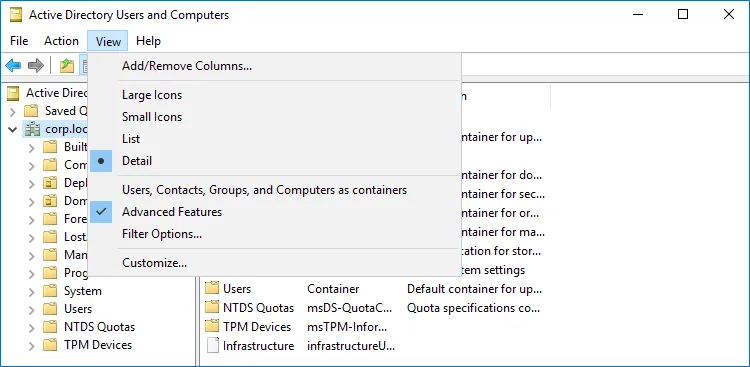
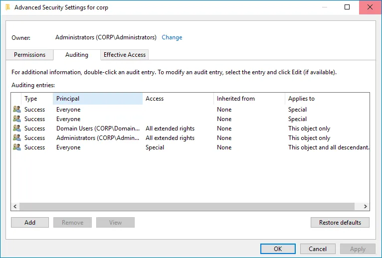

# Configure Object-Level Auditing

Object-level auditing must be configured for the **Domain** partition if you want to collect
information on user activity in the domain. If you also want to audit changes to AD configuration
and schema, you must enable object-level auditing for **Configuration** and **Schema** partitions.

Auditing of the Configuration partition is enabled by default. See the
[Active Directory](../../admin/monitoringplans/activedirectory/overview.md) topic for detailed
instructions on how to enable monitoring of changes to the Schema partition in the target AD domain.

Perform the following procedures to configure object-level auditing for the Domain, Configuration
and Schema partitions:

- Configuring object-level auditing for the Domain partition
- Enabling object-level auditing for the Configuration and Schema partitions

## Configuring object-level auditing for the Domain partition

**Step 1 –** Open the **Active Directory Users and Computers** console on any domain controller in
the target domain: navigate to Start > Windows Administrative Tools → **Active Directory Users and
Computers**.

**Step 2 –** In the **Active Directory Users and Computers** dialog, click **View** in the main menu
and ensure that the **Advanced Features** are enabled.

**Step 3 –** Right-click the **`<domain_name>`** node and select **Properties.** Select the
**Security** tab and click **Advanced**. In the **Advanced Security Settings for `<domain_name>`**
dialog, select the **Auditing** tab.

**Step 4 –** Perform the following actions on the Windows Server 2012 and above:

1. Click **Add**. In the **Auditing Entry** dialog, click the **Select a principal** link.
2. In the **Select user, Computer, Service account, or Group** dialog, type _"Everyone"_ in the
   **Enter the object name to select** field.
3. Set **Type** to _"Success"_ and **Applies to** to _"This object and all descendant objects"_.
4. Under **Permissions**, select all checkboxes except the following: _Full Control_, _List
   Contents_, _Read All Properties_ and _Read Permissions_.
5. Scroll to the bottom of the list and make sure that the **Only apply these auditing settings to
   objects and/or containers within this container** checkbox is cleared.

    

## Enabling object-level auditing for the Configuration and Schema partitions

To perform this procedure, you will need the
[ADSI Edit](<http://technet.microsoft.com/en-us/library/cc773354(v=ws.10).aspx>) utility. Follow the
steps to enable object-level auditing for the Configuration and Schema partitions.

**Step 1 –** On any domain controller in the target domain, navigate to Start > Windows
Administrative Tools **> ADSI Edit**.

**Step 2 –** Right-click the **ADSI Edit** node and select **Connect To**. In the **Connection
Settings** dialog, enable **Select a well-known Naming Context** and select **Configuration** from
the drop-down list.

**Step 3 –** Expand the **Configuration `<Your_Root_Domain_Name>`** node. Right-click the
**CN=Configuration, DC=`<name>`,DC=`<name>`…** node and select **Properties.**

**Step 4 –** In the **CN=Configuration, DC=`<name>`, DC=`<name>` Properties** dialog select the
**Security** tab and click **Advanced**. In the **Advanced Security Settings for Configuration**
dialog, open the **Auditing** tab.

**Step 5 –** Perform the following actions on the Windows Server 2012 and above:

1. Click **Add**. In the **Auditing Entry** dialog, click the **Select a principal** link.
2. In the **Select user, Computer, Service account, or Group** dialog, type _"Everyone"_ in the
   **Enter the object name to select** field.
3. Set **Type** to _"Success"_ and **Applies to** to _"This object and all descendant objects"_.
4. Under **Permissions**, select all checkboxes except the following: _Full Control_, _List
   Contents_, _Read All Properties_ and _Read Permissions_.
5. Scroll to the bottom of the list and make sure that the **Only apply these auditing settings to
   objects and/or containers within this container** checkbox is cleared.

    

Repeat these steps for the Schema container if necessary.
