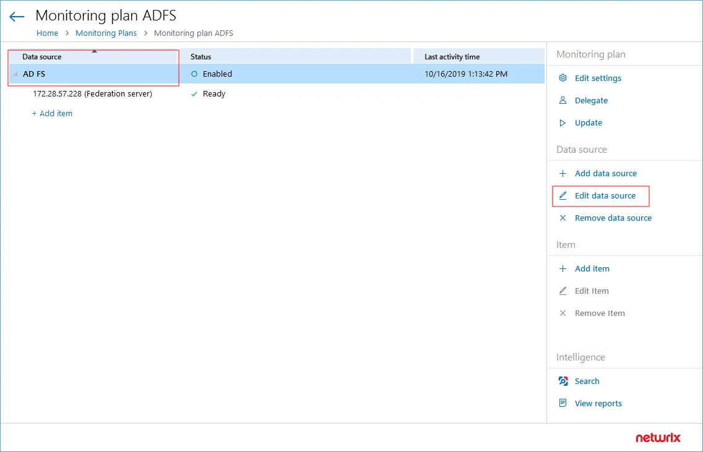

# AD FS

Netwrix Auditor relies on native logs for collecting audit data. Therefore, successful change and access auditing requires a certain configuration of native audit settings in the audited environment and on the Auditor console computer. Configuring your IT infrastructure may also include enabling certain built-in Windows services, etc. Proper audit configuration is required to ensure audit data integrity, otherwise your change reports may contain warnings, errors or incomplete audit data.

__CAUTION:__ Folder associated with Netwrix Auditor must be excluded from antivirus scanning. See the [Antivirus Exclusions for Netwrix Auditor](https://helpcenter.netwrix.com/bundle/z-kb-articles-salesforce/page/kA04u0000000HirCAE.html) knowledge base article for additional information.

Active Directory Federation Services (AD FS) server role can be assigned:

- to a domain controller
- to a Windows server joined in the domain

Multiple AD FS federation servers can be included in a __farm__, a group of connected servers with configuration replicated between them. The first AD FS federation server you set up in the farm becomes the __primary__ server. Other federation servers you add to the farm will become __secondary__ servers.

Make sure you have Windows Remote Management properly configured on your Auditor console computer. See the [Software Requirements](../../requirements/software.md) topic for additional information.

You can configure your IT Infrastructure for monitoring in one of the following ways:

- Automatically through a monitoring plan – This is a recommended method. If you select to automatically configure audit in the target environment, your current audit settings will be checked on each data collection and adjusted if necessary. See the Configure AD FS farm audit settings automatically topic for additional information.
- Manually – Native audit settings must be adjusted manually to ensure collecting comprehensive and reliable audit data. You can enable Auditor to continually enforce the relevant audit policies or configure them manually:

  - AD FS audit settings must be configured on the primary AD FS server, i.e. on the first server you have set up in the farm:

    - To configure audit of AD FS 4.0 on Windows Server 2016 or AD FS 5.0 on Windows Server 2019, use the following PowerShell cmdlets:

      ```
      Set-AdfsProperties -LogLevel Errors,FailureAudits,Verbose,SuccessAudits,Warnings  
      Set-AdfsProperties –AuditLevel Verbose
      ```
    - To configure audit of AD FS 3.0 on Windows Server 2012 R2, use the following PowerShell cmdlet

      ```
      Set-AdfsProperties -LogLevel Errors,FailureAudits,Verbose,SuccessAudits,Warnings
      ```
  - Windows Audit policy must be configured on each server in the farm. For all Windows server versions Run the _auditpol_ utility with the following parameters:

    - ```auditpol.exe /set /subcategory:"Application Generated" /failure:enable /success:enable```
  - Adjust log size and retention settings for __Security__ log and for __AD FS Admin__ log (under __Applications and Service logs__). See [Adjusting Event Log Size and Retention Settings](../windowsserver/eventlog.md) for details.
  - If AD FS Admin logging is disabled, you should enable it.
  - See the Configure AD FS farm manually topic for additional information.

## __Configure AD FS farm audit settings automatically__

Audit settings can be applied automatically if your monitoring plan has the primary AD FS federation server included as an item. If it has only secondary AD FS federation servers included, you will need to configure audit settings manually, as described later in this section.

__Step 1 –__ Select the AD FS data source in this monitoring plan (top row under the header), click __Edit data source__ to open its settings.



__Step 2 –__ In the __Configure audit settings__ section, select __Adjust audit settings automatically__ check box.


__Step 3 –__ Save the settings.

Auditor  will automatically configure audit settings on all servers in the AD FS farm and adjust the necessary log settings on these servers.

## Configure AD FS farm manually

Follow the steps to enable AD FS audit settings and set up Windows audit policy.

__Step 1 –__ AD FS audit settings must be configured on the primary AD FS server, i.e. on the first server you have set up in the farm:

- To configure audit of AD FS 3.0 on Windows Server 2012 R2, use the following PowerShell cmdlet:

Set-AdfsProperties -LogLevel Errors,FailureAudits,Verbose,SuccessAudits,Warnings

- To configure audit of AD FS 4.0 on Windows Server 2016 or AD FS 5.0 on Windows Server 2019, use the following PowerShell cmdlets:

Set-AdfsProperties -LogLevel Errors,FailureAudits,Verbose,SuccessAudits,Warnings

Set-AdfsProperties –AuditLevel Verbose

__Step 2 –__ Windows Audit policy must be configured on each server in the farm. For all Windows server versions

- Run the _auditpol_ utility with the following parameters:

```auditpol.exe /set /subcategory:"Application Generated" /failure:enable /success:enable
```

__Step 3 –__  Adjust log size and retention settings for __Security__ log and for __AD FS Admin__ log (under __Applications and Service logs__). See the [Adjusting Event Log Size and Retention Settings](../windowsserver/eventlog.md) topic for additional information.

If AD FS Admin logging is disabled, you should enable it.

_Remember,_ do the following:

- Configure Data Collecting Account as described in the [Permissions for AD FS Auditing](permissions.md) topic.
- Configure ports as described in the [AD FS Ports](ports.md) topic.

## AD FS Servers Data Collection

For Active Directory Federation Services (AD FS) servers, Netwrix Auditor can collect audit data on the events and configuration objects listed below.

| Event type | Action | Details |
| --- | --- | --- |
| AD FS logon (intranet) | Failed Logon | Cause (for failed attempts) |
| AD FS logon (extranet) | Successful Logon | Authentication methods (for Successful attempts) |

Configuration information can be collected for the following objects:

- AD FS servers included in the farm
- Application Groups settings
- Authentication Method names
- Relying Party Trusts settings
- Scope Descriptions
