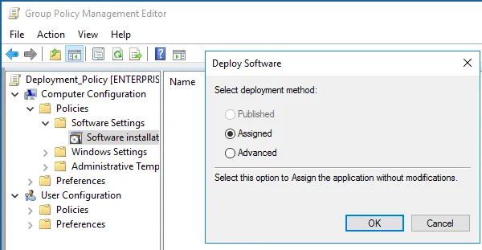

# Install Client via Group Policy

The Netwrix Auditor client can be deployed on multiple computers via Group Policy. This can be helpful if you want to grant access to configuration and audit data to a significant number of employees and, therefore, have to run Netwrix Auditor installation on multiple computers.

If installing via Group Policy, make sure to deploy Netwrix Auditor client and Netwrix Auditor server on different machines. If both components are installed on the same machine, you may experience issues with future upgrades.

To run the Netwrix Auditor installation, you must be a member of the local Administrators group.

## Extract MSI File

1. Download the product installation package.
2. Open the command prompt: navigate to Start → Run and type "_cmd_".
3. Enter the following command to extract the msi file into %Temp% folder:

    ```Netwrix_Auditor.exe -d%Temp%```

   where %Temp% can be replaced with any folder you want to extract the file to.
4. Navigate to this directory and locate Netwrix_Auditor_client.msi.

## Create and Distribute Installation Package

1. Create a shared folder that will be used for distributing the installation package.

   Make sure that the folder is accessible from computers where the Netwrix Auditor clients are going to be deployed. You must grant the Read permissions on this folder to these computer accounts.
2. Copy Netwrix_Auditor_client.msi to the shared folder.

## Create a Group Policy to Deploy Netwrix Auditor

It is recommended to create a dedicated organizational unit using Active Directory Users and Computers and add computers where you want to deploy the Netwrix Auditor client.

Follow the steps to create a Group Policy

__Step 1 –__ Open the __Group Policy Management__ console on any domain controller in the target domain: navigate to Start > Windows Administrative Tools (Windows Server 2016 and higher) or Administrative Tools (Windows 2012) __Group Policy Management.__

__Step 2 –__ In the left pane, navigate to __Forest: `<forest_name>` → Domain →__ __`<domain_name>`, right-click `<OU_name>`__ and select __Create a GPO in this domain and Link it here__.


__Step 3 –__  Right-click the newly created GPO and select __Edit__ from the pop-up menu.

__Step 4 –__ In the Group Policy Management Editor dialog, expand the __Computer Configuration__ node on the left and navigate to __Policies → Software Settings → Software installation.__

__Step 5 –__ In the right page, right-click and select New → Package.

__Step 6 –__ In the dialog that opens, locate Netwrix_Auditor_client.msi and click Open.

__Step 7 –__ In the Deploy Software dialog, select Advanced.



__Step 8 –__ In the Netwrix Auditor Properties dialog, select the Deployment tab and click Advanced.

__Step 9 –__ In the Advanced Deployment Options dialog, select the Ignore language when deploying this package checkbox.


__Step 10 –__ Close the Netwrix Auditor Properties dialog.

__Step 11 –__ Reboot computers where you want to deploy the Netwrix Auditor client.

The product will be automatically installed on computers affected by the newly created Group Policy after reboot.
