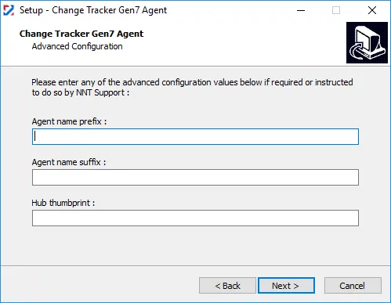
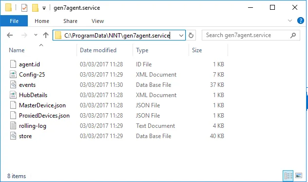

# Installing Gen 7 Agent for Windows

The **Hub API** page must be entered together with **Access Credentials**.

By default the Agent username is ‘agent’ with password ‘passWord121’ but these can be changed. See
the Users: User Administration topic for additional information.

By default the Agent will register using the Name of the server but there is an opportunity to
customize this during installation or post-installation via an edit of the Hub Details file. See the
[First Run – HubDetails.xml File](../../admin/settings/devicegroups.md) topic for additional
information.

**_RECOMMENDED:_** During installation, this can also be performed on the **Advanced Configuration**
step of the installation, and there is also an option to test agent connectivity.

**NOTE:** In order to maximize performance, Gen 7 Agent operational files are located in
_%PROGRAMDATA%\NNT\gen7agent.service_, similarly if you are ever required to provide the
**rolling-log.txt** file to [Netwrix Support](https://www.netwrix.com/support.html) this is where it
is located. See the [First Run – HubDetails.xml File](../../admin/settings/devicegroups.md) topic
for additional information on downloading the .xml file for agents.

Run the Agent UI. See the [ Agent First Run](firstrun.md) topic for additional information.
