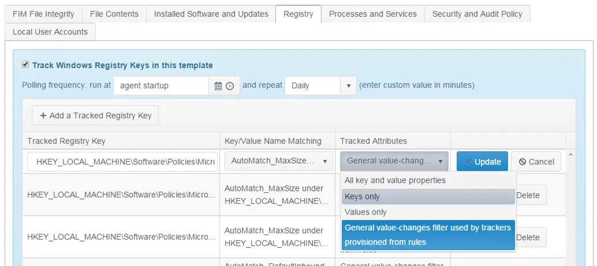
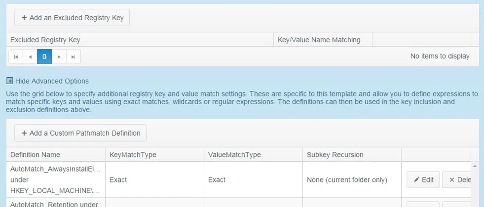

# Policy Templates: Registry

__NOTE:__ This template applicable to Windows OS only.

The Windows Registry was designed as the core repository for configuration settings. Monitoring of Registry Keys and Values is another way to ‘fingerprint’ an application or device configuration state.

__NOTE:__ To select a Registry Key to monitor, the best way is to use the Microsoft ‘regedit’ program (start -> run -> regedit). You can then browse all Registry Keys for the device and at any point use a ‘right click’ to access the tools menu which includes an option to ‘copy key name’. You can then paste the key name into the __Compliance Hub__ field.

Click __Add new registry key__ and type or paste the Key into monitor. Once you have added a Key to monitor, click __Insert__ then __Save Settings to Device__.

Like the __File Integrity__ settings covered earlier, exclusion rules can be used, and Registry Trackers can also be filtered using a __Registry Key/Value Match Rule__ and a __Tracked Attributes__ dimension.

Use the __Advanced Options__ to create and edit new Definitions. See the[Registry Inclusion/Exclusion Match Rules ](../../matchrules/registryrules.md) topic for additional information.

