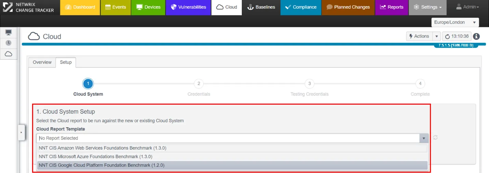

# Cloud Policy Setup Wizard

__Step 1 –__ New Policy: Use the Actions button to start a new Cloud Tracker system set-up.

__Step 2 –__ Cloud Report Template: Templates presented here will be filtered to show all Cloud reports available in your system.



__Step 3 –__ Create a new Cloud System and Credentials: The Cloud Set-Up Wizard is context-sensitive so depending on which Cloud Platform you select will determine the Credentials dialogue you will be presented with next.

Google Cloud Platform Credentials example:


__NOTE:__  Just click the Query icon to get a quick tip on what the Credential field requires.

- Credential Name – Enter a name to uniquely identify these credentials
- Cloud Platform – Select from the drop-down options presented
- Description – Optionally provide a credential description

Once Credentials have been entered, Change Tracker will automatically select an Agent to run the Cloud Compliance Report from and then run a test of the Credentials. By default, the Agent selected will be the local Agent on the Hub Server.

__NOTE:__ This must always be the latest Net Core Gen 7 Agent. See the [Netwrix Support](https://www.netwrix.com/support.html) site for more details.

This can be changed using the links displayed once the Credentials test has completed, and in the event that the Credentials are not working for any reason, you will now have the opportunity to edit them and verify they have been entered correctly.

Cloud security is higher and more complex than standard access credentials for regular servers and hypervisors so please ask for help if needed!


At this point you are ready to run your first Cloud Compliance Report – just hit the Run Report button!

AWS Platform Credentials Example:


- Credential Name – Enter a name to uniquely identify these credentials Cloud
- Platform – Select from the drop-down options presented
- Description – Optionally provide a credential description
- ARN – AWS Resource Name of a role that can be assumed by a user when establishing a trust relationship.
- ExternalId – An Id used in establishing the trust relationship
- Root AccessKeyId – The Access Key Id of the AWS user the trust relationship is established for
- Root SecretAccessKey – The Access Key Secret of the AWS user the trust relationship is established for

### Special Instructions for AWS Cloud Reporting

The NNT Cloud Tracker feature set utilizes the Microsoft PowerShell cmdlets for AWS.

You may experience a failure message after the Credentials Test has run: "Cannot execute AWS commands, error: The specified module 'AWSPowerShell. NETCore was not loaded because no valid module file was found in any module directory".

In this case it will be necessary to run the following PowerShell setup on the host running the Gen7Agent NETCore being used for Cloud Tracker work:

__Step 1 –__ Install PowerShell NETCore version 7.x (NB this is not the old PowerShell that is packaged with Windows, but a new cross-platform version based on NETCore). See the Microsoft [Installing the MIS package](https://docs.microsoft.com/en-us/powershell/scripting/install/installing-powershell-on-windows#installing-the-mis-package) article for additional information.

Although the agent provides its own PowerShell scripting, this NETCore version of PowerShell must be installed in order that the various AWS/Azure etc. PowerShell core support libraries can be installed. These are used by some Change Tracker reports to collect data from the cloud environments.

__Step 2 –__ Install AWS Cmdlets for use in AWS compliance reports, run the following in the PowerShell NETCore command prompt (PowerShell 7(x64) Start menu item, Run As Administrator).

```Install```-Module -name AWSPowerShell.NetCore -scope ```AllUsers```

Azure Platform Credentials Example:


- Credential Name – Enter a name to uniquely identify these credentials
- Cloud Platform – Select from the drop-down options presented
- Description – Optionally provide a credential description
- Tenant ID – From the Azure portal, click properties and copy the Tenant Id
- Application ID – The Azure application (client) ID
- ClientSecret – The application client secret

### Special Instructions for Azure Cloud Reporting

The NNT Cloud Tracker feature set utilizes the Microsoft PowerShell cmdlets for AWS.

You may experience a failure message after the Credentials Test has run: "Cannot execute Az commands, error on Import-Module: The specified module 'Az' was not loaded because no valid module file was found".

In this case it will be necessary to run the following PowerShell setup on the host running the Gen7Agent NETCore being used for Cloud Tracker work:

__Step 1 –__ Install PowerShell NETCore version 7.x (NB this is not the old PowerShell that is packaged with windows, but a new cross-platform version based on netcore). See the Microsoft [Installing the MIS package](https://docs.microsoft.com/en-us/powershell/scripting/install/installing-powershell-on-windows#installing-the-mis-package) article for additional information.

Although the agent provides its own PowerShell scripting, this NETCore version of PowerShell must be installed in order that the various AWS/Azure etc. PowerShell core support libraries can be installed. These are used by some Change Tracker reports to collect data from the cloud environments.

__Step 2 –__ Install Azure Cmdlets for use in Azure compliance reports, run the following in the PowerShell NETCore command prompt (PowerShell 7(x64) Start menu item, Run As Administrator):

Install-Module -name Az -```scope``` AllUsers
