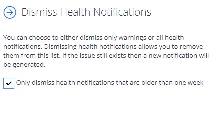

# Operations and Health Dashboards

The Dashboard administration area provides a selection of tools to review application health.

## Dashboard view

The default screen shows a high-level overview of Netwrix Data Classification statistics, displaying
the last active times of each service (with inactive services shown in red). Select the "i" icon
next to each date to view the name of the active server as well as batch processing statistics. You
will also view the processing throughput.

The following statistics are available for each thread type:

- Processing Time—The weighted average time for each thread (total batch time / number of documents
  processed)
- Real Execution Time—The actual execution time of each thread (average of each threads run time)

Statistics shown on the Dashboard screen are cached and updated regularly by the Collector service.
If the values are not being updated please ensure that the Collector service is running.

New content will be shown as awaiting collection, and progress through to fully processed once it
has been classified.

Content that has failed to process fully will be indicated under the "Exceptions" section, with the
following meanings:

- Collection Errors—Items that failed to process during collection (typically due to an error from
  the source system)
- Text Extraction Errors—Items that failed text extraction (either partially or fully)—this will
  typically mean that the full text for the affected documents will not be available
- Collection Exclusions—Items that have been excluded due to the specified configuration (such as
  Sources → SharePoint → Exclusions)
- Files Skipped—File share items that have been ignored due to the "Files Included" or "Files
  Excluded" configuration (Sources → File)
- Deleted Automatically—Items that have been detected as removed from the source system
- Deleted Manually—Items removed manually by an end-user via the administration console

    

## System Health

The health service provides a traffic light based reporting system. Colour-coded traffic lights will
appear in the top menu bar when issues are detected. The traffic lights provide a quick link to this
page to display more detailed information.

You will then see the list of reported issues, with the ability to view a detailed description of
the problem and suggested resolution steps.

It is also possible to configure notifications of system issues, along with daily reports of
outstanding system issues.

1. Click Dismiss at the bottom.

    

2. Select Only dismiss health notifications that are older than one week, if you do not want to be
   notified on outdated issues.
3. Select what you want to dismiss – warnings and all security notifications.

## Netwrix Data Classification Service Viewer

From the Netwrix Data Classification Service Viewer it is possible to view a live stream of the
current work being processed by the NDC services. As the services progress each document, the
display will change. Once all work is complete, "Idle..." will be displayed.

This functionality may not work in older browsers. In this case the "on-server" application Netwrix
Data Classification Service Viewer should be used.
