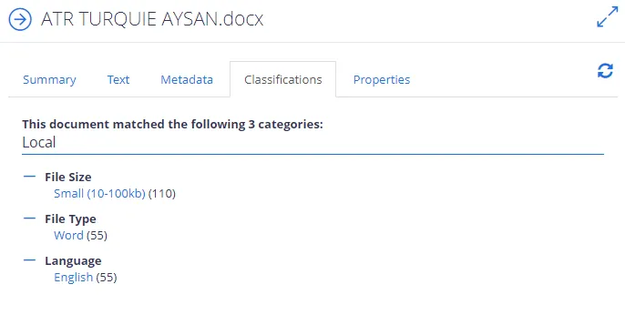

# View Results

## Data Processing Statistics

Select the source from the list on the **Sources** - **General** tab, and click the **Reports**
("chart") icon to view data processing statistics for that source.

## Content Crawling and Classification Results

Click on a source row in the list of sources on the **General** tab to view the crawled data,
including the number of processed documents/URLs (_Documents_ column), the size of the crawled
content (_Size_), status, etc.

To browse the whole structure of the crawled content, click on the items in the list. It is also
possible to filter the list by any field.

- Each document has an associated status (shown as the ID). Click the numeric ID to read the status
  description:

- Click the "Info" icon for the document/item to view its **Properties**, including summary,
  classifications (if any), etc.:

- For content sources that support writing the classifications back to the source system, i.e.
  "_tagging_" (e.g. such as writing classifications to SharePoint managed metadata fields):
    - a tick will also be displayed if tagging was successful
    - a cross displayed if tagging failed

See the related content source description for details.
