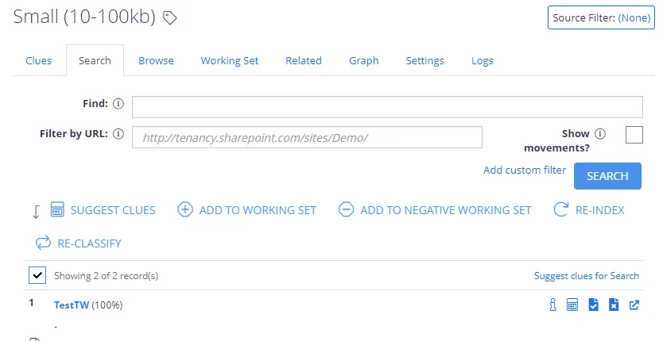

# Browse

To view the documents classified for each term, click on the Browse tab. This will display a list of documents achieving the minimum score set for classification in the term. [See Classification Rules (Clues) for more information.](clues.md)

__NOTE:__ This list will include the current classification status of each document and any changes made to the class, since the last classification, are not taken into account.

The document text will be highlighted based upon the clues configured for the term. Highlighting will include regular expression matches when configured (Config→Query Server→Enable Regex Browse Highlighting (Advanced)).

__NOTE:__ If a new class is selected in the treeview menu, the view will remain in "Browse" mode and will show the documents for the selected class.

You can use the Browse function to:

- Identify documents that are receiving a score, but are "missing" being classified because they do not quite reach the terms threshold. For example, changing the mode to "Near Misses `<20%`" for a term with a threshold of 50, will find any documents that scored 40 or more, but did not reach the threshold.
- Identify low scoring documents that are only just reaching the classification threshold. For example, changing the mode to "Low Scoring Documents `<20%`" for a term with a threshold of 50 will find any documents that scored between 50 and 60.

To restrict the browsing scope, you can either add a URL filter, or add a custom filter, as well as select to show document movements. These options are configured in the same way as for [Search Documents by Clue](search.md).
