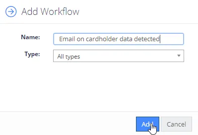
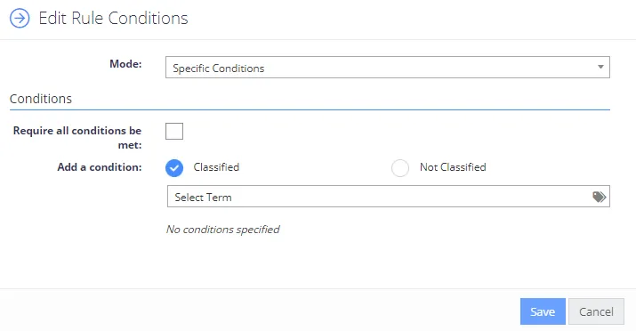
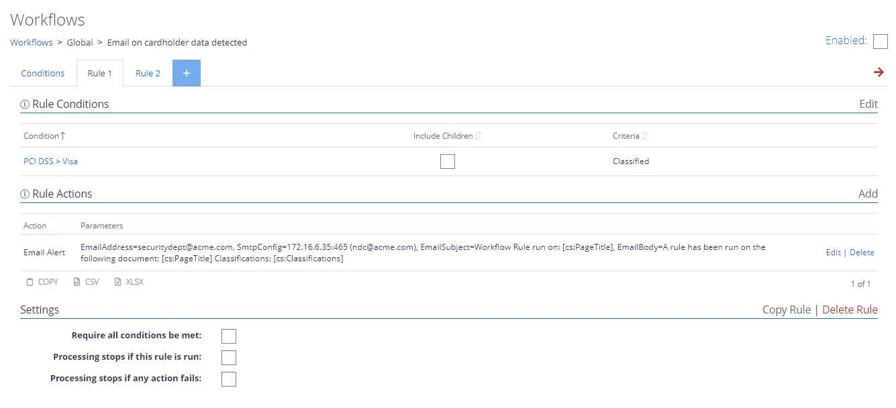
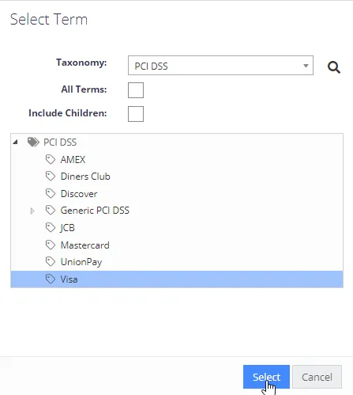

# Configure a Workflow using Advanced dialog

This section contains information on how to add or edit workflows using the __Advanced__ dialog window.

To configure a workflow:

1. On the __Workflow__ tab, click __Add__ and in the dialog displayed click __Advanced__.
2. Specify __Name__ for the workflow.
3. From the __Type__ drop-down list, select the type of content your workflow will apply to.
4. Click __Add__.

   
5. Then you need to configure document processing rules. For each rule, you should set up rule conditions and rule actions. Also, specify how the workflow should be processed with regards to rules.

   - Specifying Rule Conditions
   - Specifying Rule Actions
   - Other Rule Settings

   To apply pre-conditions (they will be used before rule processing starts), see Specifying Workflow Conditions
6. Navigate to Content → Sources and select Re-classify for the selected sources in the workflow.

## Specifying Rule Conditions

1. In the corresponding section on the __Rule__ tab, click __Edit__ on the right. The __Edit Rule Conditions__ dialog will be displayed.
2. From the __Mode__ list, select how the conditions should be applied.

The following options are available:

- __Any Document__ — with this option selected, the workflow will be applied to all documents in the specified content source
- __Any Classified Document__ — with this option selected, the workflow will be applied to the documents in the specified source if they were tagged by any classification
- __Specific Classification__ — with this option selected, you need to specify whether to apply the workflow to the classified or non-classified documents
  - To process only documents classified by specific classification, select __Classified__ (this will act as including filter)
  - To process only non-classified documents, select __Not Classified__.

  If you have selected any of the __Specific Classification__ variants, you should then specify taxonomy terms that will be applied to filter out the documents for your workflow.

To configure terms

1. In the __Select Term__ field, click the tag icon.
2. In the __Details__ dialog, specify filter settings to use when filtering out the documents:
   1. __Taxonomy__ - select what classification taxonomy from the existing ones should be used.
   2. __All Terms__ - select this option if you want to filter by all terms in the taxonomy. If this option is cleared, then after selecting the necessary taxonomy, you will be presented the list of its terms. Select the one you plan to use for filtering.

   __NOTE:__ Multiple selection is not supported: to configure several filter values, you should repeat this procedure for each filter value you need.

   3. __Include Children__ - select this option if needed.
3. Finally, click __OK__ to save the settings and close the dialog.

3. You can specify what logic should be used when applying the filtering terms:

- To apply AND logic (i.e. the document must match all filters), select __Require all conditions be met__.
- Otherwise, OR logic will be used (i.e. the document must meet any of the filtering conditions).

4. Make sure the filtering term is displayed in the __Edit Rule Conditions__ window with blue color. Click __Save__.

The configured rule condition will appear in the __Rule Conditions__ section on the __Rule__ tab.

Example

If you want to apply the rule to all documents classified as Visa cardholder data using PCI DSS taxonomy, configure the rule condition as follows:

1. From the __Mode__ list select __Specific Conditions__.
2. Select __Classified__ option.
3. In the __Select Term__, click the tag icon.
4. In the __Details__ window, from the __Taxonomy__ list select __PCI DSS__.
5. In the tags hierarchy, select __Visa__ and click __OK__.

Make sure the filtering term is displayed in the Edit Rule Conditions window with blue color. Click __Save__.

The configured rule condition will appear in the __Rule Condtions__ section on the __Rule__ tab.

## Specifying Rule Actions

1. In the corresponding section on the __Rule__ tab, click __Add__ on the right. The __Add Action__ dialog will be displayed.
2. From the __Action Type__ list, select the action you want to apply to the documents that match rule conditions.
   For details, see [Workflow Actions](../actions/actions.md).
3. Click __Save__.

## Other Rule Settings

On the __Rule__ tab, you can also manage the rule, as follows:

- Add another rule, clicking the '+' sign.
- Enable or disable this rule, selecting or clearing the __Enabled__ check box in the top right corner.
- Specify how rule application will affect workflow processing. Possible options are:
  - __Processing stops if this rule is run__
  - __Processing stops if any action fails__
- __Edit__ rule conditions.
- __Copy__ or __delete__ the current rule.
- Copy rule configuration as text, CSV or XLSX file.
- __Add__, __Edit__ or __Delete__ rule actions.

If multiple rule actions have been configured, they will be processed in the order listed. Use the red down arrow or green up-arrow to change the processing sequence as required:

## Specifying Workflow Conditions

You can narrow the initial workflow scope. For that, specify the conditions that document should match to be processed by the workflow.

1. Go to the __Conditions__ tab. By default, the __Workflow Conditions__ list includes none, that is, current workflow will consider any document; actual filtering conditions will be applied by the rule (rule conditions).

1. Click __Edit__ to open __Edit Workflow Conditions__ dialog.
2. Select the option you need from the __Mode__ list. The next steps are similar to those described in Specifying Rule Conditions
