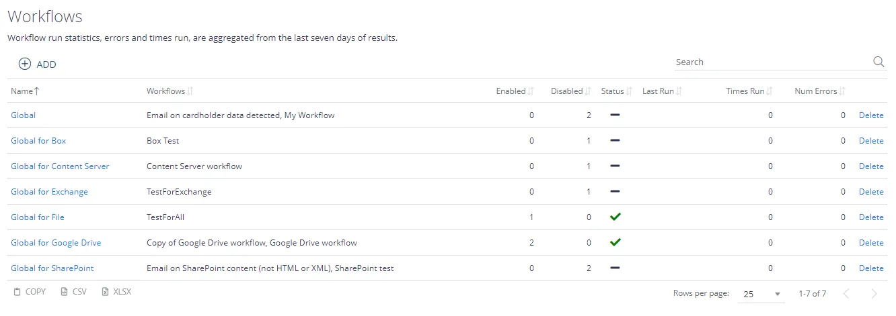

# Managing Workflows

Authorized users can create, modify or delete automated workflows that apply to the certain content.
For that, in the administrative web console select Content from the top menu and go to the
**Workflows** tab.

**NOTE:** To manage the automated workflows, users require sufficient access rights that are
assigned based on either their Windows identity or using non-Windows based access controls. See
"Users" for details on rights and permissions.

- Click **Copy** if you want to copy the list content to the clipboard.
- You can also export the list to **CSV** or **XLSX** file.
- By default, the number of list items displayed (**Page Size**) is set to **10**. Modify this
  setting as necessary.
- To delete all workflows from a certain scope, select the corresponding list item and click
  **Delete**.

## Creating a Workflow

To create an automated workflow for certain type of documents, you can use the Add Workflow wizard
or **Advanced** dialogs.

See next:

- [Create a Workflow using Add Workflow Wizard](addworkflowwizard.md)
- [Configure a Workflow using Advanced dialog](advancedwindow/createworkflow.md)

## Modifying or Deleting a Workflow

To modify a workflow, follow the steps described in the [Edit Workflow settings](editsettings.md)
section.

To delete a workflow, follow the steps described in the [Delete Workflow](delete.md)section.

## Cloning, Enabling or Renaming a Workflow

1. Click the link in the **Name** column for the required workflow ( e.g. Global for Google Drive in
   the figure below):

2. This will open the list of workflows for selected scope. You can sort the list by **Details**
   (workflow action) or by **Active** (workflow state) field.
3. Select one or several workflows you need.
4. To **Disable** or **Enable** the workflow, use the corresponding button above or link on the
   right. Workflow state (**Active** field) will change accordingly.
5. If you want to create a copy of selected workflow, with all associated actions and conditions,
   click **Clone**, then enter the scope (group) and name for the new workflow.

**NOTE:** Workflows within a generic group (scope) are cloned within the same group, source-specific
workflows can be copied within any groups of the same type. The clone workflow will be disabled by
default.

To provide another name to a workflow, select it from the list and click **Rename**.

**NOTE:** Workflow names must be unique within the group (scope).
