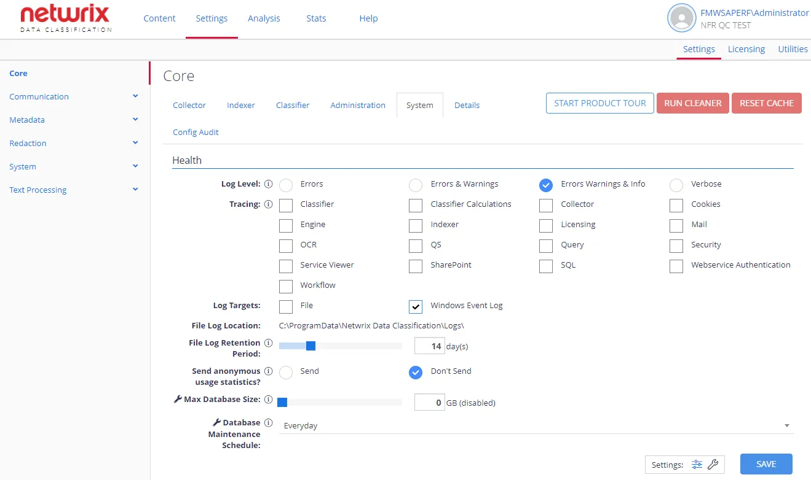

# System

This configuration tab contains the settings related to system health, operation and logging. Each configuration option has an associated “i” which describes the nature of the setting.

## Health

| Option | Description | Comment |
| --- | --- | --- |
| __General settings__ |  |  |
| Log Level | Defines logging level that should be persisted to the log targets. Possible options:   - __Errors__ - __Errors & Warnings__ - __Errors Warnings & Info__ - __Verbose__ |  |
| Tracing | Used to provide additional information/ functionality. | Will apply to selected components (none by default) |
| Log Targets | Select where the log should be written: to a file, to Windows Event Log, or both. |  |
| File Log Location | If you selected to write log to a file, this location path will be used. | Default is _C:\ProgramData\Netwrix Data Classification\Logs_ |
| File Log Retention Period | Number of days (since the last use) that file logs should be kept for before deletion. | To keep all logs (without automatic deletion), specify _0_ . |
| Send anonymous usage statistics? | Disabled by default.  When enabled, the program will send a small amount of information of how the product is being used — to improve the functionality and future offering. | Personal information/ company data will not be sent. |
| __Advanced settings__ |  |  |
| Max Database Size | Specifies the max size (in GB) the SQL database will grow to. | When this value is reached, Collector and Indexer components will be suspended.  Default is _0_ (no limit). |
| Database Maintenance Schedule | Specify the schedule for running database maintenance (including the rebuilding of SQL Server indexes) | Default is _Everyday_. |

## Configuration Export

You may need to export the current configuration —to send to the support team for debugging purposes. Go to __System Configuration > Config > Settings > Core > System__ and in the __Configuration Export__ section click __Export__ button.
