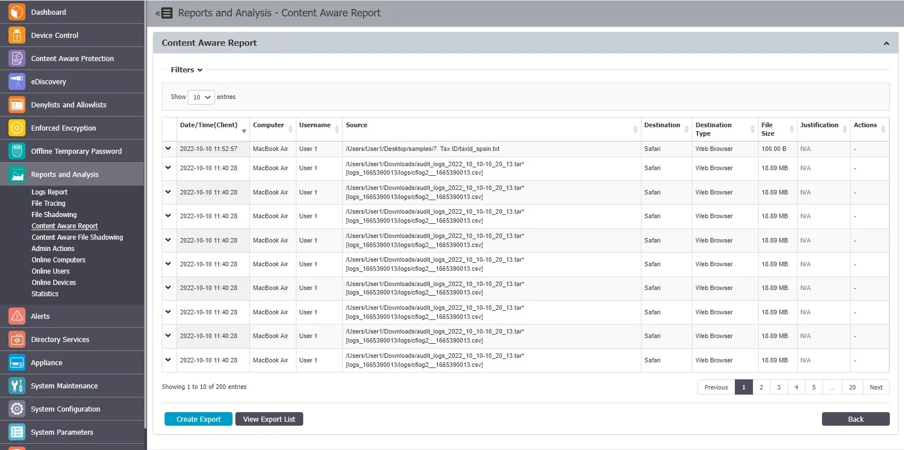
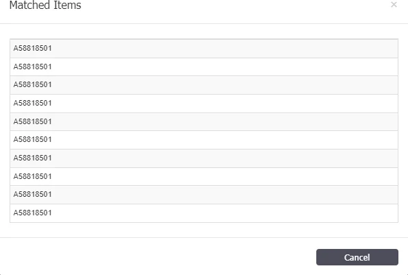
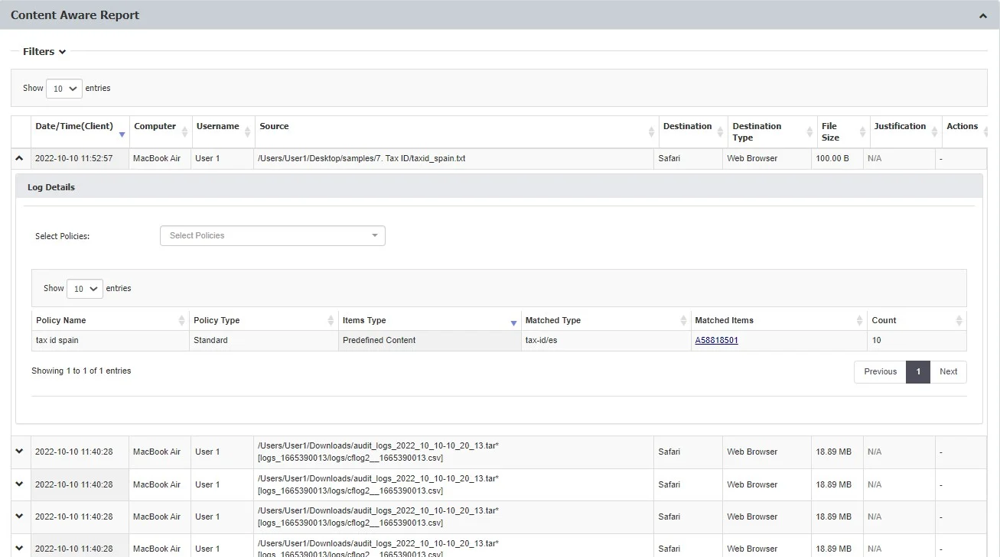
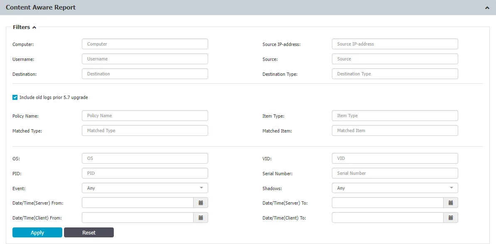
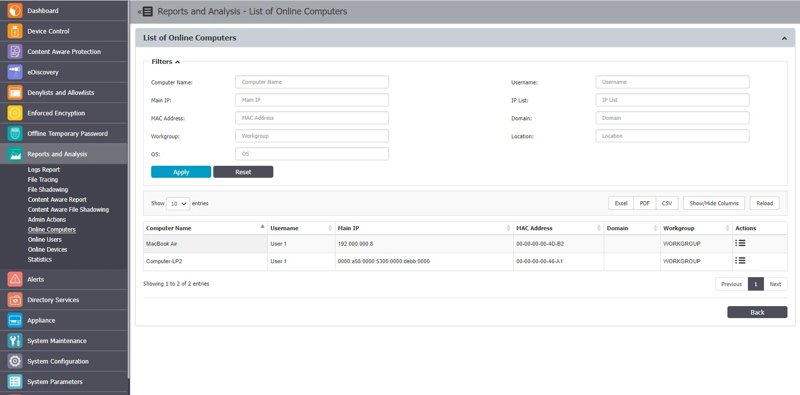
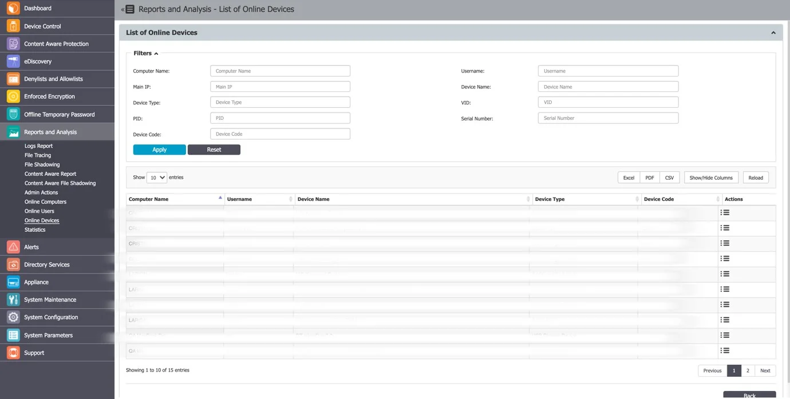
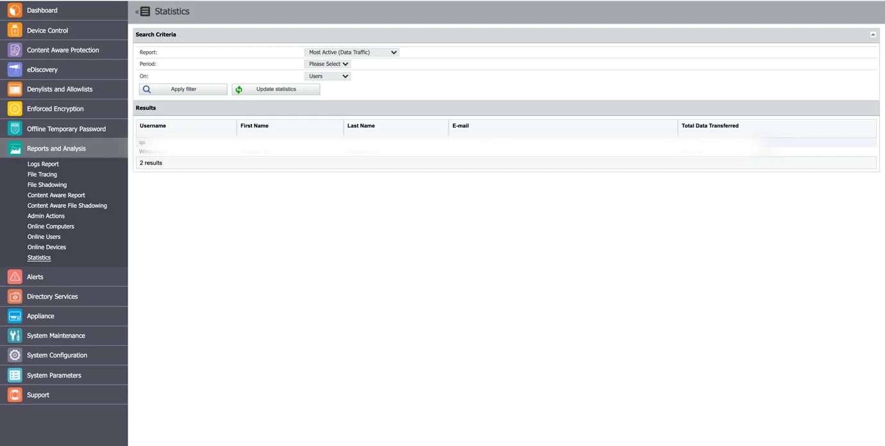

# Reports and Analysis

This section offers an overview of the System Logs, Device Control Logs and Shadows, Content Aware
Logs and Shadows, Admin Actions, Statistics, and other helpful information.

Details regarding eDiscovery Scans and Enforced Encryption can be viewed in their specific sections
and not in the Reports and Analysis section.

As an additional security measure, this section may be protected by an additional password set by
the Super Administrator, from **System Configuration** > **System Security**.

## Logs Report

From this section, you can view, sort, and export the main logs in the system. There are several
event types such as User Login, User Logout, AD Import, AD Synchronization, Uninstall Attempt, etc.,
included in this section. Additionally, the main Device Control logs can be viewed in this section.

**NOTE:** Use the Filters option to view and sort different log types and then export the result
list.

## File Tracing

This section offers an overview of trace files that have been transferred from a protected computer
to a portable device or another computer on the network, and vice versa.

A special mention is given here to the “File Hash” column. Endpoint Protector computes an MD5 hash
for most of the files to which the File Tracing feature applies to. This way, mitigating threats
coming from changing the file content is ensured.

You can export the search results (as an Excel, PDF, or CSV) or Create and Export containing the
entire log report as a .CSV file.

### File Tracing Events by Direction

The "File Tracing Events Matrix by Direction" table is a valuable reference for understanding how
Endpoint Protector categorizes file tracing events based on data transfer directions. It offers
insight into event handling and helps users customize data protection policies effectively. Whether
tracking local transfers or interactions with removable devices and network shares, this table
provides a clear overview. It's an essential resource for configuring data protection policies in the
Endpoint Protector environment, ensuring strong security and compliance.

**NOTE:** This matrix refers to clients from the 5.9.0.0 release and higher.

Please see the table below for a detailed view of the events.

File Tracing Events Matrix by Direction

| Direction                            | Windows    | macOS      | Linux      |
| ------------------------------------ | ---------- | ---------- | ---------- |
| Local -> Local (Partition 0)         | N/A        | N/A        | N/A        |
| Local -> Removable                   | Src & Dest | Src & Dest | Src & Dest |
| Local -> Network share               | Src & Dest | Src & Dest | N/A        |
| Local -> Partition 1                 | Src & Dest | N/A        | N/A        |
| Removable -> Local (Partition 0)     | Src & Dest | Src & Dest | Src & Dest |
| Removable -> Removable               | Src & Dest | Dest       | Src & Dest |
| Removable -> Network share           | Src & Dest | Dest       | N/A        |
| Removable -> Partition 1             | Src & Dest | Src & Dest | Src & Dest |
| Network share -> Local (Partition 0) | Src & Dest | Src & Dest | N/A        |
| Network share -> Removable           | Src & Dest | Dest       | N/A        |
| Network share -> Network share       | Src & Dest | Dest       | N/A        |
| Network share -> Partition 1         | Src & Dest | Src & Dest | N/A        |
| Partition 1 -> Local (Partition 0)   | N/A        | N/A        | N/A        |
| Partition 1 -> Removable             | Src & Dest | Src & Dest | Src & Dest |
| Partition 1 -> Network share         | Src & Dest | Src & Dest | N/A        |
| Partition 1 -> Partition 0           | N/A        | N/A        | N/A        |

Legend:

- Partition 0 -> Boot Partition (OS)
- Partition 1 -> 2nd Partition (e.g., 2nd OS or Data Partition)

## Content Aware Report

From this section, you can view Content Aware Logs in the system and detect data incidents
corresponding to the Content Aware Policies applied.

When using the latestEndpoint Protector client, you can view log details structured per file scanned.

Expand each entry from the log report list to view the Log Details expanded section, providing the
following information:

- Policy – select an active policy from the drop-down list
- Policy name – the name of the selected policy
- Policy type – the type of the selected policy
- Items type – the Policy Denylist category selected
- Matched type – the Policy Denylist type selected
- Matched items – click the link to view a pop-up window with the list of matched items

- Count – the number of matched items

From the Filters section, check the **Include old logs prior to 5.7** upgrade option from the filter
section to include all logs in your searches. If the option is not selected, the filters will apply
only to the new structure of logs.

For Mac users, when the Deep Packet Inspection feature is enabled on the Endpoint Protector agent
for Mac, there might be certain scenarios where the agent does not provide full destination details
for files being transferred from a network share through monitored applications, such as browsers. In
such cases, the destination information may not be fully captured in the monitoring process

For Linux users, it's important to note that the Endpoint Protector agent does not currently support
network share visibility, except in situations where files are being transferred from a network share
through Deep Packet Inspection monitored applications, like browsers. In other scenarios, network
share visibility might not be available.

### Export Content Aware Reports

You can export Content Aware Logs as an Excel, PDF, or CSV or create and export the entire log
report as a CSV or XLSX file.

Excel/PDF/CSV – situated above the Content Aware Reports list, this will export only the default
columns

Create Export – situated below the Content Aware Reports list, this will create an export containing
all data, including the expanded Logs Details section with columns Policy Type, Policy Name, Item
type, Matched type, Matched items and Count.

After the message that is displayed that A new export has been made and is available on Export List,
click View Export List to open the list of Reports, where you can download or delete a report.

## Admin Actions

This section offers an overview of every important action performed in the interface. From the
Action column, you can view additional information.

## Online Computers

This section offers an overview of computers registered on the system which have an established
connection with the server. If the Refresh Interval for computer X is 1 minute, then computer X was
communicating with the server in the last 1 minute.

## Online Users

This section offers an overview of users registered on the system which have an established
connection with the server.

## Online Devices

This section provides an overview of devices registered on the system which have an established
connection with the server.

## Statistics

The Statistics module lets you view system activity related to data traffic and device connections.
The integrated filter makes generating reports quick and easy; simply select the field of interest
and click **Apply Filter**.

