# Install Credential Provider

You can install Directory Manager Credential Provider in one of the following ways:

- Install Credential Provider Manually
- Install Credential Provider via a Group Policy Object (GPO)

### Install Credential Provider Manually

Browse to the folder where you have copied the package:

1. Click the _NetwrixGroupIDCredentialprovider.msi_ file. The wizard opens and installs Credential
   Provider.
2. After the installation, it asks you to restart your machine.
3. After the restart, the Windows logon screen appears as follows:

    

    The **Forgot Password** and **Unlock Account** options are now available on the Windows logon
    screen. They route you to the URLs provided for these options in the _CPSettings.xml_ file. You
    can modify the URLs as well as the text of these options.

    Let’s have a look at the settings which are available in the _CPsettings.xml_ file:

    - `<ForgetPasswordText value="Forget Password?" />`

        Provide the text for the ForgotPasswordText key. This text will appear on the Windows logon
        screen for the Forgot Password option.

    - `<UnlockAccountText value="Unlock Account" />`

        Provide the text for the UnlockAccountText key. This text will appear on the Windows logon
        screen for Unlock Account option.

    - `<ResetMyPasswordUrl value="https://MachineName:port/Portalname" />`

        Provide the URL to which you want to redirect the user to reset his/her forgotten password.

        - **For GroupID 10**:  
          `https://MachineName:port/portalname`
        - **For GroupID 11**: `https://Machniename:port/portalname/Home/PasswordReset`

4. `<UnlockMyAccountUrl value="https://MachineName:port/Portalname" />`

    Provide the URL to which you want to redirect the user to unlock his/her locked account.

    - **For GroupID 10:** `https://MachineName:port/Portalname`
    - **For GroupID 11:** `https://Machinename:port/portalname/Home/UnlockAccount`

5. `<CPTitle value="Log on to: Netwrix GroupID" />`

    Provide the text for the CPTitle key. This text will appear as title under the Netwrix logo on
    the Windows logon screen.

## Install Credential Provider via a Group Policy Object (GPO)

Instead of installing Credential Provider manually on each individual client workstation, you can
distribute it for automatic installation using a GPO, for substantial time savings (especially with
larger networks). The GPO can be defined for an organizational unit or applied on the entire domain.
Credential Provider is installed automatically at the next Windows startup.

Installing Credential Provider is a two-step process:

1. Install Orca
2. Deploy Credential Provider via a GPO

### Install Orca

Before Credential Provider’s installation via GPO, Orca software is to be installed:

1. Browse to the folder where you have copied the Credential Provider package.
2. Go to the MST Guide folder and run the _Orca-x86_en-us.msi_ application. The Orca console opens:

    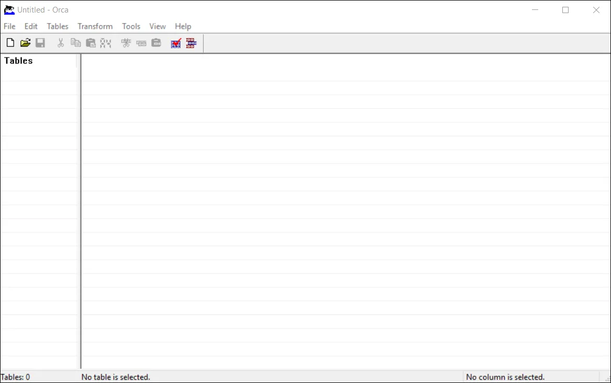

3. In Orca, click **File** > **Open**. Browse to the Credential Provider folder and load the
   _NetwrixGroupIDCredentialprovider.msi_ in Orca.

    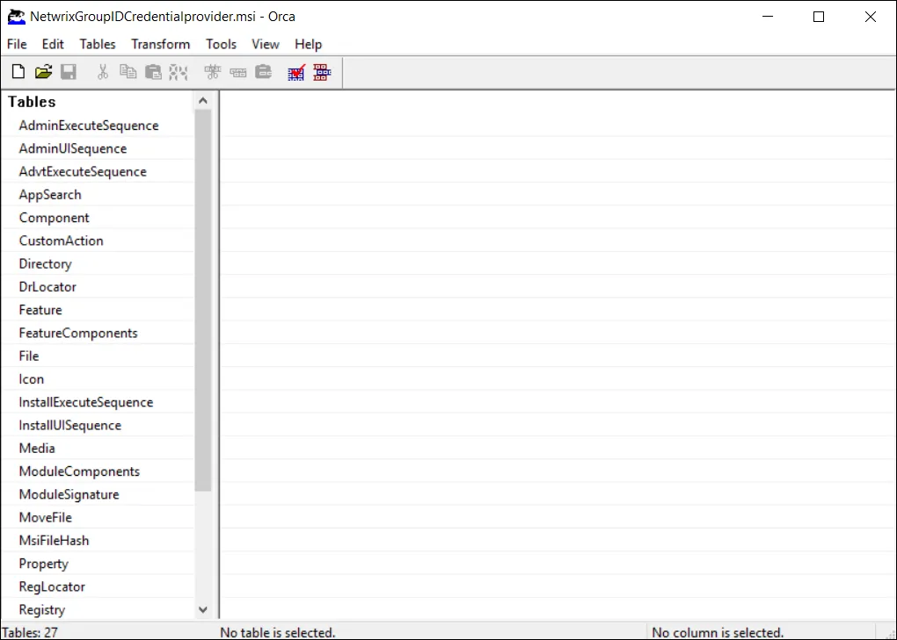

4. From the menu, select **Transform** > **New Transform**:

    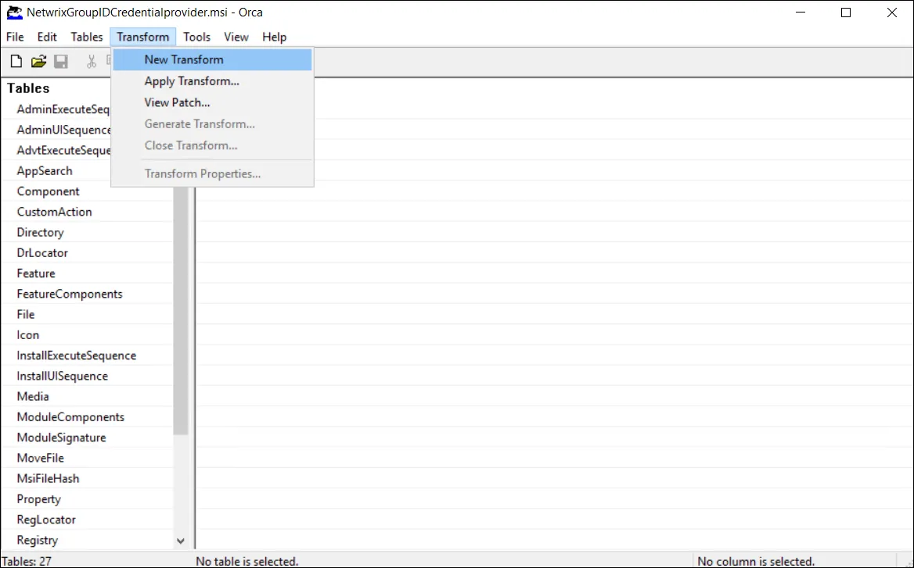

5. Click **Property** in the left pane, list of the properties are displayed in the **Property**
   main window:

    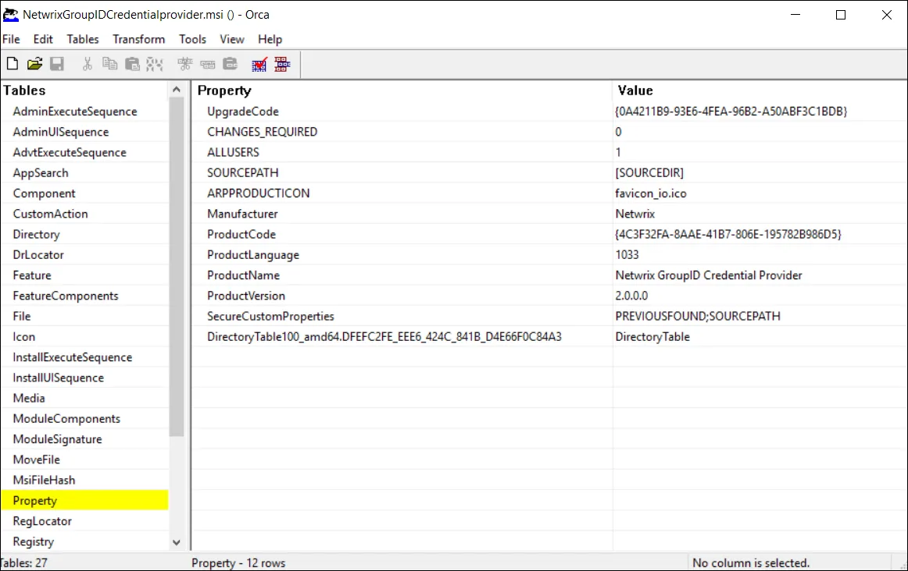

6. On your machine, create a new folder and copy the following files to it:

    - CPsettings.xml
    - NetwrixGroupidCredentialprovider.msi

7. Share the folder with the Everyone group with Read permission.
8. Provide the path of this newly created folder in the **SOURCEPATH** box.

    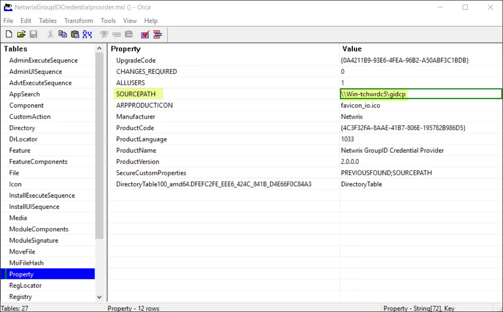

9. From the menu, select **Transform** > **Generate Transform**:

    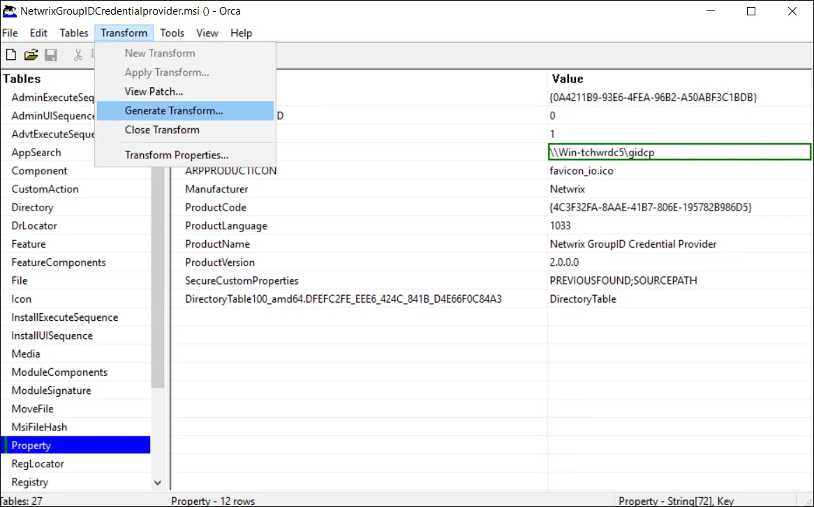

10. Type a filename for the generated .mst file and save it into the shared folder you just created.
11. Close **Orca**.

### Deploy Credential Provider via a GPO

Having Orca successfully installed, follow these steps to deploy Credential Provider via a GPO.

1. Launch **Group Policy Management** console by typing _gpmc.msc_ in the **Run** box and clicking
   **OK**. The Group Policy Management Editor opens.

    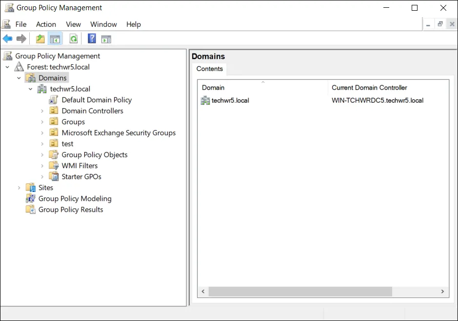

    NOTE: Group Policy Management console is available if the Group Policy Management feature has
    been installed.

2. Right-click the domain or organizational unit for the computers that you want the Credential
   Provider installed on. Select **Create a GPO in this domain, and link it here...**:

    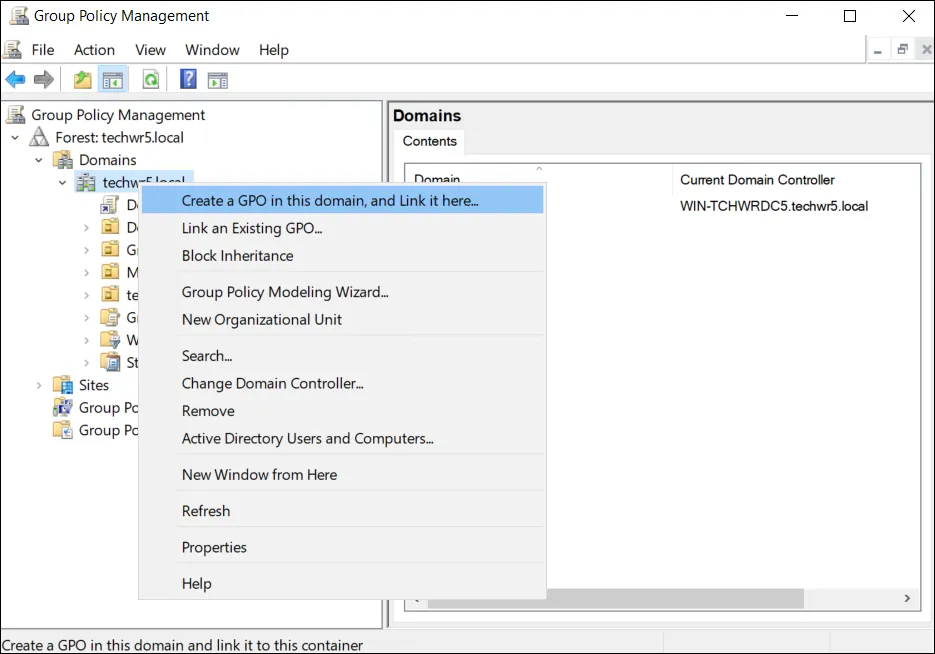

    Or

    Right-click the Select **Default Domain Policy** and select **Edit**:

    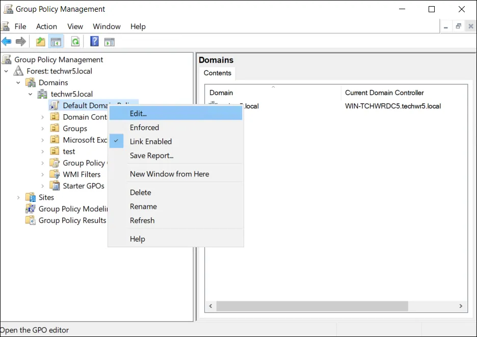

3. In the **Group Policy Management Editor**, click **Computer Configuration** > **Policies** >
   **Software Settings** > **Software installation** > **New** > **Package**.

    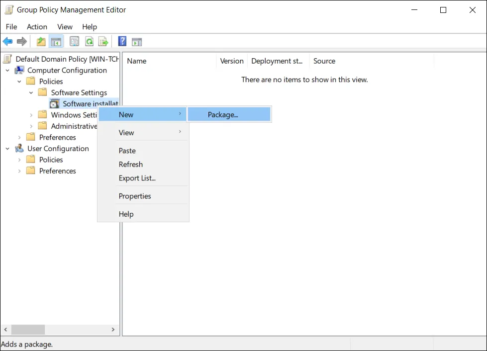

    NOTE: This documentation describes steps for editing the default policy.

4. Browse to the shared folder. The folder must have the following files in it:

    - CPSettings.xml
    - Netwrixgroupidcredentialprovider.msi
    - .mst file

    Select the _Netwrixgroupidcredentialprovider.msi_ and click **Ok**.

    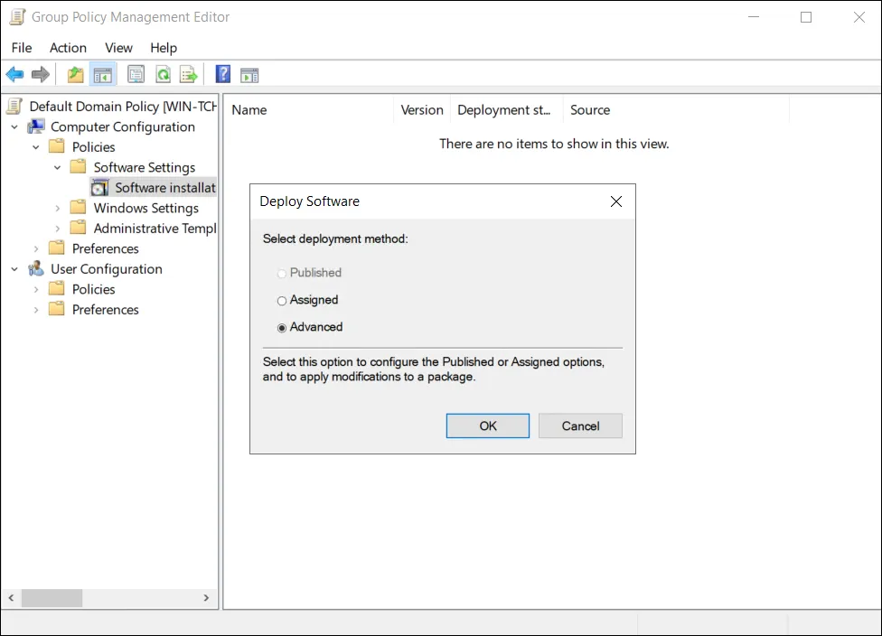

5. Select **Advanced** and click **Ok**. The following window opens:

    

6. Select the **Modifications** tab. Click **Add**.
7. Browse to the shared folder where you saved the generated .mst file. Select that file and click
   **Ok**.
8. Close the Group Policy Management Editor.

The Credential provider is deployed on your machine via the default domain policy.

## Run the credential provider

1. Restart the machine  
   or  
   Run Command Prompt as administrator and type the following command in the cmd window:  
   gpupdate /force

## Run the credential provider on client machines

The modified domain policy will be installed on the client machines, which are in the scope of the
Group Policy Object, upon their next restart. The Windows logon screen appear as follows:

