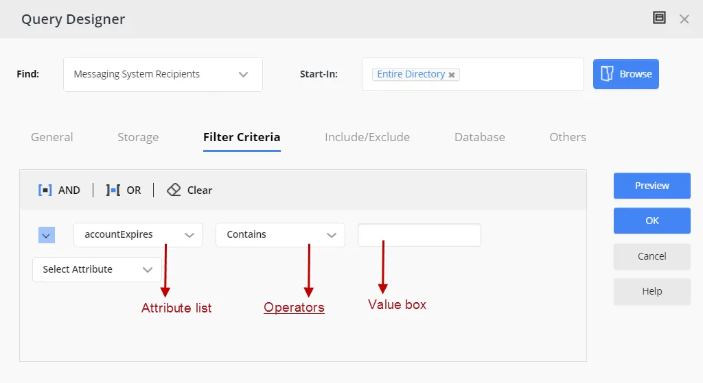
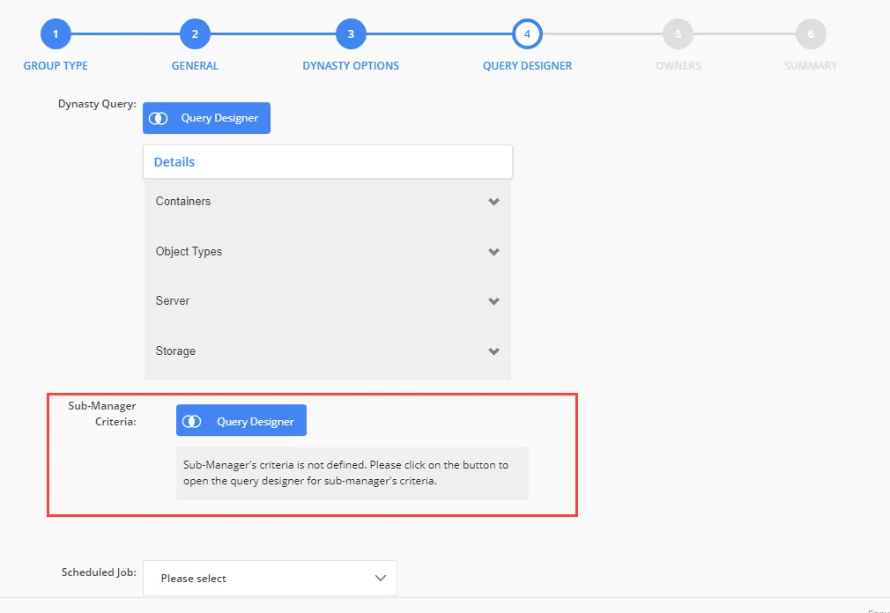
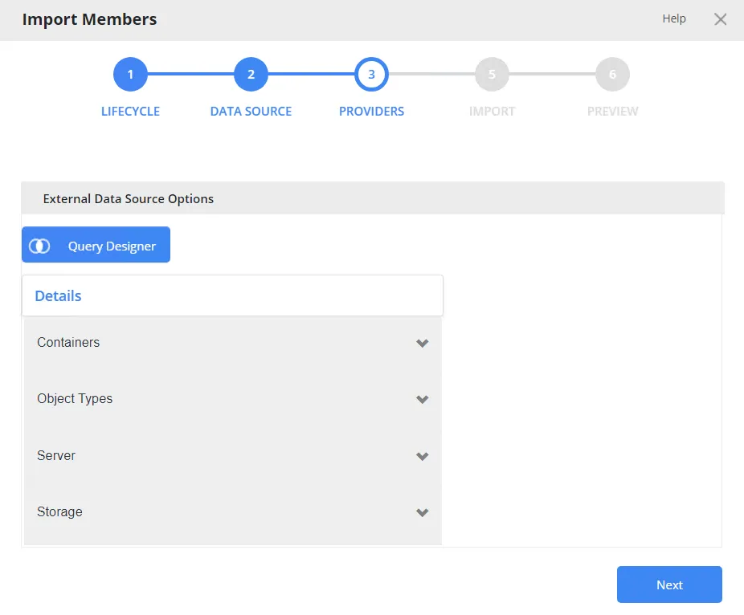

# Specify Smart Group Query Attributes

For an identity store, you can choose whether all or specific schema attributes should be available on the following pages in the portal:

- The Query Designer, where you can specify queries for Smart Groups and Dynasties for membership update. The Query Designer can be launched from:

  - The Create Object wizard for Smart Groups and Dynasties
  - The properties page for Smart Groups and Dynasties
  - When you upgrade a static group to a Smart Group or Dynasty

  The schema attributes you specify would be available to portal users on the Filter Criteria tab of the Query Designer for building Smart Group/Dynasty queries.

  
- The Sub-Manager Query Designer for a Recursive Managerial Dynasty, where you can specify a query for sub-manager selection.

  
- The __Add Attributes__ dialog box for Dynasties. The schema attributes you specify would be available in the _Group Items By_ field, which is used to divide the query results into groups. Directory Manager creates a new child group for each unique value of the attribute that users select in the _Group Items By_ field.

  
- The Query Designer for importing members to a group using an external data source. The specified schema attributes would be available on the Filter Criteria tab of the Query Designer for building membership import queries.  
  You can launch this Query Designer using the __Import__ button on the __Members__ tab in group properties (for static groups, Smart Groups and Dynasties).  
  
- The Query Designer for query-based search, where users can define a query to search the directory.  
  The schema attributes you specify would be available to portal users on the Filter Criteria tab of the Query Designer for building search queries.  
  Users can launch the Query Designer for searches from the portal’s Advanced Search page.

You can also specify the following for an attribute:

- The operator(s) that can be applied to the attribute on the Query Designer dialog boxes. For example, if you allow the ‘Contains’ and ‘Equals’ operators for the ‘cn’ attribute, then only these operators will be displayed when users select the ‘cn’ attribute on any of the Query Designers.
- The display type to use for specifying the value of the attribute. For example, it can be a simple text box, a drop-down list, or a button that launches the Find dialog box for searching and selecting an object.
- The maximum number of characters that users can enter as value for an attribute.

## Allow All Schema Attributes

1. In Admin Center, select __Applications__ in the left pane.  
   On the __GroupID Portal__ tab, a portal's card displays its info.
2. Click the ellipsis button for a portal and select __Settings__.
3. Select an identity store under __Design Settings__ to customize the portal for it.  
   All identity stores linked with the portal are listed under __Design Settings__. You can design a different portal for each of these.
4. Click __Smart Group Attributes__ in the left pane.
5. On the __Smart Group Attributes__ page, click the __All Attributes__ tile under __Select Smart Group Attributes__.  
   All schema attributes in the identity store (directory) would be available to portal users on the different Query Designers and the Add Attributes dialog box.
6. Click __Save__.

## Allow Specific Attributes

1. In Admin Center, select __Applications__ in the left pane.  
   On the __GroupID Portal__ tab, a portal's card displays its info.
2. Click the ellipsis button for a portal and select __Settings__.
3. Select an identity store under __Design Settings__ to customize the portal for it.  
   All identity stores linked with the portal are listed under __Design Settings__. You can design a different portal for each of these.
4. Click __Smart Group Attributes__ in the left pane.
5. On the __Smart Group Attributes__ page, click the __Selected Attributes__ tile under __Select Smart Group Attributes__. The __Name__ column lists any attributes that you have already specified.
6. To add an attribute, click __Add__. The __Add Smart Group Attribute__ pane is displayed.
7. Use the __Fields__ box to select one or more schema attributes. These attributes would be available in the portal, where users can use them for building Smart Group queries and other purposes.
8. Use the __Display Name__ box to specify a user-friendly name for the attribute. The attribute would be displayed in the portal with this name.  
   This box is not available when multiple attributes have been selected.
9. Select a security role in the __Visibility Level__ drop-down list. The attribute(s) would be visible to users of the selected role and roles with a priority value higher than the selected role. See [Priority](../../securityrole/manage.md).  
   Select _Never_ to hide the attribute(s) from all users.
10. Use the __Display Type__ drop-down list to specify the display type to use for enabling users to provide a value for the attribute(s) in the portal. For example, you can select a text box, drop-down list, or DN as display type. In case of DN, users can search and select a directory object as value for the attribute.  
    The list contains basic display types and custom display types defined on the __Custom Display Types__ page. See the [Display Type Categories](../displaytype/categories.md) topic.  
    When multiple attributes are selected in the __Fields__ box, this display type applies to each of them. You can edit an attribute later to apply a different display type.
11. In the __ToolTip Text__ box, enter the text to display when a user hovers the mouse over the attribute .

    This box is not available when multiple attributes have been selected.
12. In the __Max Length__ box, enter a number that represents the maximum number of characters that users can enter as value for an attribute.  
    Entering _0_ indicates that the attribute(s) can accept an unlimited number of characters as value.
13. The __Selected Operators__ area lists the operators that can be applied to attributes in the Query Designers.  
    Select the check box for the operator(s) you want to provide for the selected attribute(s).
14. Click __OK__.
15. Click __Save__ on the __Smart Group Attributes__ page.

## Update the Properties of a Query Attribute

You can change the following for an attribute:

- The display name of the attribute (the attribute is displayed with this name in the Query Designers and the Add Attribute dialog box)
- The operators that users can apply to the attribute in the Query Designers
- The display type used to provide a value for the attribute in the Query Designers
- The maximum characters that users can enter as value for the attribute in the Query Designers
- Visibility level
- Tooltip

__To update attribute properties:__

1. In Admin Center, select __Applications__ in the left pane.  
   On the __GroupID Portal__ tab, a portal's card displays its info.
2. Click the ellipsis button for a portal and select __Settings__.
3. Select an identity store under __Design Setting__s to customize the portal for it.  
   All identity stores linked with the portal are listed under __Design Settings__. You can design a different portal for each of these.
4. Click __Smart Group Attributes__ in the left pane.
5. On the __Smart Group Attributes__ page, click the __Selected Attributes__ tile under __Select Smart Group Attributes__. The _Name_ column lists any attributes that you have already specified.
6. Click __Edit__ for an attribute to update its properties.
7. On the __Edit Smart Group Attribute__ pane, the attribute name is read-only. To update all other details, follow steps 8 - 15 in the Allow Specific Attributes topic.

## Remove a Query Attribute

1. In Admin Center, select __Applications__ in the left pane.  
   On the __GroupID Portal__ tab, a portal's card displays its info.
2. Click the ellipsis button for a portal and select __Settings__.
3. Select an identity store under __Design Settings__ to customize the portal for it.  
   All identity stores linked with the portal are listed under __Design Settings__. You can design a different portal for each of these.
4. Click __Smart Group Attributes__ in the left pane.
5. On the __Smart Group Attributes__ page, click the __Selected Attributes__ tile under __Select Smart Group Attributes__. The _Name_ column lists any attributes that you have already specified.
6. Click __Remove__ for an attribute to remove it. Removed attributes would not be available in the portal for building Smart Group queries and other purposes. However, Smart Groups and Dynasti created using those attributes will be unaffected.
7. Click __Save__.

See Also

- [Design a Portal with Display Types](../displaytype/overview.md)
