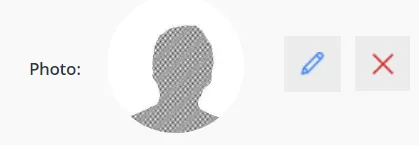

# Image Display Type

Use the image display type for schema attributes of the user object type that can store image data. The following table lists the supported attributes for Active Directory:

| AD Attribute | CN | Description | Max. Image Size (KB) |
| --- | --- | --- | --- |
| jpegPhoto | JpegPhoto | Stores one or more images of a user in JPEG File Interchange Format (JFIF). The image stored in this attribute is mainly used by SharePoint. | 10240 |
| Photo | Photo | An object encoded in G3 fax as explained in recommendation T.4, with an ASN.1 wrapper to make it compatible with an X.400 BodyPart as defined in X.420. | NA |
| thumbnailPhoto | Picture | An image of a user for display in Outlook. A space-efficient format like JPEG or GIF is recommended. | 100 |
| thumbnailLogo | Logo | A small-sized image; a user’s logo. | 32 |

To define an image display type, specify the image’s display dimensions (height and width), that would be used to display the image in the portal. You must also specify the maximum image size that can be uploaded for this display type.

A custom image display type is rendered on a portal page as:

Click __Edit__ to launch the __Manage Photo__ dialog box for uploading a photo. The dialog box also
provides many image editing options, including rotate, crop, flip, and re-size.

## Define an Image Display Type

1. In Admin Center, select __Applications__ in the left pane.  
   On the __GroupID Portal__ tab, a portal's card displays its info.
2. Click the ellipsis button for a portal and select __Settings__.
3. Select an identity store under __Design Settings__ to define a custom display type for it.  
   All identity stores associated with the portal are listed under __Design Settings__. You can design a different portal for each of these.
4. Click __Custom Display Types__ in the left pane.
5. On the __Custom Display Types__ page, click __Add__ on the __Custom Display Types__ tab.
6. On the __New Display Type__ pane, enter a name for the display type and select _Image_ in the __Type__ drop-down list.  
   You cannot
   change the name of a custom display type once you have created it.
7. In the __Height__ and __Width__ boxes, enter image dimensions (in pixels). The image will be displayed in the portal with these dimensions.  
   The default is set to 100 x 100 pixels.
8. In the __Maximum Size (KB)__ box, enter the maximum image size (in kilobytes) that users can upload for this display type.
9. Click __OK__.
10. Click __Save__ on the __Custom Display Types__ page.

You can link this custom image display type to a schema attribute (such as the Active Directory attributes _jpegPhoto_, _Photo_, _thumbnailPhoto_, and _thumbnailLogo_) on the __Search Forms, Properties, Create Object__,
and __Property Validation__ pages in __Design Settings__, after which the image placeholder is displayed on the respective portal page. Users can use it to upload their photos.

__See Also__

- [Design a Portal with Display Types](overview.md)
- [Display Type Categories](categories.md)
- [Define Custom Display Types](custom.md)
