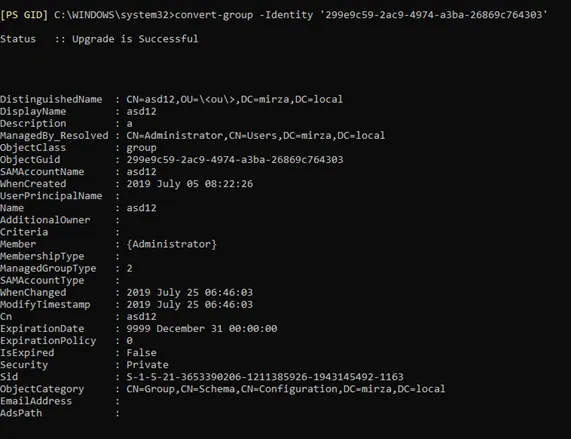

# Convert-Group

The Convert-Group commandlet converts an unmanaged group to a Smart Group.

Directory Manager Management Shell prompts for the identity of the unmanaged group you want to
convert into a Smart Group. After executing, the commandlet displays the status that update is
successful as shown in the following snapshot:



The converted Smart Group will not have an LDAP query attached to it. You have to define it
manually.

## Syntax

```
Convert-Group
-Identity <string>
[-SearchContainers <string[]>]
[-SearchContainersScopeList <string[]>]
[-ObjectTypes <string[]>]
[-LdapFilter <string>]
[-IncludeRecipients <string[]>]
[-ExcludeRecipients <string[]>]
[-Storage <string>]
[-DataSourceType <string>]
[-SystemDSN <string>]
[-TableOrView <string>]
[-DataSourceUserName <string>]
[-DataSourcePassword <string>]
[-FilePath <string>]
[-Server <string>]
[-Port <int>]
[-LDAPSearchContainer <string>]
[-DataSourceName <string>]
[-DataSourceQuery <string>]
[-WindowsAuthentication]
[-EnableUpdate <string>]
[-IsPasswordExpirySmartDL]
[-ExpirationRange <int>]
[-DomainExpiration <int>]
[-MaximumPasswordAge <int>]
[-MinimumPasswordAge <int>]
[-IncludeDisabledUsers <string>]
[-IncludePasswordNeverExpireUsers <string>]
[-SendEmail <string>]
[-EmailTemplatePath <string>] [-Script <string>]
[-ScriptFilePath <string>]
[-Provider_Container <string>]
[-PowerTools <ArrayList>]
[-KeyMapAD <string>]
[-KeyMapDB <string>]
[-ExtendGroupLife]
[-ExpirationPolicy <int>]
[-MsExchCoManagedByLink <string[]>]
[-IsExpired <string>]
[-GroupScope <string>]
[-Type <string>]
[-Prefix <string>]
[-SecurityType <string>]
[-ManagedBy <string[]>]
[-MaxSendSize <int>]
[-AcceptMessagesOnlyFrom <string[]>]
[-RejectMessagesFrom <string[]>]
[-AcceptMessagesOnlyFromGroups <string[]>]
[-RejectMessagesFromGroup <string[]>]
[-AdditionalOwners <string[]>]
[-NotifyOptOutAdditionalOwners <string[]>]
[-ExpansionServer <string>]
[-BypassOwnersPolicy <string>]
[-MsExchRequireAuthToSendTo <string>]
[-HiddenFromAddressListEnabled <string>]
[-SendOofMessageToOriginatorEnabled <string>]
[-HideMembershipFromAddressListEnabled <string>]
[-ReportToManagerEnabled <string>]
[-ReportToOriginatorEnabled <string>]
[-UpdateMembershipByManagerEnabled <string>]
[-Add <hashtable[]>]
[-Remove <hashtable[]>]
[-Replace <hashtable[]>]
[-Clear <string[]>]
[-Department <string>]
[-Company <string>]
[-Assistant <string>]
[-HomePage <string>]
[-Alias <string>]
[-EmailAddress <string>]
[-Description <string>]
[-Notes <string>]
[-AdministrativeNotes <string>]
[-DisplayName <string>]
[-SimpleDisplayName <string>]
[-CustomAttribute1 <string>]
[-CustomAttribute2 <string>]
[-CustomAttribute3 <string>]
[-CustomAttribute4 <string>]
[-CustomAttribute5 <string>]
[-CustomAttribute6 <string>]
[-CustomAttribute7 <string>]
[-CustomAttribute8 <string>]
[-CustomAttribute9 <string>]
[-CustomAttribute10 <string>]
[-CustomAttribute11 <string>]
[-CustomAttribute12 <string>]
[-CustomAttribute13 <string>]
[-CustomAttribute14 <string>]
[-CustomAttribute15 <string>]
[-Delimiter <string>]
[-IdentityStoreId <int>]
[-SecurityToken <CustomClaimsPrincipal>]
[-Credential <pscredential>]
[<CommonParameters>]
```

## Required Parameter

- Identity

Example:

The following commandlet converts a group _Clay2_ group to a Smart Group using the credentials of
current logged-on user.

```
Convert-Group -Identity "Clay2" -Credential $Cred
```
