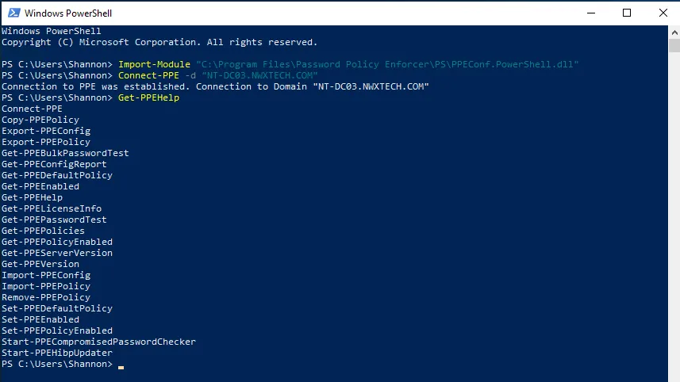

# PPE cmdlets

The PPE Cmdlets are available to manage Password Policy Enforcer from a Windows PowerShell. The cmdlets are not case-sensitive.

To establish the connection:

__Step 1 –__ Open a Windows PowerShell. Some cmdlets require administrative permissions. You can use the __Run as Administrator__ option.

__Step 2 –__ Import the PPE cmdlets module:  
__Import-Module "C:\Program Files\Password Policy Enforcer\PS\PPEConf.PowerShell.dll"__

__Step 3 –__ Connect to your domain:  
__Connect-PPE -d "_domain_"__ where _domain_ is the full name of your domain controller. __NT-DC03.NWXTECH.COM__ in this example.

__Get-PPEHelp__ with no parameters, displays a list of available cmdlets. Use the PowerShell __get-help__ _Cmdlet_ for information about the cmdlet.

Click a PPE cmdlet name for details.

- [Connect-PPE](cmdconnectppe.md)
- [Copy-PPEPolicy](cmdcopyppepolicy.md)
- [Export-PPEConfig](cmdexportppeconfig.md)
- [Export-PPEPolicy](cmdexportppepolicy.md)
- [Get-PPEBulkPasswordTest](cmdgetppebulkpasswordtest.md)
- [Get-PPEConfigReport](cmdgetppeconfigreport.md)
- [Get-PPEDefaultPolicy](cmdgetppedefaultpolicy.md)
- [Get-PPEEnabled](cmdgetppeenabled.md)
- [Get-PPEHelp](cmdgetppehelp.md)
- [Get-PPELicenseInfo](cmdgetppelicenseinfo.md)
- [Get-PPEPasswordTest](cmdgetppepasswordtest.md)
- [Get-PPEPolicies](cmdgetppepolicies.md)
- [Get-PPEPolicyEnabled](cmdgetppepolicyenabled.md)
- [Get-PPEServerVersion](cmdgetppeserverversion.md)
- [Get-PPEVersion](cmdgetppeversion.md)
- [Import-PPEConfig](cmdimportppeconfig.md)
- [Import-PPEPolicy](cmdimportppepolicy.md)
- [Remove-PPEPolicy](cmdremoveppepolicy.md)
- [Set-PPEDefaultPolicy](cmdsetppedefaultpolicy.md)
- [Set-PPEEnabled](cmdsetppeenabled.md)
- [Set-PPEPolicyEnabled](cmdsetppepolicyenabled.md)
- [Start-PPECompromisedPasswordChecker](cmdstartppecompromisedpasswordchecker.md)
- [Start-PPEHibpUpdater](cmdstartppehibpupdater.md)
