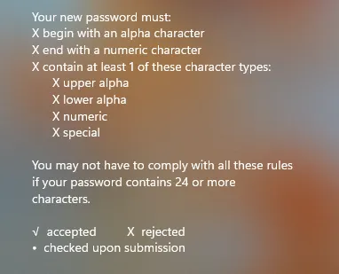
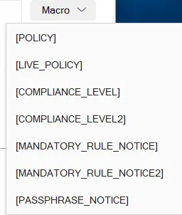

# Messages

Each Password Policy Enforcer password policy has multiple message templates, one for each of the
Password Policy Client messages.

- Password Policy – Displays the password policy guidelines on clients that have the Netwrix
  Password Policy Enforcer Client installed.
- [POLICY] – Customize the text for the active rules.
- [LIVE_POLICY] – Password Policy Client (10.2 and above) messages can be configured to display live
  feedback for the active rules to users as they enter their passwords. This feature enables users
  to see if their passwords meet the requirements of the policy set by the organization. Here is an
  example of a live policy message.

    

    **NOTE:** Start each custom message with two spaces, a hypen, and a space before your message so
    the X and checks can appear for the rule. For example: " **- Include an upper case alpha
    character.**" The quotes are only there to illustrate the message.

- Rejection Reason – Displays why an intended password was rejected on clients that have the Netwrix
  Password Policy Enforcer Client installed
- Generic Rejection – Displays if Password Policy Enforcer does not have a specific reason for the
  rejection, generally because the password does not comply with the Windows password policy

**Step 1 –** Open the Configuration Console:

Click **Start** > **Netwrix Password Policy Enforcer** > **PPE Configuration**  
or  
Double click the **PPE Configuration** desktop shortcut.

**Step 2 –** Click on a policy name to open the policy configuration page.

**Step 3 –** Open the **Messages** tab.

**Step 4 –** Select the message language from the drop-down list. You can set messages for multiple
languages. You do not have to create a Password Policy Enforcer policy for each language. To set
multiple languages, pick one, edit the message templates. Select another language, and edit the
message templates. Repeat for each language you want to implement. The correct message is displayed
to users based on their selected language.

**Step 5 –** Edit the message templates in the Password policy, [POLICY], [LIVE_POLICY], Rejection
Reason, and Generic rejection messages for any of the components you want to use.

**Step 6 –** Insert the macros into your message. Click **Macro** and pick one to insert it.

**Step 7 –** Click **Save** and review your changes in the Preview area. Click **Save** f you edit
the message.

**NOTE:** If you do not see the **Preview**, contact your network administrator to set up the
firewall to allow Password Policy Enforcer to communicate.
